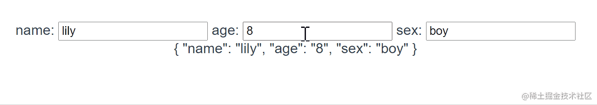
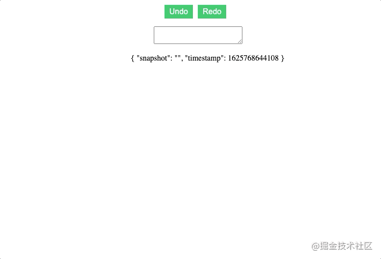
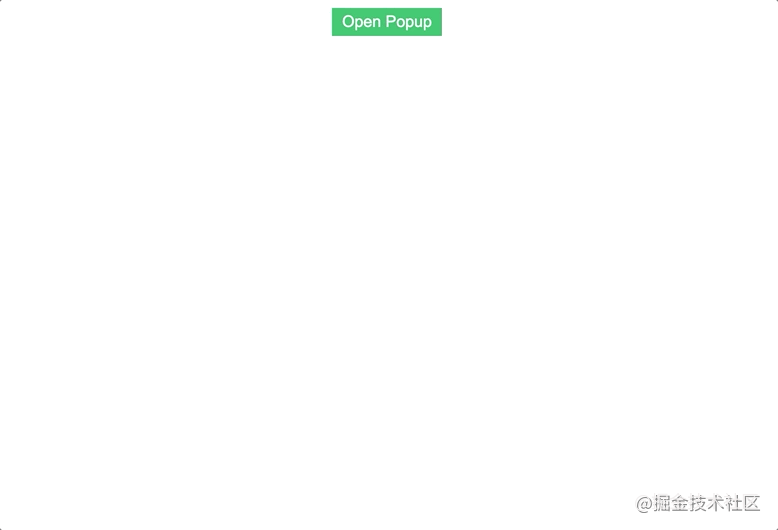
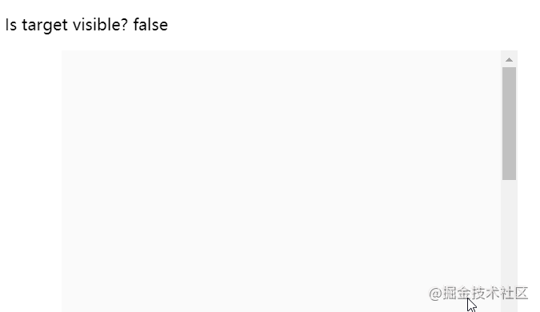
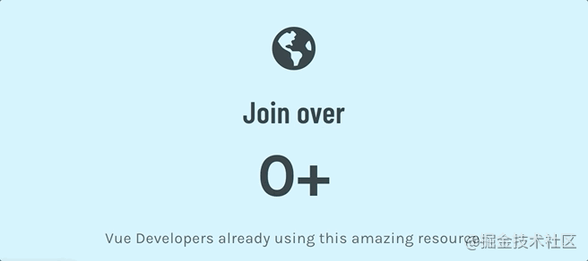

# vueuse

## 目录

- [vueuse 是什么?](#vueuse-是什么)
- [vueuse 开源吗？现状如何？](#vueuse-开源吗现状如何)
- [安装 vueuse](#安装-vueuse)
- [vueuse 能做什么？](#vueuse-能做什么)
  - [例子1: useMouse](#例子1-useMouse)
  - [例子2: useInterval](#例子2-useInterval)
  - [例子3：useVModel](#例子3useVModel)
  - [useRefHistory](#useRefHistory)
  - [onClickOutside 关闭 modal](#onClickOutside-关闭-modal)
  - [使用 intersectionobserver 跟踪元素的可见性](#使用-intersectionobserver-跟踪元素的可见性)
  - [使用 useTransition 做个数字加载动画](#使用-useTransition-做个数字加载动画)

[ VueUse Collection of essential Vue Composition Utilities https://vueuse.org/guide/](https://vueuse.org/guide/ " VueUse Collection of essential Vue Composition Utilities https://vueuse.org/guide/")

## vueuse 是什么?

> 一款基于Vue组合式API的函数工具集。

以上是官方网站关于它的定义。[官网地址](https://link.juejin.cn/?target=https://vueuse.org/guide/ "官网地址")

首先，它基于**Vue Composition Api (组合式API**)，只有在支持组合式API的环境下，才可以正常使用它；[什么是组合式API?](https://cn.vuejs.org/guide/extras/composition-api-faq.html "什么是组合式API?")
然后，它是一款**函数工具集**（可类比为lodash.js/ramda.js）;
简单来说，这是一个能让你更早下班的工具库。

## vueuse 开源吗？现状如何？

**当然开源**！[github/vueuse](https://link.juejin.cn?target=https://github.com/vueuse/vueuse "github/vueuse")

star数：**6.3K**

社区活跃度：社区**非常活跃**，截止2021年11月，一直有mr被合入主线；

被引用情况：截止2021年11月13日，npm上可查询到依赖它的库就有172个，其中包括著名UI库：`Element-Plus`

那位常年被调侃“懂个锤子Vue”的著名开源作者`Evan You`也是此库的金牌赞助商；


## 安装 vueuse

```typescript 
npm i @vueuse/core
// or
yarn add @vueuse/core
```


> 🎩注： VueUse 借助 vue-demi 的强大功能,可以在一个包中同时适用于 Vue 2 和 3！

Vue 3 Demo:

> 使用vite: [github.com/vueuse/vueu…](https://link.juejin.cn?target=https://github.com/vueuse/vueuse-vite-starter "github.com/vueuse/vueu…")使用Webpack: [github.com/vueuse/vueu…](https://link.juejin.cn?target=https://github.com/vueuse/vueuse-vue3-example "github.com/vueuse/vueu…")

Vue 2 Demo: Vue CLI

> 使用Vue CLI: [github.com/vueuse/vueu…](https://link.juejin.cn?target=https://github.com/vueuse/vueuse-vue2-example "github.com/vueuse/vueu…")

另外，要注意库的版本：

> &#x20; 从v6.0版本起，vue3 需要 vue >= v3.2; vue2 需要依赖@vue/composition-api>@vue/composition >= v1.1

## vueuse 能做什么？

**能做的那可太多了**，但总体上分为以下几个类别提供工具函数：

- 动画
- 浏览器
- 组件
- 格式化
- 传感器
- State(状态机)
- 公共方法
- 监听
- 杂项

这么列了一遍，估计**你还是很懵**，但因为方法实在太多，也不可能一个个都列出来。

那我就举几个有代表性的例子，带你快速理解这些方法大概是做什么的，有什么特点；


### 例子1: useMouse

```typescript 
<template>
  <div id="app">
    <h3>Mouse: {{x}} x {{y}}</h3>
  </div>
</template>
<script setup lang="ts">
import { useMouse } from '@vueuse/core'

const { x, y } = useMouse()
</script>
```


效果：


经过源码阅读，我们可以发现，这短短的一个方法，至少做了以下这些事：

创建了x和y这两个响应式对象（Ref）;
给window添加了鼠标事件监听，将鼠标的坐标实时赋给x，y;（并且还做了移动端兼容）

如果这些逻辑放到页面里，至少需要6行代码，这些代码后期都会增加维护人员理解页面的成本；
而现在，你只需要一行代码；
除此之外，该方法还有组件式用法，适合更热爱标签的盆友

```typescript 
<UseMouse v-slot="{ x, y }">
  x: {{ x }}
  y: {{ y }}
</UseMouse>
```


### 例子2: useInterval

顾名思义，这个方法是对`延时重复调用`能力的封装；

```typescript 
<script setup lang="ts">
import { useInterval } from '.'
const { counter, pause, resume } = useInterval(200, { controls: true })

// counter 一个 Ref 对象，它是响应式的，counter.value等于已经计数的次数
// pause() 暂停
// resume() 恢复 
</script>

<template>
  <div id="APP">
    <p>Interval fired: {{ counter }}</p>
  </div>
</template>
```


看看效果：


是不是很好用？相比手写`setInterval`更为便捷。如果徒手实现这样一个套方法，多少行暂且不说，我们需要在业务中写下大量的逻辑代码。而众所周知：**写的代码越多，出Bug的可能性越大，维护和理解的难度就越高**。 从这个角度看，这个库确实是一个合格的函数工具集；

### 例子3：useVModel

这是一个给`经常封装组件`的小伙伴的大好利器。先创建一个`组件：Test.vue`

```typescript 
<template>
  <div>
    name:
    <input v-model="_name"/>
    age:
    <input v-model="_age"/>
    sex:
    <input v-model="_sex"/>
  </div>
</template>
<script lang="ts" setup>
import { useVModel } from '@vueuse/core'
const props = defineProps({
  name: String,
  age: String,
  sex: String
})
const emit = defineEmits(['update:name', 'update:age', 'update:sex'])

const _name = useVModel(props, 'name', emit)
const _age = useVModel(props, 'age', emit)
const _sex = useVModel(props, 'sex', emit)
</script>
```


接着，`在index.vue中使用它`

```typescript 
<template>
  <div>
    <Test
    v-model:name="formData.name"
    v-model:age="formData.age"
    v-model:sex="formData.sex"
    ></Test>
    {{ formData }}
  </div>
</template>

<script setup lang="ts">
import { reactive } from 'vue-demi';
import Test from './Test.vue'
const formData = reactive({
  name: 'lily',
  age: '8',
  sex: 'boy'
})
</script>
```




**对于有组件封装需求的朋友，这个方法墙裂推荐！**不用再为了`单项数据流`的组件封装，而写在组件内写冗余的代码了。直接将`useVModel`返回的数据作为**响应式对象**用即可。这可太得劲儿了\~\~今天我要**18:00准时下班**，谁都别拦我！

### useRefHistory

useRefHistory跟踪对 ref 所做的每一个改变，并将其存储在一个数组中。这样我们能够轻松为应用程序提供撤销和重做功能。

来看一个示例，在该示例中，我们做一个能够撤销的文本区域

第一步是在没有 VueUse 的情况下创建我们的基本组件–使用ref、textarea、以及用于撤销和重做的按钮。

```typescript 
<template>
  <p> 
    <button> Undo </button>
    <button> Redo </button>
  </p>
  <textarea v-model="text"/>
</template>

<script setup>
import { ref } from 'vue'
const text = ref('')
//接着，导入useRefHistory，然后通过 useRefHistory从 text 中提取history、undo和redo属性。
import { useRefHistory } from '@vueuse/core'
const { history, undo, redo } = useRefHistory(text)
</script>

<style scoped>
  button {
    border: none;
    outline: none;
    margin-right: 10px;
    background-color: #2ecc71;
    color: white;
    padding: 5px 10px;;
  }
</style>

```


每当我们的`ref`发生变化，更新`history`属性时，就会触发一个监听器。

为了看看底层做了什么，我们把 `history` 内容打印出来。并在单击相应按钮时调用 `undo` 和`redo`函数。

```typescript 
<template>
  <p> 
    <button @click="undo"> Undo </button>
    <button @click="redo"> Redo </button>
  </p>
  <textarea v-model="text"/>
  <ul>
    <li v-for="entry in history" :key="entry.timestamp">
      {{ entry }}
    </li>
  </ul>
</template>

<script setup>
import { ref } from 'vue'
import { useRefHistory } from '@vueuse/core'
const text = ref('')
const { history, undo, redo } = useRefHistory(text)
</script>

<style scoped>
  button {
    border: none;
    outline: none;
    margin-right: 10px;
    background-color: #2ecc71;
    color: white;
    padding: 5px 10px;;
  }
</style>

```


直接，跑起来，效果如下：



还有不同的选项，为这个功能增加更多的功能。例如，我们可以深入追踪 reactive 对象，并像这样限制 history 记录的数量。

```typescript 
const { history, undo, redo } = useRefHistory(text, {
  deep: true,
  capacity: 10,
})

```


### onClickOutside 关闭 modal

`onClickOutside` 检测在一个元素之外的任何点击。根据我的经验，这个功能最常见的使用情况是关闭任何模态或弹出窗口。

通常，我们希望我们的模态屏蔽网页的其余部分，以吸引用户的注意和限制错误。然而，如果他们确实点击了模态之外，我们希望它关闭。

要做到这一点，只有两个步骤。

- 为要检测的元素创建一个模板引用
- 使用这个模板`ref`运行`onClickOutside`

这是一个简单的组件，使用`onClickOutside`弹出窗口。

```typescript 
<template>
  <button @click="open = true"> Open Popup </button>
  <div class="popup" v-if='open'>
    <div class="popup-content" ref="popup">
      Lorem ipsum dolor sit amet consectetur adipisicing elit. Corporis aliquid autem reiciendis eius accusamus sequi, ipsam corrupti vel laboriosam necessitatibus sit natus vero sint ullam! Omnis commodi eos accusantium illum?
    </div>
  </div>
</template>

<script setup>
import { ref } from 'vue'
import { onClickOutside } from '@vueuse/core'
const open = ref(false) // state of our popup
const popup = ref() // template ref
// whenever our popup exists, and we click anything BUT it
onClickOutside(popup, () => {
  open.value  = false
})
</script>

<style scoped>
  button {
    border: none;
    outline: none;
    margin-right: 10px;
    background-color: #2ecc71;
    color: white;
    padding: 5px 10px;;
  }
  .popup {
    position: fixed;
    top: ;
    left: ;
    width: 100vw;
    height: 100vh;
    display: flex;
    align-items: center;
    justify-content: center;
    background: rgba(, , , 0.1);
  }
  .popup-content {
    min-width: 300px;
    padding: 20px;
    width: 30%;
    background: #fff;
  }
</style

```


结果是这样的，我们可以用我们的按钮打开弹出窗口，然后在弹出内容窗口外单击关闭它。



### 使用 intersectionobserver 跟踪元素的可见性

- 当确定两个元素是否重叠时，useIntersectionObserver 是非常强大的。这方面的一个很好的用例是检查一个元素在视口中是否当前可见。
- 基本上，它检查目标元素与根元素/文档相交的百分比。如果这个百分比超过了某个阈值，它就会调用一个回调，确定目标元素是否可见。
- useIntersectionObserver提供了一个简单的语法来使用IntersectionObserver API。我们所需要做的就是为我们想要检查的元素提供一个模板ref。
- 默认情况下，IntersectionObserver将以文档的视口为根基，阈值为0.1–所以当这个阈值在任何一个方向被越过时，我们的交集观察器将被触发。

示例：我们有一个假的段落，只是在我们的视口中占据了空间，目标元素，然后是一个打印语句，打印我们元素的可见性。

```typescript 

<template>
  <p> Is target visible? {{ targetIsVisible }} </p>
  <div class="container">
    <div class="target" ref="target">
      <h1>Hello world</h1>
    </div>
  </div>
</template>

<script>
import { ref } from 'vue'
import { useIntersectionObserver } from '@vueuse/core'
export default {
  setup() {
    const target = ref(null)
    const targetIsVisible = ref(false)
    const { stop } = useIntersectionObserver(
      target,
      ([{ isIntersecting }], observerElement) => {
        targetIsVisible.value = isIntersecting
      },
    )
    return {
      target,
      targetIsVisible,
    }
  },
}
</script>

<style scoped>
.container {
  width: 80%;
  margin:  auto;
  background-color: #fafafa;
  max-height: 300px;
  overflow: scroll;
}
.target {
  margin-top: 500px;
  background-color: #1abc9c;
  color: white;
  padding: 20px;
}
</style>

```




我们还可以为我们的 Intersection Observer 指定更多的选项，比如改变它的根元素、边距（计算交叉点时对根的边界框的偏移）和阈值水平。

```typescript 
const { stop } = useIntersectionObserver(
      target,
      ([{ isIntersecting }], observerElement) => {
        targetIsVisible.value = isIntersecting
      },
      {
        // root, rootMargin, threshold, window
        // full options in the source: https://github.com/vueuse/vueuse/blob/main/packages/core/useIntersectionObserver/index.ts
        threshold: 0.5,
      }
)

```


同样重要的是，这个方法返回一个 stop 函数，我们可以调用这个函数来停止观察交叉点。如果我们只想追踪一个元素在屏幕上第一次可见的时候，这就特别有用。

在这段代码中，一旦targetIsVisible被设置为true，observer 就会停止，即使我们滚动离开目标元素，我们的值也会保持为 true 。

```typescript 
const { stop } = useIntersectionObserver(
      target,
      ([{ isIntersecting }], observerElement) => {
        targetIsVisible.value = isIntersecting
        if (isIntersecting) {
          stop()
        }
      },
    )

```


### 使用 useTransition 做个数字加载动画

`useTransition`是整个VueUse库中我最喜欢的函数之一。它允许我们只用一行就能顺利地在数值之间进行过渡。

如果使用 `useTransition` 做一个下面这样的效果，要怎么做呢?



我们可以通过三个步骤来做到这一点。

- 初始化一个 `ref` 变量 `count` ，初始值为 `0`
- 使用 `useTransition` 创建一个变量 `output`
- 改变 count 的值

```typescript 
<template>
  <h2> 
    <p> Join over </p>
    <p> {{ Math.round(output) }}+ </p>
    <p>Developers </p>
  </h2>
</template>

<script setup>
import { ref } from 'vue'
import { useTransition, TransitionPresets } from '@vueuse/core'
const count = ref(0)
const output = useTransition(count, {
  duration: 3000,
  transition: TransitionPresets.easeOutExpo,
})
count.value = 5000
</script>


```
