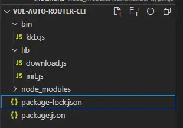
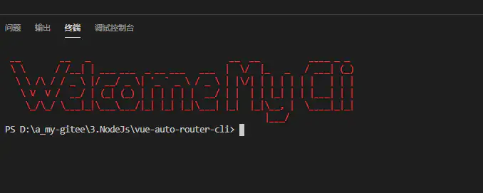
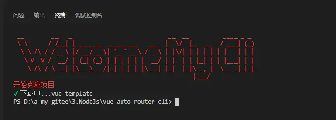
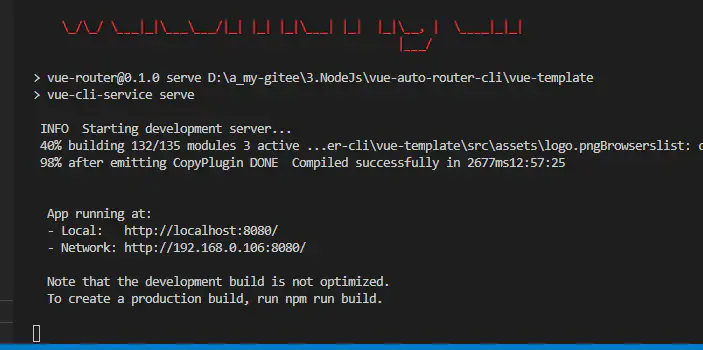
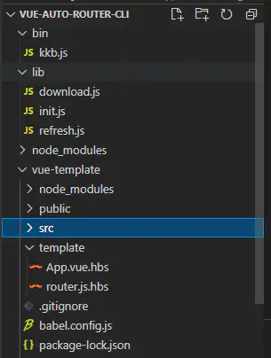
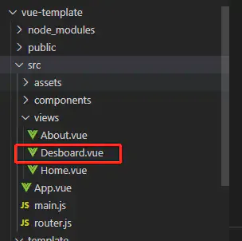

# cli工具开发

## 目录

- [案例cli](#案例cli)
  - [package.json](#packagejson)
  - [使用commander定制命令行](#使用commander定制命令行)
  - [打印一个欢迎界面](#打印一个欢迎界面)
  - [实现克隆github项目的功能](#实现克隆github项目的功能)
  - [安装依赖](#安装依赖)
  - [启动项目并且打开浏览器](#启动项目并且打开浏览器)
  - [自动生成router.js和App.vue中的router-link](#自动生成routerjs和Appvue中的router-link)
  - [代码](#代码)

# 案例cli

[ Node  ——  写一个实用cli工具 学习目标用node写实用的cli工具，是我们工程化的一个必经之路，本文也能激起大家学习node的兴趣， 本文实现一个vue脚手架，这个脚手架的主要实现的功能就是： 自动克隆g... https://www.jianshu.com/p/8702ee80c2f3](https://www.jianshu.com/p/8702ee80c2f3 " Node  ——  写一个实用cli工具 学习目标用node写实用的cli工具，是我们工程化的一个必经之路，本文也能激起大家学习node的兴趣， 本文实现一个vue脚手架，这个脚手架的主要实现的功能就是： 自动克隆g... https://www.jianshu.com/p/8702ee80c2f3")

#### package.json

```typescript 
{
  "name": "vue-auto-router-cli",
  "version": "1.0.0",
  "description": "",
  "main": "index.js",
  "bin": {
    "kkb": "./bin/kkb.js"
  },
  "scripts": {
    "test": "echo \"Error: no test specified\" && exit 1"
  },
  "keywords": [],
  "author": "",
  "license": "ISC",
  "dependencies": {
    "chalk": "^4.1.0",
    "clear": "^0.1.0",
    "commander": "^7.2.0",
    "download-git-repo": "^3.0.2",
    "figlet": "^1.5.0",
    "handlebars": "^4.7.7",
    "open": "^8.0.5",
    "ora": "^5.4.0"
  }
}
```


#### 使用`commander`定制命令行

- `command`相当于注册了一个**init**命令**name**就是后面跟的参数，命令具体的操作在`action`里面写，commander会将命令后面的参数传到这个action接收的这个函数参数里面

```typescript 
#!/usr/bin/env node
//指定解释器类型
const program = require ('commander');
program.version (require ('../package.json').version); //指定版本号
program.command ('init <name>').description ('初始化项目中...').action (payload => {
  console.log (payload);
}); //相当于注册一个命令
program.parse (process.argv); //process描述的是主进程  process.argv是命令后面的参数，整个program是通过解析后面的参数来完成的

```


执行命令`kkb init project`&#x20;

```typescript 
输出：project
```


#### 打印一个欢迎界面



编辑kkb.js

```typescript 
#!/usr/bin/env node
//指定解释器类型
const program = require ('commander');
program.version (require ('../package.json').version); //指定版本号
program
  .command ('init <name>')
  .description ('初始化项目...')
  .action (require ('../lib/init.js')); //相当于注册一个命令
program.parse (process.argv); //process描述的是主进程  process.argv是命令后面的参数，整个program是通过解析后面的参数来完成的

```


新建init.js文件

```typescript 
const {promisify} = require ('util'); //promisify 将异步函数转换为Promise类型的;

const figlet = promisify (require ('figlet')); //艺术字;
const chalk = require ('chalk'); //粉笔;
const clear = require ('clear'); //清屏;
const log = content => console.log (chalk.red (content)); //封装一个log方法，用chalk染色;
module.exports = async name => {
  clear ();首先清屏
  const data = await figlet ('Welcome My Cli');
  log (data);
};
```


运行`kkb init name`



#### 实现克隆github项目的功能

- 使用`download-git-repo`这个包
- ora：进度条

新建download.js文件

```typescript 
const {promisify} = require ('util');
const ora = require ('ora'); //进度条
const download = promisify (require ('download-git-repo'));
module.exports = async (repo, name) => {
  const process = ora ('下载中...' + name);
  process.start ();
  await download (repo, name);
  process.succeed ();
};
```


编辑init.js文件

```typescript 
const {promisify} = require ('util'); //promisify 将异步函数转换为Promise类型的;

const figlet = promisify (require ('figlet')); //艺术字;
const chalk = require ('chalk'); //粉笔;
const clear = require ('clear'); //清屏;
const log = content => console.log (chalk.red (content)); //封装一个log方法，用chalk染色;
const download = require ('./download');
module.exports = async name => {
  clear ();
  const data = await figlet ('Welcome My Cli');
  log (data);
  log ('开始克隆项目');
  await download ('github:su37josephxia/vue-template', name);
};
```


运行`kkb init vue-template`命令，成功克隆项目



#### 安装依赖

项目成功克隆之后，接下来常规操作安装依赖，运行`npm install`命令，然后`npm run serve`启动，那么在nodejs里面我们如何写脚本让他自动执行呢？

- 使用**Promise**封装spawn方法，创建一个子进程让他去执行`npm install`这个命令。
- 因为子进程执行，我们是看不见的，所以通过**pipe（管道）** 对接到主进程，让他执行过程能在我们终端显示出来，你也可以把`proc.stdout.pipe (process.stdout); proc.stderr.pipe (process.stderr);`这俩句注释掉，结果就是控制台不会打印任何信息，但项目依然能启动。如此，显而易见。
- 为什么要用`npm.cmd`，可以参考这篇[文章](https://links.jianshu.com/go?to=https://blog.csdn.net/sikichan/article/details/52087597 "文章")。
- 关于`child_process`这个模块你可以自己下去仔细学习下，这个包很重要，这篇文章不做赘述。

```typescript 
const {promisify} = require ('util'); //promisify 将异步函数转换为Promise类型的;

const figlet = promisify (require ('figlet')); //艺术字;
const chalk = require ('chalk'); //粉笔;
const clear = require ('clear'); //清屏;
const log = content => console.log (chalk.red (content)); //封装一个log方法，用chalk染色;
const open = require ('open');
// const download = require ('./download');

// 封装spawn方法
const spawn = async (...args) => {
  const {spawn} = require ('child_process');
  return new Promise (resolve => {
    const proc = spawn (...args);
    proc.stdout.pipe (process.stdout);
    proc.stderr.pipe (process.stderr);
    proc.on ('close', () => {
      resolve ();
    });
  });
};
module.exports = async name => {
  clear ();
  const data = await figlet ('Welcome My Cli');
  log (data);
  // 克隆项目
  // log ('开始克隆项目');
  // await download ('github:su37josephxia/vue-template', name);//克隆github项目

  // 安装依赖
  log ('开始安装依赖');
  await spawn ('npm.cmd', ['install'], {cwd: `./${name}`});
};

```


#### 启动项目并且打开浏览器

- open：使用系统浏览器打开一个网址；

```typescript 
const {promisify} = require ('util'); //promisify 将异步函数转换为Promise类型的;

const figlet = promisify (require ('figlet')); //艺术字;
const chalk = require ('chalk'); //粉笔;
const clear = require ('clear'); //清屏;
const log = content => console.log (chalk.red (content)); //封装一个log方法，用chalk染色;
const open = require ('open');
const download = require ('./download');

// 封装spawn方法
const spawn = async (...args) => {
  const {spawn} = require ('child_process');
  return new Promise (resolve => {
    const proc = spawn (...args);
    proc.stdout.pipe (process.stdout);
    proc.stderr.pipe (process.stderr);
    proc.on ('close', () => {
      resolve ();
    });
  });
};
module.exports = async name => {
  clear ();
  const data = await figlet ('Welcome My Cli');
  log (data);
  // 克隆项目
  log ('开始克隆项目');
  await download ('github:su37josephxia/vue-template', name);//克隆github项目

  // 安装依赖
  log ('开始安装依赖');
  await spawn ('npm.cmd', ['install'], {cwd: `./${name}`});

  // 打开浏览器安装运行
  open ('http://localhost:8080');
  await spawn ('npm.cmd', ['run', 'serve'], {
    cwd: `./${name}`,
  });
};
```




#### 自动生成`router.js`和`App.vue`中的**router-link**

我们日常开发项目的时候，每次新加一个页面都要编辑router.js和App.vue里面加一个链接，这样的重复操作给我们带来了很大的心智负担，所以我们接下来要实现的就是运行命令，自动生成。

看一下此时的目录结构



在我们克隆的项目`vue-template`中新建一个tempalte文件夹，以及文件`App.vue.hbs`和`router.js.hbs`，这俩个文件将来要给**handelbars**这个包使用。

```typescript 
//App.vue.hbs
<template>
  <div id="app">
    <div id="nav">
      <router-link to="/">Home</router-link> 
      {{#each list}}
      | <router-link to="/{{name}}">{{name}}</router-link>
      {{/each}}
    </div>
    <router-view/>
  </div>
</template>

<style>
#app {
  font-family: 'Avenir', Helvetica, Arial, sans-serif;
  -webkit-font-smoothing: antialiased;
  -moz-osx-font-smoothing: grayscale;
  text-align: center;
  color: #2c3e50;
  margin-top: 60px;
}
</style>


//router.js.hbs文件
import Vue from 'vue'
import Router from 'vue-router'
import Home from './views/Home.vue'

Vue.use(Router)

export default new Router({
  mode: 'history',
  base: process.env.BASE_URL,
  routes: [
    {
      path: '/',
      name: 'home',
      component: Home
    },
    {{#each list}}
    {
      path: '/{{name}}',
      name: '{{name}}',
      component: () => import('./views/{{file}}')
    },
    {{/each}}
  ]
})

```


`lib`文件夹下面创建`refresh.js`

```typescript 
const fs = require ('fs');
const handlebar = require ('handlebars'); //
module.exports = async () => {
  const list = fs.readdirSync ('./vue-template/src/views').map (v => ({
    name: v.replace ('.vue', '').toLowerCase (),
    file: v,
  })); //文件集合
  compile (
    {list},
    './vue-template/src/router.js',
    './vue-template/template/router.js.hbs'
  ); //生成router.js
  compile (
    {list},
    './vue-template/src/App.vue',
    './vue-template/template/App.vue.hbs'
  );//生成App.vue
  function compile (meta, filePath, templatePath) {
    if (fs.existsSync (templatePath)) {
      const content = fs.readFileSync (templatePath).toString ();
      const data = handlebar.compile (content) (meta);
      fs.writeFileSync (filePath, data);
      console.log (`${filePath}创建成功`);
    }
  }
};

```


编辑kkb.js，新增一个命令`kkb refresh`

```typescript 
#!/usr/bin/env node
//指定解释器类型
const program = require ('commander');
program.version (require ('../package.json').version); //指定版本号

// 初始化项目
program
  .command ('init <name>')
  .description ('初始化项目...')
  .action (require ('../lib/init.js')); //相当于注册一个命令

// 刷新路由文件
program
  .command ('refresh')
  .description ('自动生成路由...')
  .action (require ('../lib/refresh'));

program.parse (process.argv); //process描述的是主进程  process.argv是命令后面的参数，整个program是通过解析后面的参数来完成的
```


views下面新增一个文件，执行`kkb refresh`命令，我们会看到`router.js`和`App.vue`自动生成




## 代码

[app-cli.zip](./assets/file/app-cli_6TwafHUhWD.zip " app-cli.zip")

或者

[vue-auto-router-cli.zip](./assets/file/vue-auto-router-cli_jeVmRxHdoY.zip " vue-auto-router-cli.zip")
