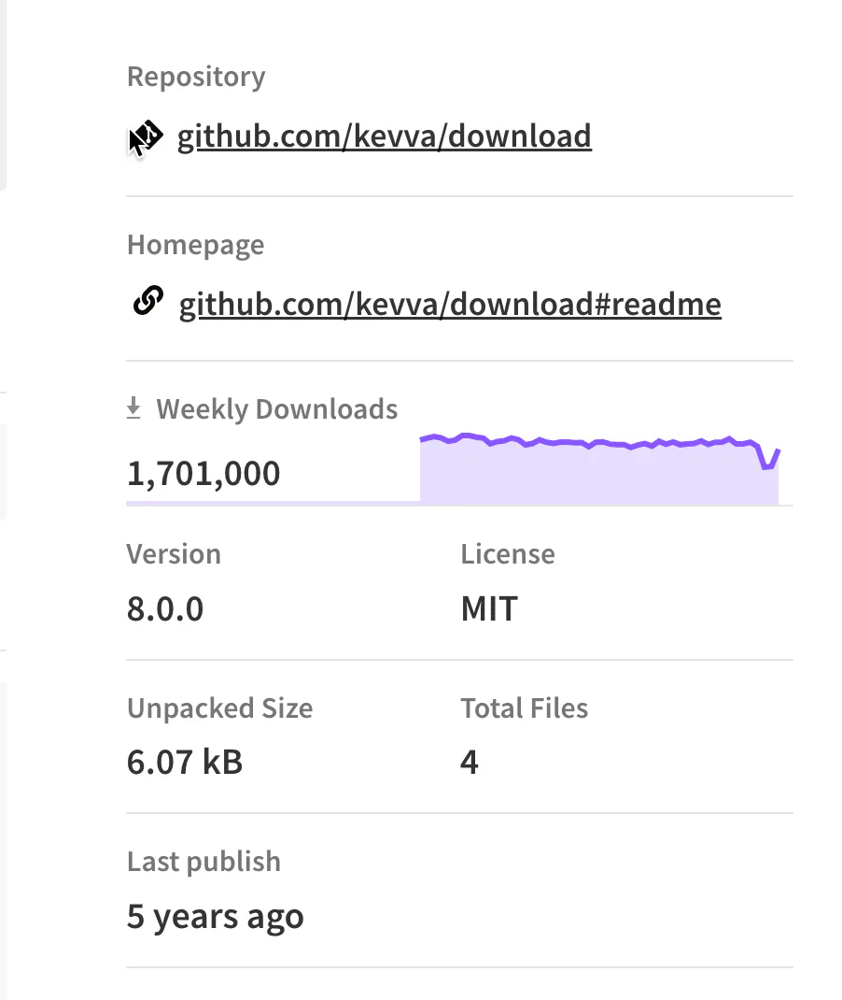

# download

## 目录

- [API](#API)
  - [download(url, destination?, options?)](#downloadurl-destination-options)
    - [url](#url)
    - [destination](#destination)
    - [options](#options)
      - [extract](#extract)
      - [filename](#filename)

[ download - npm Download and extract files. Latest version: 8.0.0, last published: 5 years ago. Start using download in your project by running \`npm i download\`. There are 1810 other projects in the npm registry usin https://www.npmjs.com/package/download](https://www.npmjs.com/package/download " download - npm Download and extract files. Latest version: 8.0.0, last published: 5 years ago. Start using download in your project by running `npm i download`. There are 1810 other projects in the npm registry usin https://www.npmjs.com/package/download")



```javascript 
const fs = require('fs');
const download = require('download');
 
(async () => {
    await download('http://unicorn.com/foo.jpg', 'dist');
 
    fs.writeFileSync('dist/foo.jpg', await download('http://unicorn.com/foo.jpg'));
 
    download('unicorn.com/foo.jpg').pipe(fs.createWriteStream('dist/foo.jpg'));
 
    await Promise.all([
        'unicorn.com/foo.jpg',
        'cats.com/dancing.gif'
    ].map(url => download(url, 'dist')));
})();
```


## API

### download(url, destination?, options?)

Returns both a `Promise<Buffer>` and a [Duplex stream](https://nodejs.org/api/stream.html#stream_class_stream_duplex "Duplex stream") with [additional events](https://github.com/sindresorhus/got#streams-1 "additional events").

#### url

Type: `string`

URL to download.

#### destination

Type: `string`

Path to where your file will be written.

#### options

Type: `Object`

Same options as [got](https://github.com/sindresorhus/got#options "got") and [decompress](https://github.com/kevva/decompress#options "decompress") in addition to the ones below.

##### extract

Type: `boolean
`Default: `false`

If set to `true`, try extracting the file using [decompress](https://github.com/kevva/decompress "decompress").

##### filename

Type: `string`

Name of the saved file.
