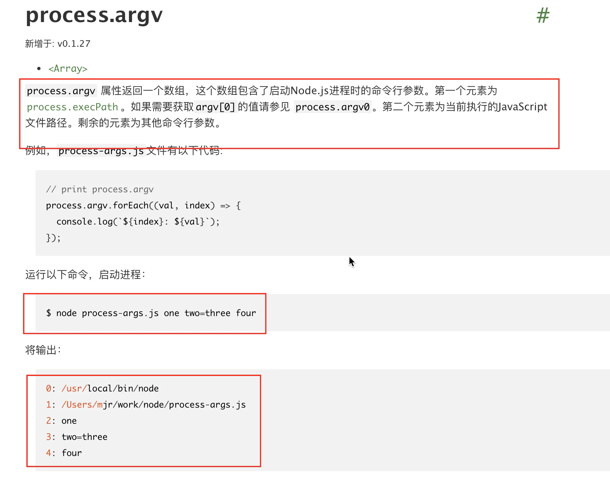

# minimist 解析命令行

## 目录

- [简单使用](#简单使用)
- [定制参数解析](#定制参数解析)
- [简单说明](#简单说明)
- [源码解析](#源码解析)

解析命令行的参数&#x20;

链接：[https://npm.im/minimist](https://npm.im/minimist "https://npm.im/minimist")

# 简单使用

```typescript 
const argv = minimist<{
  t?: string
  template?: string
}>(process.argv.slice(2), { string: ['_'] })
```




`process.argv`可以获取运行脚本时的命令行参数 \*\*，而之所以常用`process.argv.slice(2)`\*\*，是因为一般第二个参数后才是我们需要的。再来看`minimist`的用法及例子：

再来看`minimist`的用法及例子：

```typescript 
const args = require('minimist')(process.argv.slice(2))

```


举例：

```typescript 
node test.js -a a -b b
// args: {_: [], a: 'a', b: 'b'}
node test.js -x 3 -y 4 -n5 -abc --beep=boop foo bar baz
// { 
//_: [ 'foo', 'bar', 'baz' ],
// x: 3,
// y: 4,
// n: 5,
// a: true,
// b: true,
// c: true,
// beep: 'boop'
}

```


minimist会解析参数，并放到一个对象中，方便在脚本中读取。特别要说明的是其中首个key是`_`，它的值是个[数组](https://www.6hu.cc/archives/tag/数组 "数组")，**包含的是所有没有关联选项的参数。**

# 定制参数解析

你可能需要更详细的配置来告诉 `minimist` 如何解析特定的参数。下面是 `minimist` 的一些可用选项：

- `string`: 指定哪些参数应该总是被当作字符串处理；字符串或者数组
- `boolean`: 指定哪些参数应该被当作布尔值处理；boolean类型或字符串或者数组；boolean表示所有参数均为boolean
- `alias`: 为参数设置别名
- `default`: 为参数设置默认值
- `stopEarly`: 当设置后，`minimist` 将会在遇到第一个非选项参数后停止解析
- `--`: 如果设置为 `true`, 则将 `--` 后的所有参数放入 `argv._`
- **`unknownFn`** : 函数, 针对未知参数的处理；

让我们通过一个定义了多个解析选项的例子来看具体如何操作：

```javascript 
// 使用自定义配置解析命令行参数
var parseArgs = require('minimist');

// 自定义选项
var options = {
  boolean: 'verbose',
  default: { verbose: false },
  alias: { v: 'verbose' }
};

var argv = parseArgs(process.argv.slice(2), options);

// 若命令行为：node example.js -v
console.log(argv);
// 输出：{ _: [], verbose: true, v: true }

```


在这段代码中，`verbose` 选项被设置为布尔值，并且定义了简写 `-v` 作为它的别名。

# 简单说明

```javascript 
// indexlearn.js
module.exports = function (args, opts) {
    // ...处理...
    
    // 1. 解析配置参数 opts
    
    // 1.1 opts.unknownFn
    // 1.2 opts.boolean 指明布尔类型参数
    // 例如: 若opts.boolean为true, 则将所有不带等号的双连字符参数视为布尔值(--name)
    // 1.3 opts.alias 指明参数的别名, 【处理后】存储在变量 aliases
    // 例如: {name:["n", "na", "nam"]} -> {name:["n", "na", "nam"], n:["name", "na", "nam"], na:["name", "n", "nam"], nam:["name", "n", "na"] }
    // 1.4 opts.strings 指明字符串类型参数,联动别名
    // ...
    
    var argv = {_:[]}
    
    // 2. 解析 args, 整合参数
    
    // 2.1 处理 args 参数, 得到新的 args 和 notFlags
    // 2.2 遍历新的 args 并处理, 整合到 argv
    //  - 这里涉及了一些正则判断和处理, 是对不规则参数的处理
    // 2.3 处理 opts.defaults(提供参数的默认值), 整合到 argv
    // 2.4 如果 opts["--"] 为 true, 处理 notFlags 参数, 整合到 argv
    // ...
    
    return argv
}

```


# 源码解析

[   https://juejin.cn/post/7160597511495745550?searchId=202501131638477E4FB35D9055F10C0A43](https://juejin.cn/post/7160597511495745550?searchId=202501131638477E4FB35D9055F10C0A43 "   https://juejin.cn/post/7160597511495745550?searchId=202501131638477E4FB35D9055F10C0A43")
