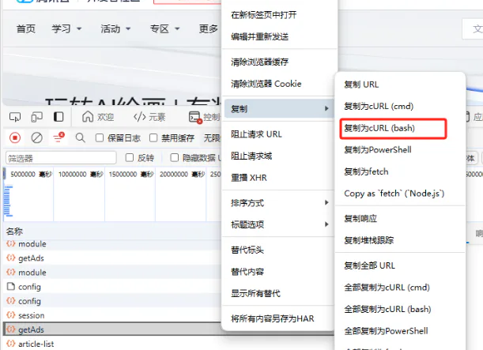

# 爬虫

## 目录

- [例子](#例子)

在这里，我们想向大家介绍一个非常实用的开发爬虫工具，它就是；需要科学上网工具

[   https://curlconverter.com/](https://curlconverter.com/ "   https://curlconverter.com/")

我是通过偶然的机会发现了这个工具的，它的确大大提升了我的爬虫效率。通常情况下，当我们找到了需要爬取的接口时，我们需要编写Python代码来发起请求，可能还要处理各种请求头和cookie，这一过程会消耗大量时间。而这个工具则帮助我们省去了这些繁琐的步骤，使得整个过程变得更加高效。

首先，我们在后台查找到目标请求，然后通过右键点击复制该请求。以Edge浏览器为例，具体操作如下所示：



在将内容复制后，我们可以直接前往这个在线工具网站，将其粘贴进去，从而生成相应的Python代码。这里以使用requests库为例进行演示。当你浏览该网站时，你**可以选择你喜欢的任何编程语言进行相应代码的生成**。


# 例子

```javascript 
const  axios  = require('axios');
const createCsvWriter = require('csv-writer').createObjectCsvWriter;
const csvWriter = createCsvWriter({
    path: 'output.csv',
    header: [
      { id: 'AffiliationID', title: '子产品ID' },
      { id: 'AffiliationName', title: '子产品名称' },
      { id: 'onLine', title: '页面是否上线' },
      { id: 'pageUrl', title: '页面URL' },
    ]
  });
async function fetchApi(){
     const date = new Date()
    const dateString = date.toISOString().replace(/\.\d{3}Z$/, 'Z'); 
    const response = await axios.post('https://xxxx/api/xxxxx',
  {
    'objectType': 1,
    'contentType': 1,
    'objectId': 'xxxxx',
    'page': 1,
    'pagesize': 3,
    'objId': 2397254
  },
  {
    headers: {
      'accept-language': 'zh-CN,zh;q=0.9,en;q=0.8',
      'cache-control': 'no-cache',
      'origin': 'https://cloud.tencent.com',
      'pragma': 'no-cache',
      'priority': 'u=1, i',
      'referer': 'https://xxxxxx/developer/article/xxxxxx',
      'sec-ch-ua': '"Google Chrome";v="137", "Chromium";v="137", "Not/A)Brand";v="24"',
      'sec-ch-ua-mobile': '?0',
      'sec-ch-ua-platform': '"macOS"',
      'sec-fetch-dest': 'empty',
      'sec-fetch-mode': 'cors',
      'sec-fetch-site': 'same-origin',
      'user-agent': 'Mozilla/5.0 (Macintosh; Intel Mac OS X 10_15_7) AppleWebKit/537.36 (KHTML, like Gecko) Chrome/137.0.0.0 Safari/537.36',
      'cookie': 'xxxx'
    }
  }
);
      const list = response.data.Result.Pages.map(item=>{
        const { AffiliationID,AffiliationName,Status,PagePath} = item
        return {
            AffiliationID,
            AffiliationName,
            onLine:Status === 'Online'?'是':'否',
            pageUrl: PagePath
        }
      })
      csvWriter.writeRecords(list)
  .then(() => console.log('The CSV file was written successfully'));
}
fetchApi()
```


> 注意：有些请求里有变量；**比如说时间戳；要自己修改修改；**
