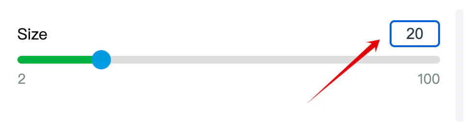

# input\[number]

## 目录

- [去掉 input\[type="number"\] 的加减按钮](#去掉-inputtypenumber-的加减按钮)
  - [解决方案](#解决方案)
    - [方法1：使用 CSS 隐藏 spinner](#方法1使用-CSS-隐藏-spinner)
    - [方法2：使用纯 HTML 和 JavaScript 替代方案](#方法2使用纯-HTML-和-JavaScript-替代方案)
  - [相关API和区别](#相关API和区别)
- [代码](#代码)

# 去掉 input\[type="number"] 的加减按钮

在 HTML 中，`<input type="number">`默认会显示加减按钮（也称为"spinner"），但有时我们可能需要去掉这些按钮以获得更简洁的外观。

## 解决方案

### 方法1：使用 CSS 隐藏 spinner

```css 

/* 适用于大多数现代浏览器 */
input[type="number"]::-webkit-outer-spin-button,
input[type="number"]::-webkit-inner-spin-button {
    -webkit-appearance: none;
    margin: 0;
}

/* Firefox */
input[type="number"] {
    -moz-appearance: textfield;
}

```


### 方法2：使用纯 HTML 和 JavaScript 替代方案

如果你需要完全控制输入行为，可以考虑使用`type="text"`并添加验证：

```html 
<input type="text" pattern="\d*" oninput="this.value = this.value.replace(/[^0-9]/g, '');">
```


## 相关API和区别

1. **`input[type="number"]`****vs****`input[type="text"]`**
   - `number`类型：提供内置的数字验证，移动设备会显示数字键盘，有spinner控件
   - `text`类型：纯文本输入，需要手动添加验证
2. **类似的控制方法**
   - `step`属性：控制数字输入的步长
   - `min`/`max`属性：限制输入范围
   - `pattern`属性：定义输入模式（正则表达式）
3. **相反的API**
   - 如果你想增强spinner的样式，可以使用`::-webkit-inner-spin-button`和`::-webkit-outer-spin-button`伪元素来自定义样式

# 代码



```typescript 
import {memo, useEffect, useRef, useState} from 'react';
import styles from './index.module.less';


interface FjInputNumberProps {
  min:number;
  max:number;
  onChangeValue:(num:number)=>void;
  value?:number;
  className?:string;
  defaultValue?:number
}

const FJInputNumber = memo<FjInputNumberProps>((props) => {
  const {
      min,
      max,
      onChangeValue,
      value,
      className='',
      defaultValue = 0
  } = props
    const inputNumberEl = useRef<HTMLInputElement>()
    const [num,setNum] = useState<number>(defaultValue)
    useEffect(()=>{
        if(typeof  value === 'number'){
            setNum(value)
        }
    },[value])
    const onBlur = ()=>{
        const inputEl = inputNumberEl.current!
        const legalNumber = Math.max(Number(inputEl.min), Math.min(Number(inputEl.max), Number(inputEl.value)))
        inputEl.value = String(legalNumber)
        onChangeValue(legalNumber)
    }
    const onChange = (e:React.ChangeEvent<HTMLInputElement>)=>{
        setNum(Number(e.target.value))
    }
    return <input
      value={num}
      type='number'
      className={`${styles.number_range} ${className}`}
      onChange={onChange}
      onBlur={onBlur}
      min={min}
      max={max}
      ref={inputNumberEl}
    />

});
FJInputNumber.displayName = 'FJInputNumber';

export default FJInputNumber;
```


```css 
.number_range {
  color: #2c3e50;
  border-radius: 4px;
  border: 1px solid #D2D2DB;
  font-size: 16px;
  text-align: center;
  display: inline-block;
  height: 26px;
  width: 50px;
}
.number_range:out-of-range {
  border: 1px solid red;
}

/* 适用于大多数现代浏览器 */
input[type="number"]::-webkit-outer-spin-button,
input[type="number"]::-webkit-inner-spin-button {
  -webkit-appearance: none;
  margin: 0;
}

/* Firefox */
input[type="number"] {
  -moz-appearance: textfield;
}

```
