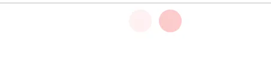
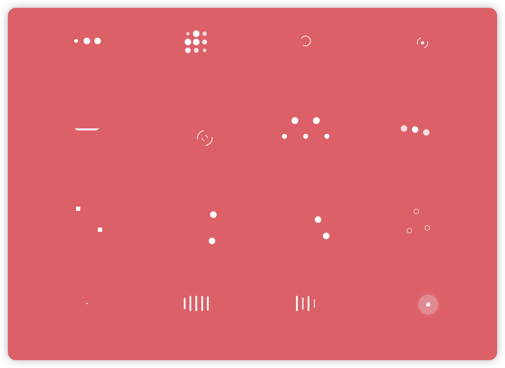
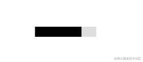
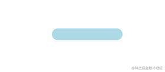
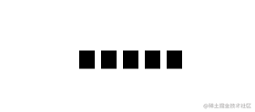
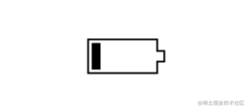
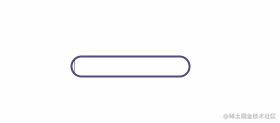
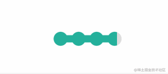
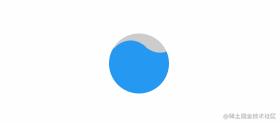

# loading 动画

## 目录

- [loading](#loading)
- [进度条](#进度条)
  - [平滑加载](#平滑加载)
  - [按步加载](#按步加载)
  - [条纹加载](#条纹加载)
  - [虚线加载](#虚线加载)
  - [电池加载](#电池加载)
  - [内嵌加载](#内嵌加载)
  - [珠链加载](#珠链加载)
  - [斑马线加载](#斑马线加载)
  - [水柱加载](#水柱加载)
  - [信号加载](#信号加载)

# loading

```typescript 
<!doctype html>
<html lang="en">
<head>
    <meta charset="UTF-8">
    <meta name="viewport"
          content="width=device-width, user-scalable=no, initial-scale=1.0, maximum-scale=1.0, minimum-scale=1.0">
    <meta http-equiv="X-UA-Compatible" content="ie=edge">
    <title>Document</title>
    <style>
        .loading {
            margin-left: auto;
            margin-right: auto;
            width: 30px;
            height: 30px;
            border-radius: 30px;
            background-color: transparent;
            animation: load 3s linear infinite;
        }
        @keyframes load {
            0% {
                box-shadow: -40px 0 0 rgba(250, 189, 189, 0),
                inset 0 0 0 15px rgba(250, 189, 189, 0),
                40px 0 0 rgba(250, 189, 189, 0);
            }
            30% {
                box-shadow: -40px 0 0 rgba(250, 189, 189, 1),
                inset 0 0 0 15px rgba(250, 189, 189, 0),
                40px 0 0 rgba(250, 189, 189, 0);
            }
            60% {
                box-shadow: -40px 0 0 rgba(250, 189, 189, 0),
                inset 0 0 0 15px rgba(250, 189, 189, 1),
                40px 0 0 rgba(250, 189, 189, 0);
            }
            100% {
                box-shadow: -40px 0 0 rgba(250, 189, 189, 0),
                inset 0 0 0 15px rgba(250, 189, 189, 0),
                40px 0 0 rgba(250, 189, 189, 1);
            }
        }
    </style>
</head>
<body>

<div class="loading"></div>
</body>
<script>

</script>
</html>

```




[使用 CSS3 实现超炫的 Loading（加载）动画效果 - 梦想天空（山边小溪） - 博客园 SpinKit 是一套网页动画效果，包含8种基于 CSS3 实现的很炫的加载动画。借助 CSS3 Animation 的强大功能来创建平滑，易于定制的动画。SpinKit 的目标不是提供一个每个浏览器 https://www.cnblogs.com/lhb25/p/loading-spinners-animated-with-css3.html](https://www.cnblogs.com/lhb25/p/loading-spinners-animated-with-css3.html "使用 CSS3 实现超炫的 Loading（加载）动画效果 - 梦想天空（山边小溪） - 博客园 SpinKit 是一套网页动画效果，包含8种基于 CSS3 实现的很炫的加载动画。借助 CSS3 Animation 的强大功能来创建平滑，易于定制的动画。SpinKit 的目标不是提供一个每个浏览器 https://www.cnblogs.com/lhb25/p/loading-spinners-animated-with-css3.html")

[28个纯css3 加载loading动画特效.zip](<https://github.com/scZhengChao/IT_Blogs/releases/download/assets-v1/28.css3.loading._IZHzuvwOxY.zip> " 28个纯css3 加载loading动画特效.zip")



# 进度条

为保证运行正常，咱先规定下：

```typescript 
* {
  box-sizing: border-box;
}
```


### 平滑加载



```typescript 
<div class="progress-1"></div>

.progress-1 {
  width:120px;
  height:20px;
  background: linear-gradient(#000 0 0) 0/0% no-repeat #ddd;
  animation:p1 2s infinite linear;
}
@keyframes p1 {
    100% {background-size:100%}
}

```


1. `linear-gradient(#000 0 0)` 你可以理解为 `linear-gradient(#000 0 100%)`，如果还不熟悉，复制 `linear-gradient(#000 0 50%, #f00 50% 0)` ，替换原先的部分跑一下。觉得 `linear-gradient(#000 0 0)` 别扭的话，直接写 `#000` 即可。
2. `0/0%` 是 `background-position: 0;/background-size: 0;` 的简写。

### 按步加载



```typescript 
<div class="progress-2"></div>
.progress-2 {
  width:120px;
  height:20px;
  border-radius: 20px;
  background:
   linear-gradient(orange 0 0) 0/0% no-repeat
   lightblue;
  animation:p2 2s infinite steps(10);
}
@keyframes p2 {
    100% {background-size:110%}
}

```


1. `steps(10)` 是 `step(10, end)` 的简写，指明刚开始没有，所以有**第2点**的处理
2. `100% {background-size:110%}` 添加多一个 `step` 的百分比，上面的 `step` 是 `10`，所以是`100% + (1/10)*100% = 110%`

### 条纹加载


```typescript 
<div class="progress-3"></div>
.progress-3 {
  width:120px;
  height:20px;
  border-radius: 20px;
  background:
   repeating-linear-gradient(135deg,#f03355 0 10px,#ffa516 0 20px) 0/0% no-repeat,
   repeating-linear-gradient(135deg,#ddd 0 10px,#eee 0 20px) 0/100%;
  animation:p3 2s infinite;
}
@keyframes p3 {
    100% {background-size:100%}
}
```


`repeating-linear-gradient(135deg,#ddd 0 10px,#eee 0 20px) 0/100%;` 画出灰色的斑马线条纹，`repeating-linear-gradient(135deg,#f03355 0 10px,#ffa516 0 20px) 0/0% no-repeat` 则是进度条加载的条纹。

### 虚线加载



```typescript 
<div class="progress-4"></div>
.progress-4 {
  width:120px;
  height:20px;
  -webkit-mask:linear-gradient(90deg,#000 70%,#0000 0) 0/20%;
  background:
   linear-gradient(#000 0 0) 0/0% no-repeat #ddd;
  animation:p4 2s infinite steps(6);
}
@keyframes p4 {
    100% {background-size:120%}
}

```


`-webkit-mask` 默认有值 `repeat`，不然遮罩不会有五个。

### 电池加载



```typescript 
<div class="progress-5"></div>
.progress-5 {
            width:80px;
            height:40px;
            border:2px solid #000;
            padding:3px;
            background:
                    repeating-linear-gradient(90deg,#000 0 10px,#0000 0 16px)
                    0/0% no-repeat content-box content-box;
            position: relative;
            animation:p5 2s infinite steps(6);
        }
        .progress-5::before {
            content:"";
            position: absolute;
            top: 50%;
            left:100%;
            transform: translateY(-50%);
            width:6px;
            height: 16px;
            border: 2px solid #000;
            border-left-color: white;;
        }
        @keyframes p5 {
            100% {background-size:120%}
        }

```


### 内嵌加载



```typescript 
<div class="progress-6"></div>
.progress-6 {
  width:120px;
  height:22px;
  border-radius: 20px;
  color: #514b82;
  border:2px solid;
  position: relative;
}
.progress-6::before {
  content:"";
  position: absolute;
  margin:2px;
  inset:0 100% 0 0;
  border-radius: inherit;
  background: #514b82;
  animation:p6 2s infinite;
}
@keyframes p6 {
    100% {inset:0}
}

```


`inset` 属性用作定位元素的 `top`、`right`、`bottom`、`left` 这些属性的简写。类似于 `margin` 和 `padding` 属性，依照“上右下左”的顺序。举个例子：

`inset:0 100% 0 0;` 右边内缩 `100%`，所以在 `keyframes` 部分需要将 `inset` 设置为 `0`。

### 珠链加载



```typescript 
<div class="progress-7"></div>
.progress-7 {
  width:120px;
  height:24px;
  -webkit-mask:
    radial-gradient(circle closest-side,#000 94%,#0000) 0 0/25% 100%,
    linear-gradient(#000 0 0) center/calc(100% - 12px) calc(100% - 12px) no-repeat;
  background:
   linear-gradient(#25b09b 0 0) 0/0% no-repeat
   #ddd;
  animation:p7 2s infinite linear;
}
@keyframes p7 {
    100% {background-size:100%}
}


```


遮罩 `-webkit-mask` 中 `radial-gradient` 是将宽度四等份，每份以最小 `closest-side` 的边为直径画圆。

### 斑马线加载


```typescript 
<div class="progress-8"></div>
.progress-8 {
  width:60px;
  height:60px;
  border-radius: 50%;
  -webkit-mask:linear-gradient(0deg,#000 55%,#0000 0) bottom/100% 18.18%;
  background:
   linear-gradient(#f03355 0 0) bottom/100% 0% no-repeat
   #ddd;
  animation:p8 2s infinite steps(7);
}
@keyframes p8 {
    100% {background-size:100% 115%}
}


```


对 `linear-gradient` 描绘的角度做调整，再加上蒙版。

### 水柱加载



```typescript 
<div class="progress-9"></div>
.progress-9 {    
  --r1: 154%;
  --r2: 68.5%;
  width:60px;
  height:60px;
  border-radius: 50%; 
  background:
    radial-gradient(var(--r1) var(--r2) at top ,#0000 79.5%,#269af2 80%) center left,
    radial-gradient(var(--r1) var(--r2) at bottom,#269af2 79.5%,#0000 80%) center center,
    radial-gradient(var(--r1) var(--r2) at top ,#0000 79.5%,#269af2 80%) center right,
    #ccc;
  background-size: 50.5% 220%;
  background-position: -100% 0%,0% 0%,100% 0%;
  background-repeat:no-repeat;
  animation:p9 2s infinite linear;
}
@keyframes p9 {
    33%  {background-position:    0% 33% ,100% 33% ,200% 33% }
    66%  {background-position: -100%  66%,0%   66% ,100% 66% }
    100% {background-position:    0% 100%,100% 100%,200% 100%}
}


```


radial-gradient 画出水平面的波动，就三个圆。var(--r1) 直接调用定义好的属性值。技能 get ...

### 信号加载

_PstgGzcsmb.gif> "  ")

```typescript 
<div class="progress-10"></div>
.progress-10 {
  width:120px;
  height:60px;
  border-radius:200px 200px 0 0;
  -webkit-mask:repeating-radial-gradient(farthest-side at bottom ,#0000 0,#000 1px 12%,#0000 calc(12% + 1px) 20%);
  background:
   radial-gradient(farthest-side at bottom,#514b82 0 95%,#0000 0) bottom/0% 0% no-repeat
   #ddd;
  animation:p10 2s infinite steps(6);
}
@keyframes p10 {
    100% {background-size:120% 120%}
}


```


用 `repeating-radial-gradient` 方法画出环状的蒙版遮罩。`radial-gradient` 从底部向上圆形渐变填充。
