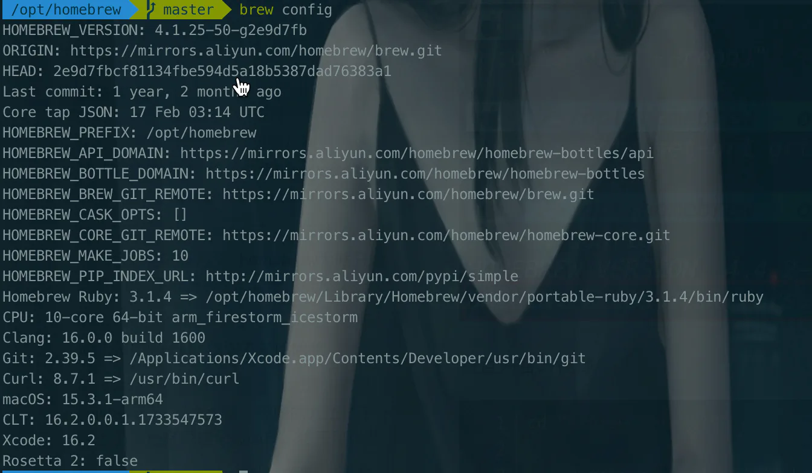

# Homebrew基本使用&#x20;

## 目录

- [查看当前配置](#查看当前配置)
- [安装卸载软件](#安装卸载软件)
- [升级软件相关](#升级软件相关)
- [清理相关](#清理相关)
- [brew update-reset](#brew-update-reset)

```javascript 
安装任意包
 brew install <packageName]]> 
brew install node

卸载任意包
 brew uninstall <packageName]]> 
brew uninstall git

查询可用包
 brew search <packageName]]>
 
查看已安装包列表
  brew list 

查看任意包信息¡
 brew info <packageName]]>
 
更新Homebrew
 brew update
 
查看Homebrew版本
 brew -v
 
Homebrew帮助信息
 brew -h 

brew outdated    # 查 看已安装的哪些软件包需要更新 

brew upgrade [name]    #  更新单个软件包 

brew home [name]    #  访问软件包官方站 

brew cleanup    #  清理所有已安装软件包的历史老版本 

brew cleanup [name]    # 清 理单个已安装软件包的历史版本 


```


# 查看当前配置

> brew config



# 安装卸载软件

1. `brew --version`或者`brew -v`显示`brew`版本信息
2. `brew install <formula>`安装指定软件
3. `brew uninstall <formula>`卸载指定软件
4. `brew list`显示所有的已安装的软件
5. `brew search text`搜索本地远程仓库的软件，已安装会显示绿色的勾
6. `brew search /text/`使用正则表达式搜软件
7. `brew info <formula>`显示指定软件信息
8. `brew reinstall <formula>`重新安装指定软件，先卸载后安装
9. `brew install <formula> --build-from-source`源码安装指定软件，可以给定指定参数
10. `brew commands`列出所有可用命令

# 升级软件相关

1. `brew update`自动升级 homebrew （从 github 下载最新版本）
2. `brew outdated`检测已经过时的软件
3. `brew upgrade`升级所有已过时的软件，即列出的以过时软件
4. `brew upgrade <formula>`升级指定的软件
5. `brew pin <formula>`禁止指定软件升级
6. `brew unpin <formula>`解锁禁止升级
7. `brew upgrade --all`升级所有的软件包，包括未清理干净的旧版本的包
8. `brew edit <formula>`编辑软件，不会的情况下慎用
9. `brew tap`列出本地资源仓库，其中 homebrew 是默认仓库，其它都是第三方仓库
10. `brew tap <user/repo>`添加第三方仓库，命名的规则按照 github 来定的。[使用](https://links.jianshu.com/go?to=https://docs.brew.sh/Taps "使用")
11. `brew untap <user/repo>`删除仓库
12. `brew deps <formula>`查看指定软件依赖于哪些软件
13. `brew uses <formula>`查看指定软件被哪些软件所依赖

# 清理相关

`homebrew`再升级软件时候不会清理相关的旧版本，在软件升级后我们可以使用如下命令清理

1. `brew cleanup -n`列出需要清理的内容
2. `brew cleanup <formula>`清理指定的软件过时包
3. `brew cleanup`清理所有的过时软件
4. `brew unistall <formula>`卸载指定软件
5. `brew unistall <fromula> --force`彻底卸载指定软件，包括旧版本

# brew update-reset

macOS Sonoma 的升级可能导致 `Homebrew` 识别新系统版本时出现兼容性问题，具体表现为“`unknown or unsupported macOS version: :dunno`”错误。经过进一步调查，社区发现该问题可以通过重置 `Homebrew` 解决。

通过参考 `Homebrew` 官方社区的讨论（[来源](https://github.com/orgs/Homebrew/discussions/941 "来源")），可以发现`brew update-reset`是一个行之有效的解决方案。此命令用于将 `Homebrew` 恢复到稳定版本，能够有效处理因系统升级导致的兼容性问题。

1. 运行`brew update-reset`在终端中执行以下命令，将 **Homebrew 重置到官方的稳定版本**：

   &#x20;该命令会将 Homebrew 的本地存储库恢复到与远程存储库一致的状态，移除任何本地更改。这一过程类似于“重启 Homebrew”，是修复较大问题时的一种有效方法。
2. **运行**\*\*`brew doctor`检查其他问题\*\*如果问题仍未解决，可以使用`brew doctor`检查系统环境和配置中的潜在问题，并根据提示进行修复。`brew doctor`**是 Homebrew 内置的自我诊断工具，通常可以帮助识别出导致错误的根本原因。**
3. 完成更新：运行`brew update`最后，使用`brew update`命令来更新 Homebrew 并确保所有组件都已是最新版本。这样可以进一步避免出现与 macOS 新版本不兼容的问题。

- **Q1：为何 macOS 升级后 Homebrew 出现问题？** A1：macOS 升级会导致系统环境发生变化，Homebrew 可能无法立即适配最新的系统版本，因此会出现报错。
- \*\*Q2：`brew update-reset`是否会丢失已安装的软件包？\*\*A2：`brew update-reset`主要作用于 Homebrew 自身的配置和版本，不会影响用户已安装的软件包。
- **Q3：如何预防 Homebrew 与 macOS 新版本的不兼容？** A3：建议在每次系统升级前，先查看 Homebrew 社区的支持情况，确保相关兼容性问题已被解决。

当 macOS 进行大版本更新后，可能会对 Homebrew 的正常使用产生影响。使用`brew update-reset`能够有效修复 Homebrew 报错问题，帮助用户快速恢复软件包管理的便捷体验。如果遇到系统升级后的报错，按照上述步骤操作便可解决问题。
