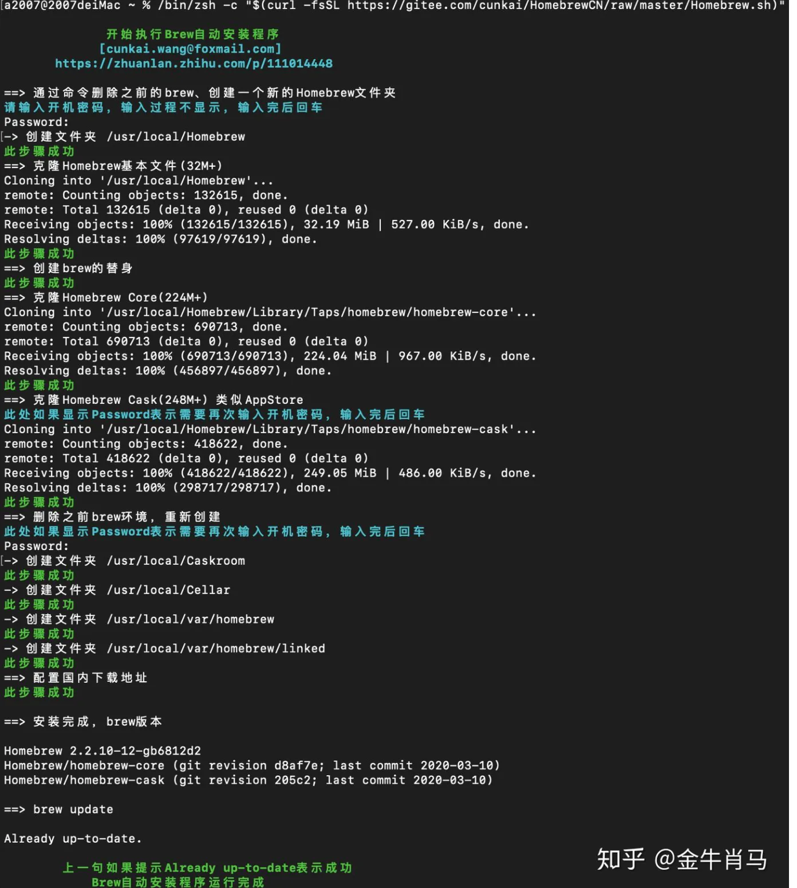

# 安装和使用

## 目录

- [Homebrew安装 ](#Homebrew安装-)
  - [1. 要求 ](#1-要求-)
  - [2. 安装和卸载 ](#2-安装和卸载-)
  - [国内安装实践](#国内安装实践)
- [注意 ](#注意-)

参考资料：

[Homebrew国内如何自动安装（国内地址） 如果你是提示来这个页面查看错误，说明你用的脚本太老了，用下面脚本安装。自动脚本(全部国内地址)（在终端中复制粘贴回车下面脚本) 苹果电脑 常规安装脚本（推荐 完全体 几分钟安装完成）：/bin/zsh -c \&#34;\$(cu… https://zhuanlan.zhihu.com/p/111014448](https://zhuanlan.zhihu.com/p/111014448 "Homebrew国内如何自动安装（国内地址） 如果你是提示来这个页面查看错误，说明你用的脚本太老了，用下面脚本安装。自动脚本(全部国内地址)（在终端中复制粘贴回车下面脚本) 苹果电脑 常规安装脚本（推荐 完全体 几分钟安装完成）：/bin/zsh -c \&#34;\$(cu… https://zhuanlan.zhihu.com/p/111014448")

[Homebrew介绍和使用 一、Homebrew是什么 Homebrew是一款Mac OS平台下的软件包管理工具，拥有安装、卸载、更新、查看、搜索等很多实用的功能。简单的一条指令，就可以实现包管理，而不... https://www.jianshu.com/p/de6f1d2d37bf](https://www.jianshu.com/p/de6f1d2d37bf "Homebrew介绍和使用 一、Homebrew是什么 Homebrew是一款Mac OS平台下的软件包管理工具，拥有安装、卸载、更新、查看、搜索等很多实用的功能。简单的一条指令，就可以实现包管理，而不... https://www.jianshu.com/p/de6f1d2d37bf")

[ MacBook使用笔记：安装Homebrew（M1） 作者 ｜ 公众号：程序员的一天一、Homebrew是什么？Homebrew官网： 英文： https://brew.sh 中文： https://brew.sh/index\_zh-cnHomebrew是MacOS（或 Linux）的软件包管理器。 通过它，我们可以方便的对Mac上的各… https://zhuanlan.zhihu.com/p/372576355](https://zhuanlan.zhihu.com/p/372576355 " MacBook使用笔记：安装Homebrew（M1） 作者 ｜ 公众号：程序员的一天一、Homebrew是什么？Homebrew官网： 英文： https://brew.sh 中文： https://brew.sh/index_zh-cnHomebrew是MacOS（或 Linux）的软件包管理器。 通过它，我们可以方便的对Mac上的各… https://zhuanlan.zhihu.com/p/372576355")

# Homebrew安装&#x20;

## 1. 要求&#x20;

- Intel CPU&#x20;
- OS X 10.9 or higher&#x20;
- Xcode命令行工具&#x20;

xcode-select --install&#x20;

- 支持shell (sh或者bash)&#x20;

一般Mac 都支持

## 2. 安装和卸载&#x20;

- 安装

```bash 
/bin/zsh -c "$(curl -fsSL https://gitee.com/cunkai/HomebrewCN/raw/master/Homebrew.sh)"
```


- 卸载

```bash 
/bin/zsh -c "$(curl -fsSL https://gitee.com/cunkai/HomebrewCN/raw/master/HomebrewUninstall.sh)"
```




## 国内安装实践

1. gitee

```javascript 
/bin/zsh -c "$(curl -fsSL https://gitee.com/cunkai/HomebrewCN/raw/master/Homebrew.sh)"

```


回车执行指令后，根据提示操作。具体包括以下提示操作：

**（1）选择下载镜像**

根据需要选择下载源，例如，我这里选择中科大下载源，就输入‘1’，回车。


**（2）确认删除旧版本**

如果存在旧版本，会弹出删除旧版本提示，输入"Y"，回车。


**（3）输入开机密码（用于mac确认第三方应用安装）**

**（4）安装git**

如果之前没有安装过git，会终止homebrew安装，弹出git安装提示，点击“安装”。


**（5）再次执行homebrew安装指令**

耐心等待git安装完成后，再次运行homebrew安装指令，重新根据提示操作即可。

安装需要一段时间，过程中，可以在终端看到脚本执行了那些操作。


**（6）验证是否安装成功**

安装脚本执行完成后，重启终端。（重启后才生效）

通过在终端输入"brew -v"，可以查看homebrew版本。

如果正确输出版本信息，表示成功安装。

> 虽然叫做'Homebrew'，但实际使用时，命令是'brew'。

> 在M1芯片上，homebrew的安装路径为："/opt/Homebrew/"

```javascript 
qiuxiannv@qiuxiannvdeMBP ~ % brew -v

Homebrew 3.1.7-42-gd45832b
Homebrew/homebrew-core (git revision 09d1a8b385; last commit 2021-05-15)
Homebrew/homebrew-cask (git revision c1dad4a5cf; last commit 2021-05-15)
qiuxiannv@qiuxiannvdeMBP ~ % 
```


# 注意&#x20;

在Mac OS X 10.11系统以后，/usr/local/等系统目录下的文件读写是需要系统root权限的，以往的Homebrew安装如果没有指定安装路径，会默认安装在这些需要系统root用户读写权限的目录下，导致有些指令需要添加sudo前缀来执行，比如升级Homebrew需要：&#x20;

```javascript 
$  sudo brew update 
```


如果你不想每次都使用sudo指令，你有两种方法可以选择:&#x20;

1. 对/usr/local 目录下的文件读写进行root用户授权&#x20;

```html 
$ sudo chown -R $USER /usr/local  
示例： 
 $ sudo chown -R gaojun /usr/local 
```


1. （推荐）安装Homebrew时对安装路径进行指定，直接安装在不需要系统root用户授权就可以自由读写的目录下&#x20;

```bash 
<install path> -e "$(curl -fsSL https://raw.githubusercontent.com/Homebrew/install/master/install)" 
```


[Brew换源](./Brew换源/index.md "Brew换源")

[镜像](../../../终端服务/镜像.md "镜像")

## 子目录与文章

- [镜像](./镜像/index.md)
