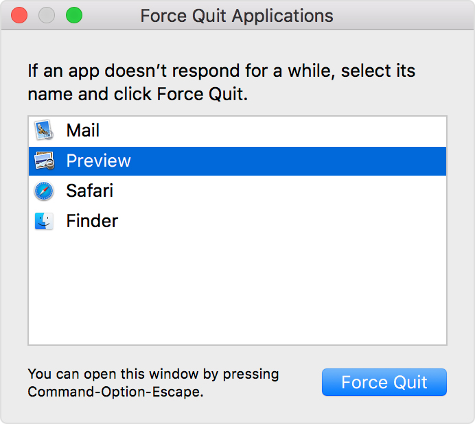

# 优雅的使用Mac

## 目录

- [mac touchBar 调出 F12](#mac-touchBar-调出-F12)
- [聚焦搜索](#聚焦搜索)
- [切换桌面](#切换桌面)
- [切换全屏](#切换全屏)
- [非全屏状态下最小化](#非全屏状态下最小化)
- [关闭和退出](#关闭和退出)
- [删除文件](#删除文件)
- [截图](#截图)
- [快速锁屏](#快速锁屏)
- [访达前往服务器](#访达前往服务器)
- [显示隐藏文件：](#显示隐藏文件)
- [查看ip](#查看ip)
- [图片预览：](#图片预览)
- [快速行首行尾](#快速行首行尾)
- [卸载App:](#卸载App)
- [Mac 三指拖拽 ：](#Mac-三指拖拽-)
- [如何强制退出 App](#如何强制退出-App)
- [Mac生产ssh key](#Mac生产ssh-key)
- [操作废纸篓](#操作废纸篓)
- [配置 hosts](#配置-hosts)
- [打开新页面](#打开新页面)

# mac touchBar 调出 F12

偏好设置--键盘—功能键 --添加app    可以优雅的在使用各种app时 出现F1-F12

# 聚焦搜索

- command +  space

# 切换桌面

- commond + tab 
- control + 左/右 箭头

# 切换全屏

- command + control + F   放大缩小

# 非全屏状态下最小化

- Command+M  最小化

# 关闭和退出

Command + W 关闭当前的软件窗口（软件并没有真正退出进程），相当于点了左上角的红色叉叉。

Command + Q 真正退出软件。

Command + option + esc 强制退出某个软件。通常在软件无响应时使用。

# 删除文件

Command + delete 删除，把文件移至废纸篓

Option + Shift + Command + Delete 是不经确认倾倒废纸篓

# 截图

Command + Shift + 4 截取所选屏幕区域到一个文件　　

Command + Shift + 3 截取全部屏幕到文件　　

Command + Shift + Control + 3 截取全部屏幕到剪贴板　　

Command + Shift + 4 截取所选屏幕区域到一个文件，或按空格键仅捕捉一个窗口　　

Command + Shift + Control + 4 截取所选屏幕区域到剪贴板，或按空格键仅捕捉一个窗口

# 快速锁屏

- control+cmmand+q 
- window  window+L

# 访达前往服务器

- command + k
- 终端打开文件件  open   /

# 显示隐藏文件：

- shift + cmmand + . 

# 查看ip

1. 终端 ： ifconfig | grep "inet"
2. option + 右键wify

# 图片预览：

- 空格 或者 shift+空格

# 快速行首行尾

- Ctrl + S 到行首
- Ctrl + E 到行尾

# 卸载App:

1. 按住 Option (⌥) 键，或者点按并按住任意 App，直到 App 开始晃动。
2. 点按要删除的 App 旁边的 ，然后点按“删除”进行确认。这个 App 将立即被删除。 没有显示  的 App 要么并非来自 App Store，要么就是 Mac 的必备 App。要删除并非来自 App Store 的 App，请改用“访达”。
3. 在访达/应用程序中找到App，将这个 App 拖移到“废纸篓”，或者选择这个 App，然后选取“文件”>“移到废纸篓

# Mac 三指拖拽 ：

- 辅助功能==》指针控制===〉触控板选项==》启动拖移===〉三指拖移

# 如何强制退出 App

- options + command + esc
- 屏幕左上角的苹果菜单  中选取“强制退出”

然后，在“强制退出”窗口中选择相应的 App 并点按“强制退出”。

# Mac生产ssh key

ssh-keygen -t rsa -C ["your\_email@example.com](mailto:"your_email@example.com "\"your_email@example.com")” 然后一直回车就可以了

[参考这边文章就](https://blog.csdn.net/lwb102063/article/details/70157649 "参考这边文章就")行了

# 操作废纸篓

- 将某个项目直接删除至废纸篓 command + del
- 从废纸篓中恢复某项目 command + delete  或者右键
- 清空废纸篓 ：   Shift+ command + delete
- 强制清空废纸篓（无警告） shift + option/alt + command + delete

# 配置 hosts

1. sudo -s

输入本机密码

1. sudo vi /etc/hosts
2. 按i
3. 输入想要配置的host
4. 按esc退出编辑
5. 输入:wq保存修改（:q!不保存修改）退出

或者直接下载软件ihost

比如：访问github 太慢：掉过 域名dns解析ip 这一步 亲测有效 

通过网址： [https://www.ipaddress.com](https://www.ipaddress.com "https://www.ipaddress.com")  获取ip

配置：

140.82.114.4 [github.com](http://github.com "github.com")

199.232.5.194 [github.global.ssl.fastly.net](http://github.global.ssl.fastly.net "github.global.ssl.fastly.net")

远程ip :        访问域名

# 打开新页面

command + 鼠标点击  新标签打开页面

command + shift + 鼠标点击 ；新标签打开页面 并切换到新页面
