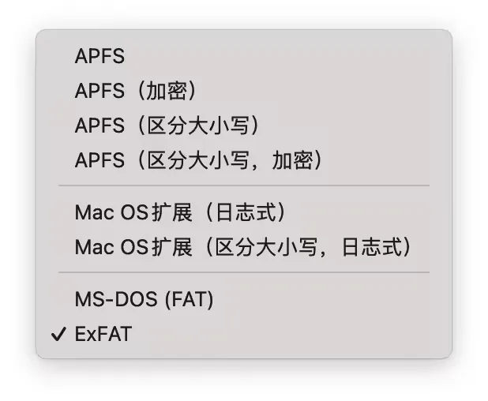

# 文件格式选择

## 目录

- [为什么Mac无法删除移动硬盘上的文件？](#为什么Mac无法删除移动硬盘上的文件)
- [怎样查看外置设备的文件格式？](#怎样查看外置设备的文件格式)
- [如何格式化](#如何格式化)
- [兼容模式 ](#兼容模式-)
- [通过软件实现“兼容模式”](#通过软件实现兼容模式)
- [建议](#建议)

## **为什么Mac无法删除移动硬盘上的文件？**

苹果官方对`NTFS`格式设备的使用进行了限制，也即，**移动硬盘在Mac电脑上可以被识别被读取，但是无法对移动硬盘进行操作。**

而Windows则是支持NTFS、ExFat、Fat

（1）APFS：macOS 10.13 及后续版本使用的文件系统。在确保可靠性的基础上优化性能，该系统的核心为增加了加密功能。为固态硬盘优化，现为配备固态硬盘的 Mac 电脑的默认文件系统。 

（2）Mac OS 扩展（日志式 HFS+ Plus）：macOS 10.12 或之前版本使用的文件系统，16年之前的格式。

在macOS自带的磁盘工具中分别提供了这两种方案的加密模式和区分大小写模式。

是否区分大小写取决于使用用途，比如安装Adobe软件到移动硬盘上要求使用没有区分大小写的模式。

APFS 基本上在所有方面都快得多——数据处理、复制和粘贴都更快，并且是现在时间机器的默认格式。但APFS对于旧版本macOS的兼容性较差。

## **怎样查看外置设备的文件格式？**

在电脑上连接外置设备并成功被识别后，在弹出的设备中右键点击属性，当属性窗口弹出后，选择常规选项卡，我们可以看见它的文件系统是什么格式。

**mac：显示简介**

# 如何格式化

**若第一次格式化没有你想选的模式；可以进行第二次看看；就有了**

[ 如何让Mac和Windows都兼容！一招解决硬盘格式问题-DOIT 相信很多用户都会苦恼，为什么有的移动硬盘插在Mac上有反应，但是插在Windows上就没反应，或者情况可能是反过来的，插在Windows上有反应但是插在Mac上 https://www.doit.com.cn/p/437334.html](https://www.doit.com.cn/p/437334.html " 如何让Mac和Windows都兼容！一招解决硬盘格式问题-DOIT 相信很多用户都会苦恼，为什么有的移动硬盘插在Mac上有反应，但是插在Windows上就没反应，或者情况可能是反过来的，插在Windows上有反应但是插在Mac上 https://www.doit.com.cn/p/437334.html")

**MacOS端修改硬盘格式**

1、将硬盘连接Mac，然后使用command+空格键打开搜索框，并搜索磁盘工具

2、选择木星10，并点击右上角的抹掉

3、选择ExFat后，点击抹掉，格式化就完成了

4、ExFat是可以正常拷贝文件的，说明格式化成功

# 兼容模式&#x20;

（1）Fat32格式：可以在任何操作系统平台上使用，但只支持最大单文件大小容量为4GB，因此日常使用没有问题，只有在传输大文件时才会显现出缺点。

（2）ExFAT文件是微软自家创建的用来取代FAT32文件格式的新型文件格式，它最大可以支持1EB的文件大小，非常适合用来存储大容量文件，还可以在Mac和Windows操作系统上通用。最大的缺点是没有文件日志功能，这样就不能记录磁盘上文件的修改记录，同样正因为如此，ExFat会出现文件“丢失”的风险的。 

# 通过软件实现“兼容模式”

Windows上读写macOS格式移动硬盘： Paragon HFS+ 和 MacDrive

MacOS上读写NTFS格式移动硬盘：omi NTFS磁盘管理助手 和 Mounty

纯macOS用户：电脑磁盘使用APFS（不要更改！！！），移动硬盘使用APFS格式（若移动硬盘不支持则使用macOS拓展格式）

# 建议

MacOS+Windows用户：重要数据使用APFS或macOS拓展格式，在两种操作系统中交换文件的磁盘使用ExFAT格式。

macOS用户使用新移动硬盘前先使用系统自带的磁盘工具进行“抹掉”操作&#x20;
