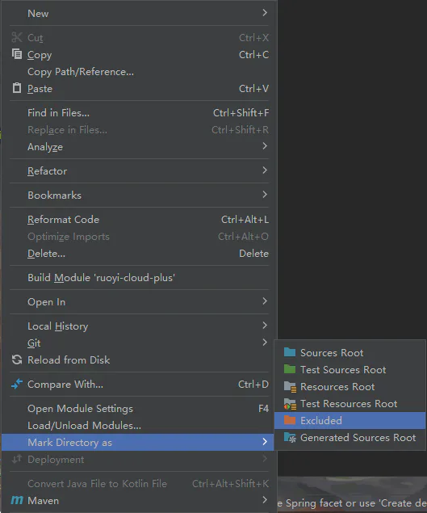
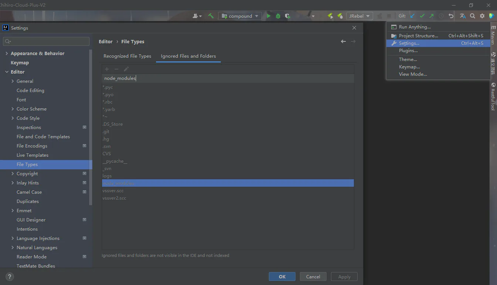

# IDEA

## 目录

- [IDEA忽略node\_modules减少内存消耗，提升索引速度](#IDEA忽略node_modules减少内存消耗提升索引速度)
  - [1.1忽略node\_modules](#11忽略node_modules)
  - [1.2 忽略文件夹](#12-忽略文件夹)
  - [1.3 修改项目.iml 文件](#13-修改项目iml-文件)

java的开发工具；前端也可以用

# IDEA忽略node\_modules减少内存消耗，提升索引速度

#### 1.1忽略node\_modules

- `node_modules` 文件夹右键，`Mark Directory as`，`Excluded`。



#### 1.2 忽略文件夹

- `File`，`Settings`，`Editor`，`File Types`，`node_modules`设置为忽略文件夹。



#### 1.3 修改项目.iml 文件

`excludeFolder` 是 IntelliJ IDEA 或 WebStorm 等 JetBrains IDE 中的一个配置项，用于指定在项目中排除的文件夹。`url="file://$MODULE_DIR$/node_modules"` 表示将 `node_modules` 文件夹排除在项目索引之外。

- 文件在项目根目录下`.idea/项目文件名.xml`

```xml 
<?xml version="1.0" encoding="UTF-8"?>
<module  type="WEB_MODULE"  version="4">
  <component name="NewModuleRootManager" inherit-compiler-output="true">
    <exclude-output />
    <content url="file://$MODULE_DIR$" />
     <excludeFolder url="file://$MODULE_DIR$/node_modules" />
</content>
    <orderEntry type="inheritedJdk" />
    <orderEntry type="sourceFolder" forTests="false" />
  </component>
</module>
```


[插件](../../前端工程/动画/GSAP/插件/index.md "插件")
