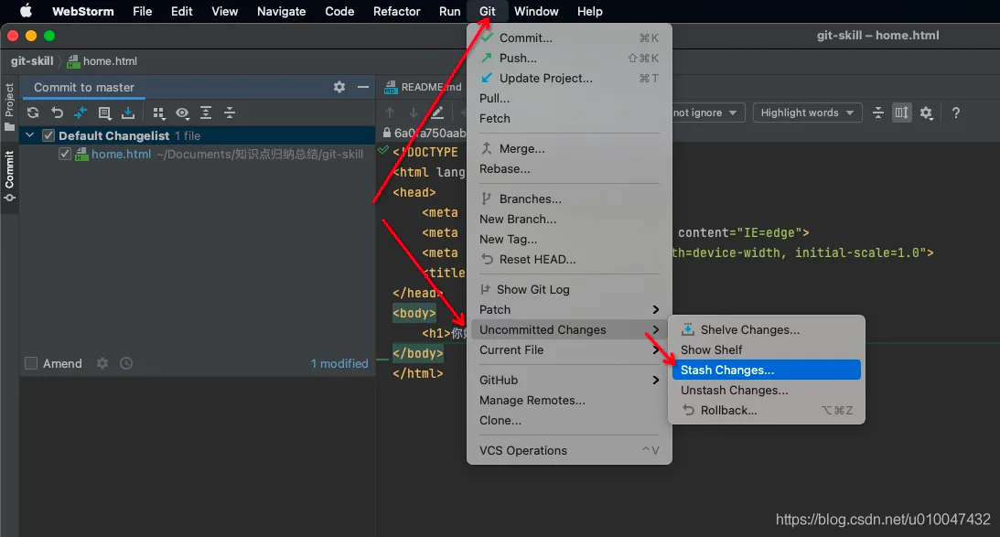
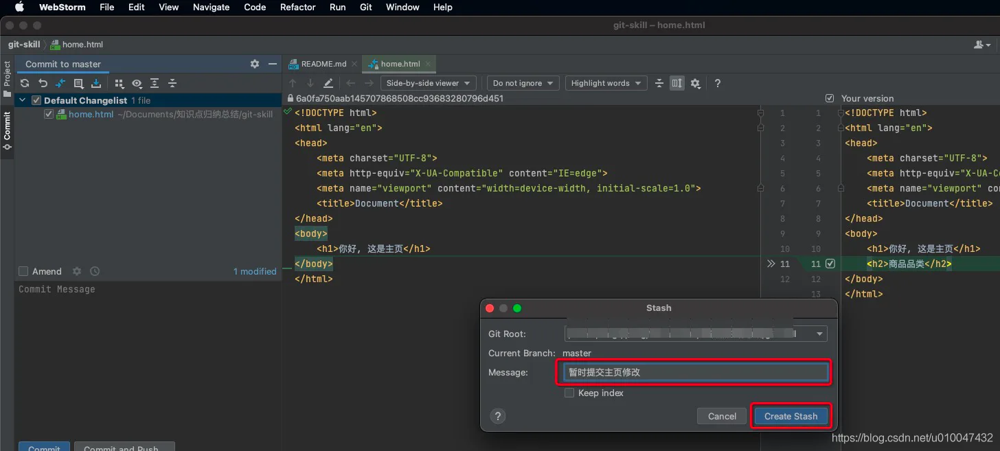
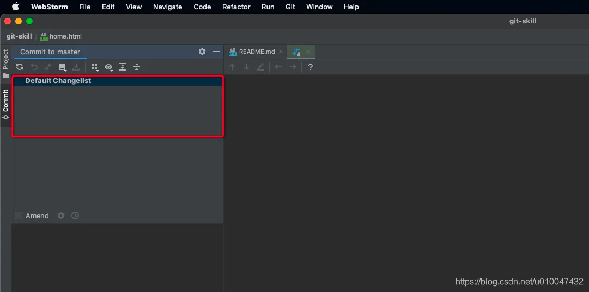
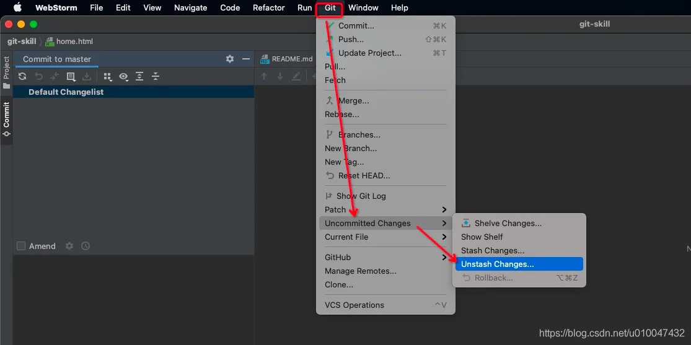
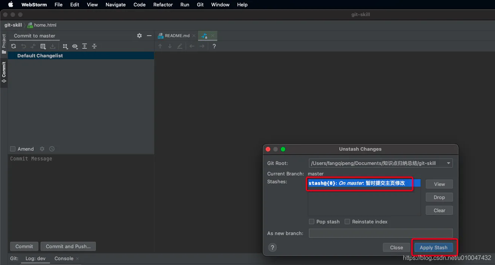
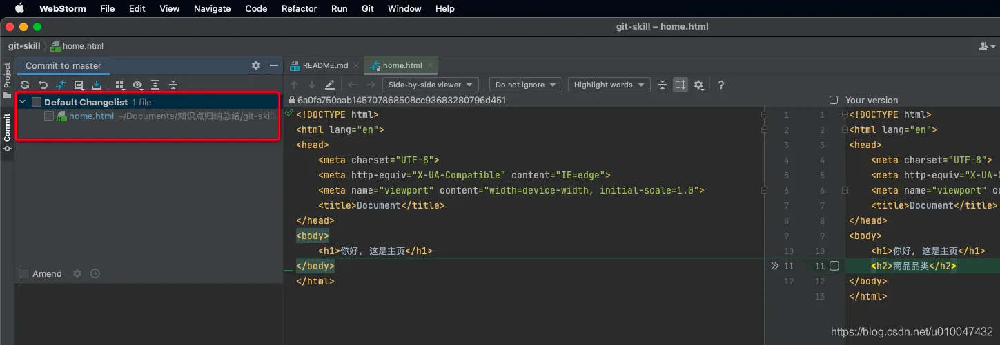
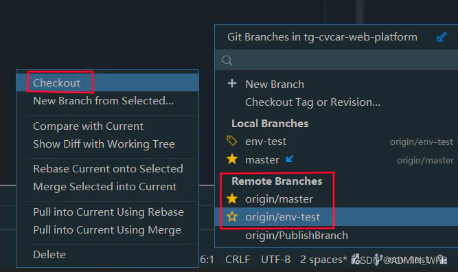
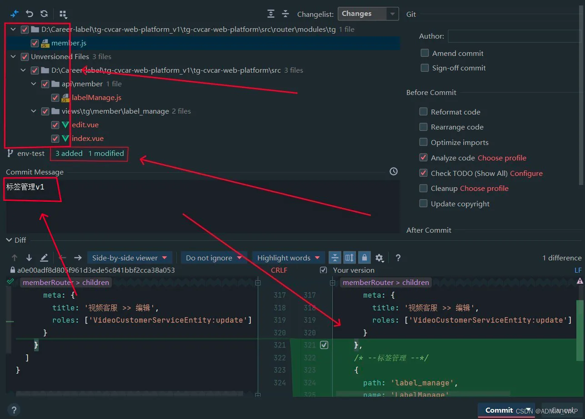
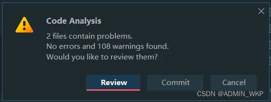

# git使用小技巧

## 目录

- [怎么使用stash](#怎么使用stash)
- [切换分支](#切换分支)
- [更新代码和上传代码至远程仓库](#更新代码和上传代码至远程仓库)

### 怎么使用stash

> 开发过程中，我们可能会面临时这种情况：正在A分支上进行功能的开发迭代，这时，同事向你反馈说B分支上有个bug需要紧急修改，如果这个时候你的代码没有暂存或提交至本地仓库，git是不允许切换的，因为未提交文件可能与目标分支文件存在冲突。要想能够顺利切换分支，有两种方法：
>
> 1、将A分支上的修改提交至本地仓库，但不提交至远程，等从B分支切回A分支的时候，在进行提交回退，即：git reset HEAD\~1，这样A分支上就不存在临时的提交记录
>
> 2、利用git stash将A分支上的修改提交至暂存区（git分为工作区、暂存区、本地仓库、远程仓库四个区域），这里着重说下webstorm下如何使用stash功能，过程如下图：

当我们在B分支上修改完成，切换到A分支，该如何调取先前的那些被改动过的文件

## [切换分支](https://so.csdn.net/so/search?q=切换分支\&spm=1001.2101.3001.7020 "切换分支")

这里公司有要求分支的话需要切换一下对应的分支防止上传错远程仓库，切换分支在webStorm编辑器的右下角方向然后选择对应的分支即可.........

## 更新代码和上传代码至远程仓库

使用过webStorm编辑器的人都知道这个编辑器的右上角有三个这样子的图标，对应的用法如下：

- **第一个向下的蓝色箭头** 等同于     **Git => Update Project**，
- **第二个绿色打钩图标** 等同于     **Git => Commit**，
- **第三个向上的绿色箭头** 等同于     **Git => push**，

如下图：

公司里面是多人进行项目开发，所以就需要我们及时Update Project代码，我们只要点击**蓝色向下箭头**或者是 **Git => Update Project**进行更新，更新好右下角会有提示弹窗

上传就是**中间的绿色打钩图标**或者是**Git => Commit**，点击以后就会出现这一样式的弹框我们需要注意的是有红色标记的地方！

- 标记1中有打\*\*红色√**的是我们选中上传的代码，不需要上传的代码就不需要**√\*\*选中
- 标记2中写着 **3 added  1 moditied**就是三个新增文件一个更改文件所以提交前需要确认
- 标记3是我们改进代码或者是更新代码的描述
- 标记4中就是选中上传的代码新增或者是更改的地方

我们这四步都确认好了就可以点**Commit**了，它会提示我们一些警告和错误我们可以不管再点一次commit就好了，如下图：

这步完成后我们的代码并没有上传到远程仓库我们还需要最后一步就是点击最后的一个**绿色的向上箭头**图标或者是**Git => push**这才真正意义上完成Git上传！！！！
