# GitLens

## 目录

- [准备工作](#准备工作)
- [开始使用](#开始使用)
  - [加入暂存区，和取消修改操作](#加入暂存区和取消修改操作)
  - [取消暂存区，取消add操作](#取消暂存区取消add操作)
  - [加入到本地分支，提交到远程](#加入到本地分支提交到远程)
  - [提交记录](#提交记录)
  - [远程被修改提示](#远程被修改提示)
  - [分支合并](#分支合并)
  - [分支创建](#分支创建)
    - [创建本地分支](#创建本地分支)
    - [从本地创建对应的远程分支](#从本地创建对应的远程分支)
  - [功能管理](#功能管理)
  - [所有分支记录](#所有分支记录)
  - [工作区暂存](#工作区暂存)

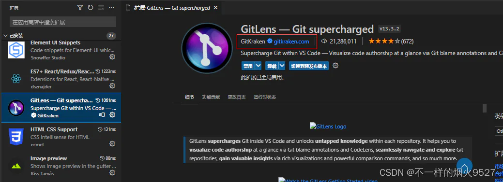

1. 简化git操作
2. 每行代码的末尾，都会公开最后一次提交的作者、时间、信息。鼠标悬停在这些注释上显示更多详细信息 &#x20;

   

#### 准备工作

1、VS code 内进行下载，下载之后如下：

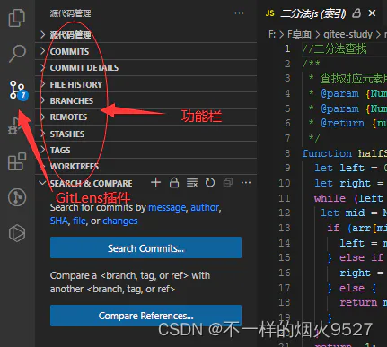

2、确保在分支上以后，可以开始工作 （查看分支显示及分支切换，带有origin是远程分支，选择远程分支会显示对应的本地分支）：

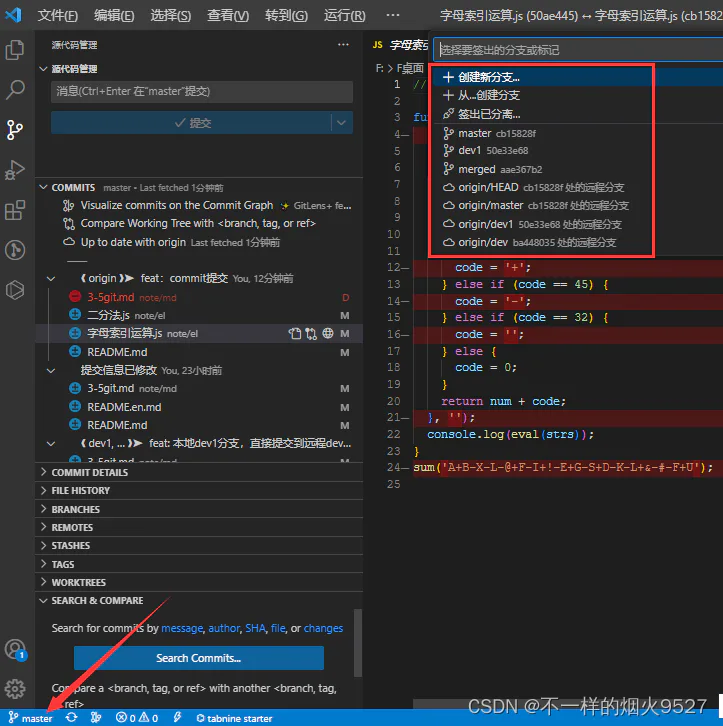

#### 开始使用

##### 加入暂存区，和取消修改操作

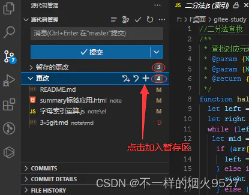

- 徽标，3和4分别指`暂存文件数量`和`待加入暂存的数量`
- **点击更改栏 “+”，将**\*\*`所有改动`\*\***加入到 “暂存的更改”（缓冲区）**
- **点击文件 “+”，仅添加相应的文件到缓冲区**
- `“+” 旁边的返回键`是撤销所有文件所有修改
- 同理，是撤销单个文件所有修改

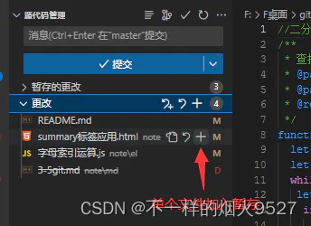

##### 取消暂存区，取消add操作

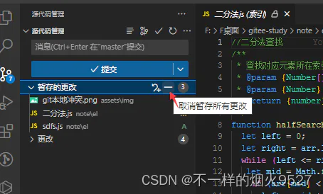

- 上图 “—” 取消所有暂存
- 同理，移到文件上，“—” 取消单个文件暂存
- 取消文件中部分修改

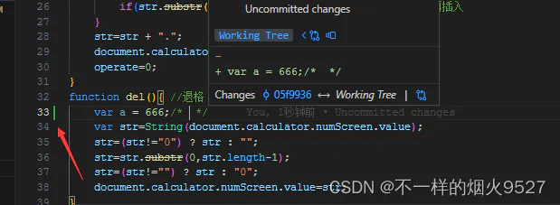

做了修改的文件左侧会有如上显示，可以进行部分单独操作，（加入暂存的文件不会有），点击后显示如下：分别加入暂存、取消修改、上下一个更改及关闭

##### 加入到本地分支，提交到远程

保所有修改都添加到 “暂存的更改”（缓冲区）

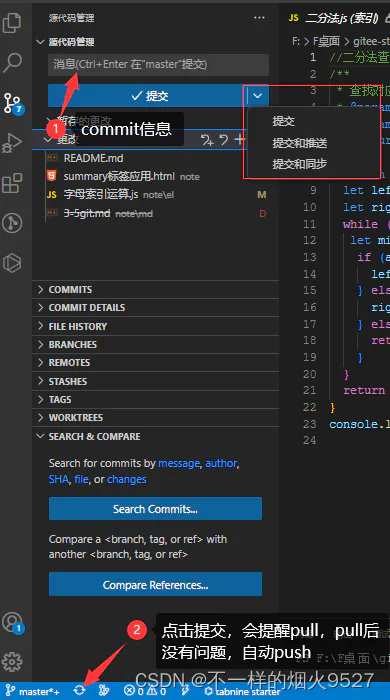

- 一步，消息栏输入提交信息，点击提交 （到本地仓库）
- 执行第二步，同步，会提醒先pull，有冲突需要先处理，没有自动push

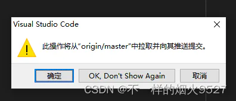

- 下拉列提交：表示仅加入本地仓库操作
- 提交和推送：是commit 后直接 push 如果远程仓库有其他人员提交过，会导致失败。
- 提交和同步：是commit 后先提醒pull，没问题才 push。

##### 提交记录

提交到远程仓库以后，可以在COMMITS 功能栏看到提交记录

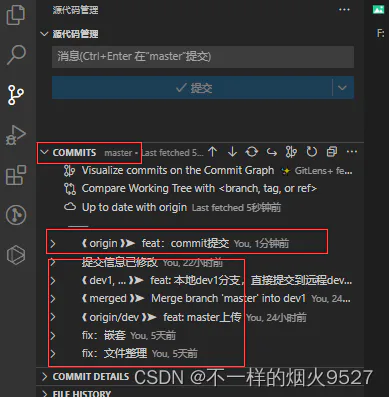

点击其中一条提交记录

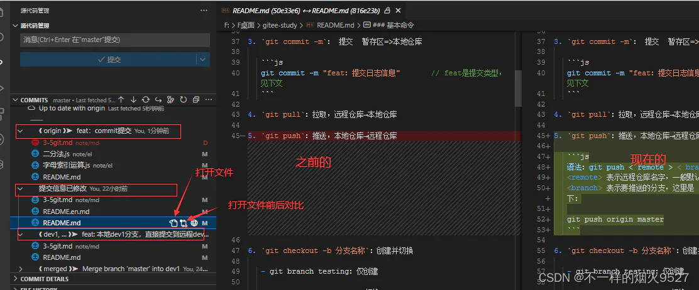

- 鼠标移动到对应文件上，可以打开文件、查看对比、圆形网络图标是链接到GitLens的github[介绍](https://github.com/gitkraken/vscode-gitlens#remote-provider-integration-settings- "介绍")
- 打开对比，可以看到修改内容，根据背景颜色判断修改的时间长度，越深表示修改的越早，越远

##### 远程被修改提示

每隔一段时间会自动检测远程是否有提交 &#x20;
最近一次检测，两分钟之前

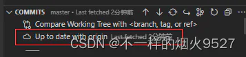

同时提交信息出也有提示，↓ 表示有其他人提交，可以pull，↑ 表示可提交数

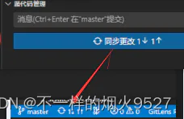

##### 分支合并

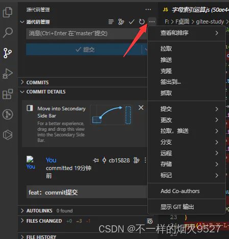

选择要合并到当前分支的其他分支

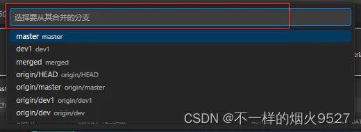

也可以提交合并请求，由其他人处理，一般很少这样做

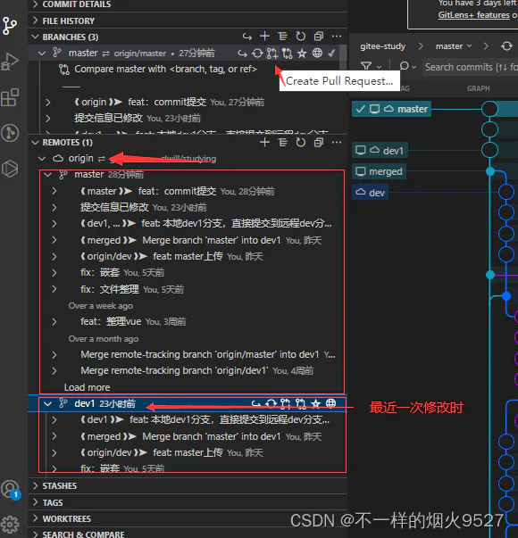

##### 分支创建

###### 创建本地分支

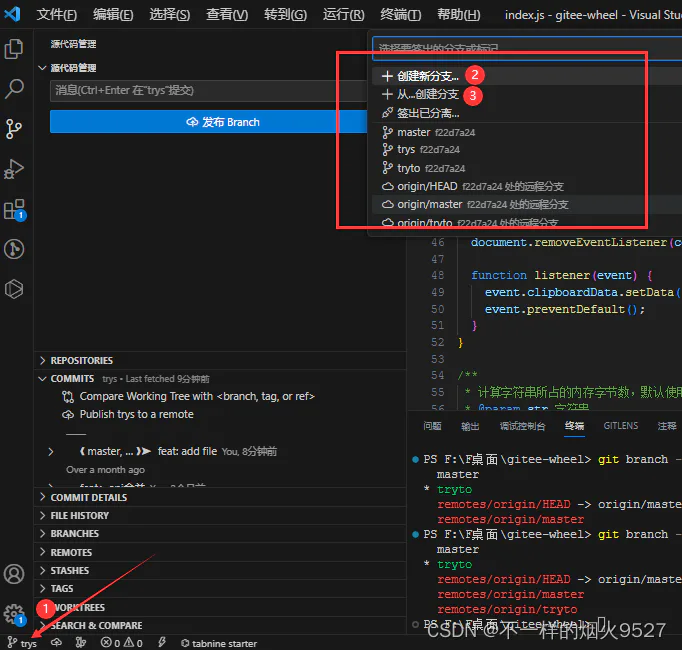

- 点击①处后显示如上输出框，输入分支名后，默认从mater分支行创建本地分支
- 点击③处，可以选择从指定分支创建本地分支

###### 从本地创建对应的远程分支

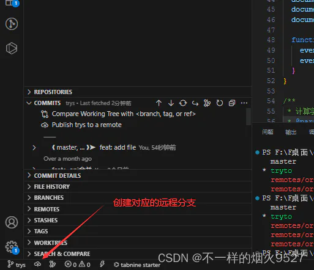

- 点击如上标识，将创建和本地名字一样的远程分支

##### 功能管理

GitLens有很多功能栏，平时用的很少，可以对功能栏显示做配置：

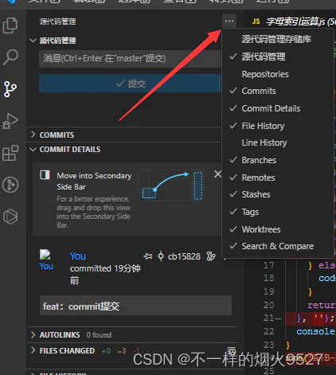

##### 所有分支记录

源代码管理，分支图标

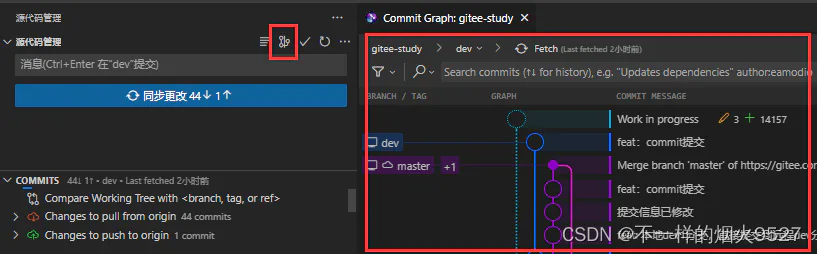

进行变基操作（将分支提交记录整理为线性）

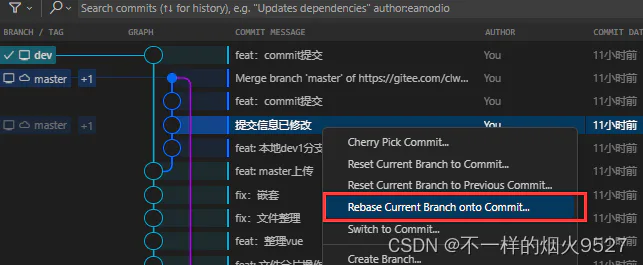

##### 工作区暂存

区别于文件暂存，工作区暂存是当前分支不能马上提交到远程，而需要切换其他分支开发，其他分支完成以后，回到之前的分支，继续工作

**`存储`**
如下 1 和 2 ：`Stash All Changes`（撤销加标识）表示暂存，点击以后，输入暂存信息（enter确认，esc 取消），方便之后恢复，确认后，修改和暂存被存储并清空，此时可切换其他分支，

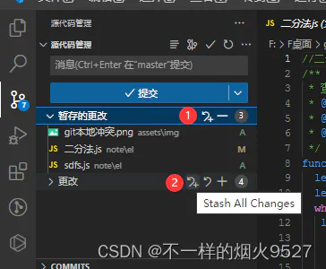

**`恢复`**
“…” — 存储 — 应用存储（或者最新存储）

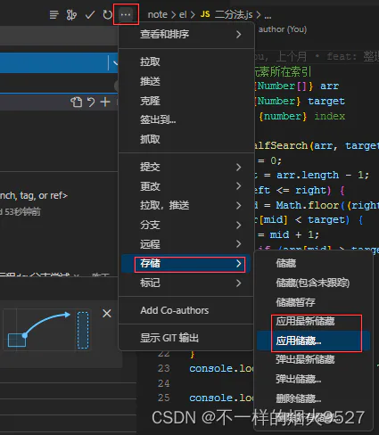

如：应用存储，选择对应之前的存储信息，取出恢复

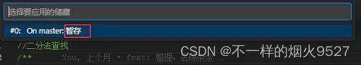
