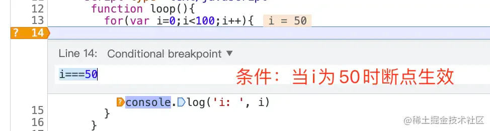
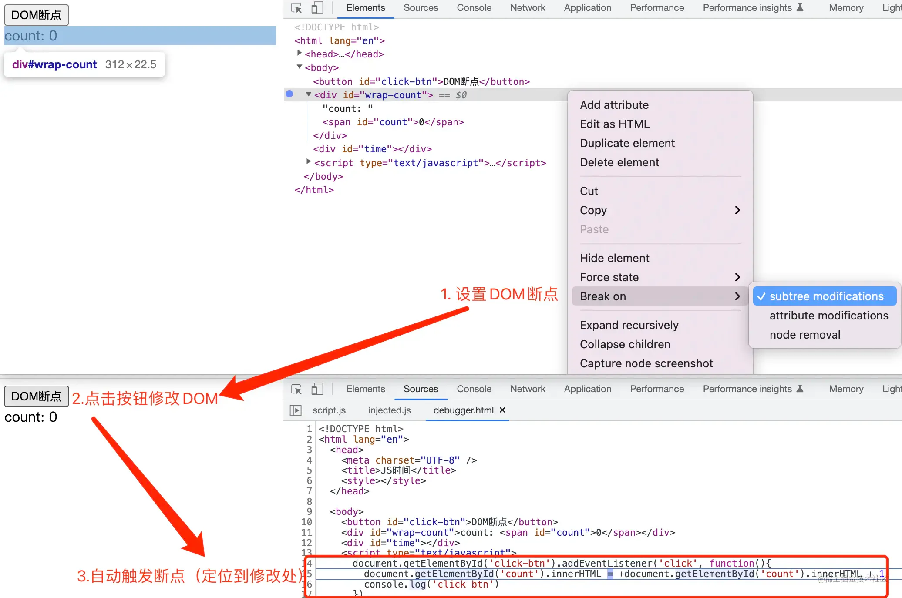
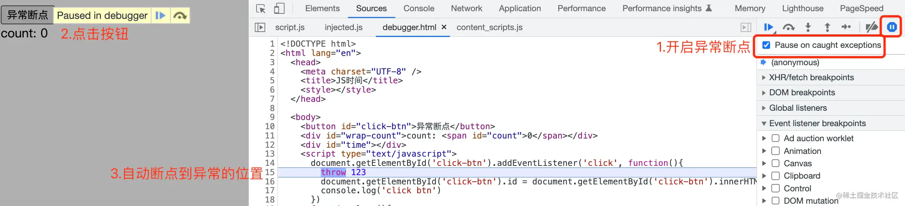

# 各种各样的断点

## 目录

- [1. 条件断点](#1-条件断点)
- [2.事件断点](#2事件断点)
- [3. Dom节点断点](#3-Dom节点断点)
- [4. 异常断点](#4-异常断点)
- [5. 其它断点](#5-其它断点)
- [调试小技巧](#调试小技巧)

### 1. 条件断点

满足某条件时，断点才会生效使用：在**行号处点击右键再选择**`条件断点`，再**刷新页面执行**并触发条件时断点。

### 2.事件断点

在处理事件相关的bug时非常有用，可以在页面触发指定事件时断点，如图：&#x20;

### 3. Dom节点断点

当节点发生变化时（新增、编辑、删除）断点，并且会定位到修改DOM的那一行

说明： &#x20;

1.`subtree modifications` 当前DOM子节点有任何变化时触发断点 &#x20;

1. `attribute modifications` **当前DOM本身属性**有任何变化时触发断点 &#x20;
2. `node removeal` **当前DOM节点被移除**时触发断点

### 4. 异常断点

在开发过程中一定会用到的断点，能帮助我们自动定位到异常问题，及时修复。

### 5. 其它断点

除此之外，还有XHR请求断点、vscode编辑器中的断点、sources面板上直接修改代码（spa页面需map映射到源代码）、代码片段调试等。后面有时间再继续完善。

## 调试小技巧

1. `$_`表示获取控制台的上一次执行结果（引用上一次的结果） &#x20;

   在了解这个以前都是复制粘贴上一次的执行结果，有了这个之后还是能提高些调试效率。 &#x20;

   `$(dom)`获取第一个dom，相当于`document.querySelector` &#x20;

   `$$(dom)`获取所有dom(数组形式)，相当于`document.querySelectorAll`
2. 使用`$i`直接在控制台安装npm包 &#x20;

   step1: 安装Console Importer插件 &#x20;

   step2: 在控制台使用命令`$i('name')`安装npm包，如\$i('dayjs') &#x20;

   在以前都要依赖项目环境来使用，有了这个就可以完全脱离项目使用npm包。
3. 重新发起请求的方式 &#x20;

   在和后台联调的时候，后台经常会需要前端再点一下发送请求来debugger问题。其实大可不必，后台就能自己重发请求。

- 方式一：右键选择Replay XHR（重放XHR请求）
- 方式二：右键XHR请求， 选择 `Copy as fetch`(**可以修改参数后再执行**)，然后直接在控制台执行即可

1. 一键展开所有DOM &#x20;

   按住opt键 + click（需要展开的最外层元素）
