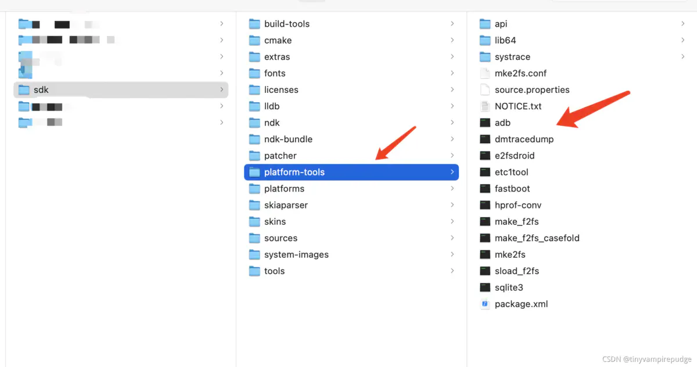
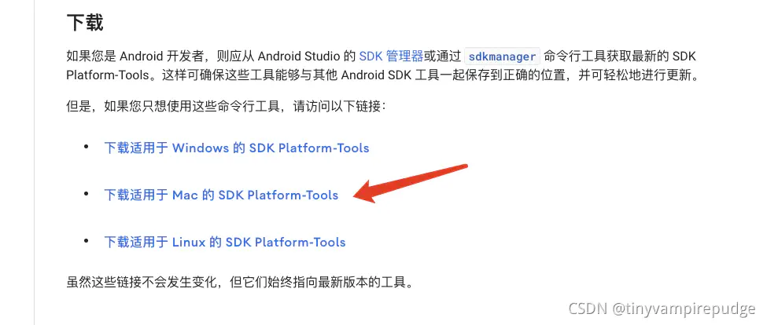

# Adb基础

## 目录

- [安装](#安装)
  - [1、通过Android sdk，配置环境变量](#1通过Android-sdk配置环境变量)
  - [2、通过homebrew安装](#2通过homebrew安装)
  - [3、自行下载platform-tools包，配置环境变量](#3自行下载platform-tools包配置环境变量)
    - [验证是否安装成功](#验证是否安装成功)
- [ADB简介：](#ADB简介)
  - [查看日志： ](#查看日志-)
  - [安装apk文件： ](#安装apk文件-)
  - [卸载App: ](#卸载App-)
  - [查看正在运行的进程](#查看正在运行的进程)
  - [传递文件： ](#传递文件-)
  - [查看手机端安装的所有app包名: ](#查看手机端安装的所有app包名-)
  - [adb停止 应用程序](#adb停止-应用程序)
  - [app switch](#app-switch)
  - [事件输入： ](#事件输入-)
  - [返回上一个界面 ](#返回上一个界面-)
  - [打开系统设置界面 ](#打开系统设置界面-)
  - [电话键 ](#电话键-)
  - [控制键 ](#控制键-)
  - [组合键 ](#组合键-)
  - [基本](#基本)
  - [符号 ](#符号-)
  - [小键盘 ](#小键盘-)
  - [功能键 ](#功能键-)
  - [多媒体键 ](#多媒体键-)
  - [手柄按键 ](#手柄按键-)
  - [待查 ](#待查-)
  - [查看目录结构 ](#查看目录结构-)
  - [查看系统当前日期 ](#查看系统当前日期-)
  - [查看系统 CPU 使用情况](#查看系统-CPU-使用情况)
  - [查看系统内存使用情况 ](#查看系统内存使用情况-)
  - [显示所有应用](#显示所有应用)
  - [显示系统自带应用](#显示系统自带应用)
  - [显示第 3 方应用 ](#显示第-3-方应用-)
  - [查看当前页面名](#查看当前页面名)
  - [清除应用数据以及缓存](#清除应用数据以及缓存)
- [adb 问题排查 ](#adb-问题排查-)
  - [adb install ](#adb-install-)
- [adb 链接android](#adb-链接android)

# 安装

### 1、通过Android sdk，配置环境变量

Android开发专用的IDE是Android Studio，在下载安装Android Studio的过程中，会`自行下载sdk`，sdk中会`包含adb环境`，具体是在`sdk文件路径/platform-tools/adb`，如下图所示。



android sdk下载完毕之后，还需要配置对应的环境变量，以zsh为例，

```javascript 
# Android Sdk
export ANDROID_HOME=~/Documents/develop/sdk
export PATH=${PATH}:${ANDROID_HOME}/tools
export PATH=${PATH}:${ANDROID_HOME}/platform-tools
export PATH=${PATH}:${ANDROID_HOME}/tools/bin
export PATH=${PATH}:${ANDROID_HOME}/emulator
export ANDROID_SDK=${ANDROID_HOME}
export ANDROID_NDK=${ANDROID_HOME}/ndk-bundle
```


`ANDROID_HOME`是我的sdk所在的具体路况，`${ANDROID_HOME}/platform-tools`这个路径则是adb相关的环境变量。

配置好之后，关闭并重启终端，adb环境即可生效。

### 2、通过homebrew安装

电脑上有[homebrew](https://links.jianshu.com/go?to=https://brew.sh/ "homebrew")的同学可以通过下面的命令快速安装，这里不在赘述。

```javascript 
brew install --cask android-platform-tools
```


安装完成后，关闭并重启终端，adb环境即可生效。

## 3、自行下载platform-tools包，配置环境变量

这个是最朴素的方式，适用于绝大多数同学。

下载地址：[SDK Platform Tools 版本说明](https://links.jianshu.com/go?to=https://developer.android.com/studio/releases/platform-tools?hl=zh-cn "SDK Platform Tools 版本说明")

在这里下载对应的版本即可：



下载完成后解压（将文件放置到一个不常改动的目录下，避免误删），然后给文件配置环境变量，还是以我的zsh配置为例:这个`platform-tools`文件夹我是放在`Downloads`目录下的。

```javascript 
# 在没有android sdk的情况下，单独配置platform-tools，支持adb命令
export PATH=${PATH}:~/Downloads/platform-tools
```


配置好之后，关闭并重启终端，adb环境即可生效。

### 验证是否安装成功

`adb --version`可用于校验adb环境是否配置好:

```javascript 
$ adb --version
Android Debug Bridge version 1.0.41
Version 31.0.3-7562133
Installed as /Users/xxx/Downloads/platform-tools/adb
```


可以看到，adb的安装路径就是配置的路径。

用到了再去查：

```javascript 
 adb connect 192.168.123.158:5555   //链接
adb shell input keyevent 82  //摇晃设备
adb kill-server   // 杀掉服务
adb disconnect 192.168.1.199:5555 //断开链接
// 安装apk
adb install -t /Users/zhengchao/Desktop/electroncabinet/build/app/outputs/apk/internal/debug/app-internal-debug.apk

```


# ADB简介：

ADB，即 Android Debug Bridge，它是 Android 开发/测试人员不可替代的强大工具，也是 Android 设备玩家的好玩具。安卓调试桥 (Android Debug Bridge, adb)，是一种可以用来

操作手机设备或模拟器的命令行工具。

它存在于 sdk/platform-tools 目录下。虽然现在 Android Studio 已经将大部分 ADB 命令以图形化的形式实现了，但是了解一下还是有必要的。

注： 有部分命令的支持情况可能与 Android 系统版本及定制 ROM 的实现有关。

- 查看当前连接设备：

```javascript 
 adb devices
```


- 如果发现多个设备：

```javascript 
 adb -s 设备号 其他指令
举例：
adb -s devicel install xxx.apk
```


## 查看日志：&#x20;

```javascript 
 adb logcat
```


## 安装apk文件：&#x20;

```javascript 
adb install xxx.apk

-t　允许测试包
-l　锁定该应用程序
-s　把应用程序安装到sd卡上
-g　为应用程序授予所有运行时的权限
-r　替换已存在的应用程序，也就是说强制安装
-d　允许进行将见状，也就是安装的比手机上带的版本低

```


- 此安装方式，如果已经存在，无法安装；  推荐使用**覆盖安装：**

```javascript 
 adb install -r xxx.apk
```


- 比分直接RUN出来的包是test-onlu的无法安装，推荐使用 **-t**

```javascript 
 adb install -r -t xxx.apk
```


## 卸载App:&#x20;

```javascript 
 adb uninstall com.zhy.app
```


- 如果想要保留数据，则：

```javascript 
 adb uninstall -k com.zhy.app
```


## 查看正在运行的进程

```javascript 
 adb shell ps  查看
adb shell ps|findstr package
```


## 传递文件：&#x20;

- 往手机SDCard传递文件：

```javascript 
 adb push 文件名 手机端SDCard路径
例如：
adb push 帅照.jpg /sdcard/
```


- 从手机端下载文件：

```javascript 
 adb pull /sdcard/xxx.txt
```


## 查看手机端安装的所有app包名:&#x20;

```javascript 
adb shell pm list packages                                         列出所有的包名（不知道包名的情况，需要执行查找包名）appPackage
adb shell dumpsys package XXX                               查看某个包的具体信息(前提是需要知道包名是什么)      appActivity
adb shell “dumpsys activity | grep mFocusedActivity”        查看当前resume的是哪个activity 
adb shell "logcat | grep ActivityManager"                              查看当前正在运行的Activity
adb shell "logcat | grep Displayed"   \


```


## adb停止 应用程序

```javascript 
 不会清除APP进程在系统中产生的数据
adb shell am force-stop  cn.com.conversant.swiftsync.android
adb shell am force-stop package:com.kuaibao.electroncabinet

相当于卸载重装的效果  包括本地数据
adb shell pm clear package 
adb shell pm clear com.kuaibao.electroncabinet 
```


## app switch

```javascript 

 adb shell input keyevent KEYCODE_APP_SWITCH

```


## 事件输入：&#x20;

1. input:

- 使用**adb shell input**命令向屏幕输入一些信息，  例如：

```javascript 
 adb shell input text "insert%stext%shere"
```


**注意：%s表示空格。**

- 使用**adb shell input tap**命令来模拟屏幕点击事件，例如：

```javascript 
 adb shell input tap 500 1450
```


## 返回上一个界面&#x20;

```javascript 
adb shell input keyevent KEYCODE_BACK
```


## 打开系统设置界面&#x20;

```javascript 
 adb shell am start -n com.android.settings/.Settings 
```


[adb shell input keyevent code详解 - 子信风蓝蓝 - 博客园 adb shell input keyevent 7 # for key \&#39;0\&#39;adb shell input keyevent 8 # for key \&#39;1\&#39;adb https://www.cnblogs.com/chengchengla1990/p/4515108.html](https://www.cnblogs.com/chengchengla1990/p/4515108.html "adb shell input keyevent code详解 - 子信风蓝蓝 - 博客园 adb shell input keyevent 7 # for key \&#39;0\&#39;adb shell input keyevent 8 # for key \&#39;1\&#39;adb https://www.cnblogs.com/chengchengla1990/p/4515108.html")

## 电话键&#x20;

| 键名                                                      | [描述](http://www.haogongju.net/tag/%E6%8F%8F%E8%BF%B0 "描述")  |  键值 |
| ------------------------------------------------------- | ----------------------------------------------------------- | --- |
| KEYCODE\_CALL                                           | 拨号键                                                         | 5   |
| KEYCODE\_ENDCALL                                        | 挂机键                                                         | 6   |
| KEYCODE\_HOME                                           | 按键Home                                                      | 3   |
| KEYCODE\_MENU                                           | [菜单](http://www.haogongju.net/tag/%E8%8F%9C%E5%8D%95 "菜单")键 | 82  |
| KEYCODE\_BACK                                           | 返回键                                                         | 4   |
| KEYCODE\_S[EA](http://www.haogongju.net/tag/EA "EA")RCH | [搜索](http://www.haogongju.net/tag/%E6%90%9C%E7%B4%A2 "搜索")键 | 84  |
| KEYCODE\_CAMERA                                         | 拍照键                                                         | 27  |
| KEYCODE\_FOCUS                                          | 拍照对焦键                                                       | 80  |
| KEYCODE\_POWER                                          | 电源键                                                         | 26  |
| KEYCODE\_NOTIFICATION                                   | 通知键                                                         | 83  |
| KEYCODE\_MUTE                                           | 话筒静音键                                                       | 91  |
| KEYCODE\_VOLUME\_MUTE                                   | 扬声器静音键                                                      | 164 |
| KEYCODE\_VOLUME\_UP                                     | 音量增加键                                                       | 24  |
| KEYCODE\_VOLUME\_DOWN                                   | 音量减小键                                                       | 25  |

## [控制](http://www.haogongju.net/tag/%E6%8E%A7%E5%88%B6 "控制")键&#x20;

| 键名                                                      | 描述                                                               | 键值  |
| ------------------------------------------------------- | ---------------------------------------------------------------- | --- |
| KEYCODE\_ENTER                                          | 回车键                                                              | 66  |
| KEYCODE\_ESCAPE                                         | ESC键                                                             | 111 |
| KEYCODE\_DPAD\_CENTER                                   | [导航](http://www.haogongju.net/tag/%E5%AF%BC%E8%88%AA "导航")键 确定键  | 23  |
| KEYCODE\_DPAD\_UP                                       | 导航键 向上                                                           | 19  |
| KEYCODE\_DPAD\_DOWN                                     | 导航键 向下                                                           | 20  |
| KEYCODE\_DPAD\_LEFT                                     | 导航键 向左                                                           | 21  |
| KEYCODE\_DPAD\_RIGHT                                    | 导航键 向右                                                           | 22  |
| KEYCODE\_MOVE\_HOME                                     | 光标[移动](http://www.haogongju.net/tag/%E7%A7%BB%E5%8A%A8 "移动")到开始键 | 122 |
| KEYCODE\_MOVE\_END                                      | 光标移动到末尾键                                                         | 123 |
| KEYCODE\_PAGE\_UP                                       | 向上翻页键                                                            | 92  |
| KEYCODE\_PAGE\_DOWN                                     | 向下翻页键                                                            | 93  |
| KEYCODE\_DEL                                            | 退格键                                                              | 67  |
| KEYCODE\_FORWARD\_DEL                                   | 删除键                                                              | 112 |
| KEYCODE\_[IN](http://www.haogongju.net/tag/in "IN")SERT | 插入键                                                              | 124 |
| KEYCODE\_TAB                                            | Tab键                                                             | 61  |
| KEYCODE\_NUM\_LOCK                                      | 小键盘锁                                                             | 143 |
| KEYCODE\_CAPS\_LOCK                                     | 大写锁定键                                                            | 115 |
| KEYCODE\_BREAK                                          | Break/Pause键                                                     | 121 |
| KEYCODE\_SCROLL\_LOCK                                   | 滚动锁定键                                                            | 116 |
| KEYCODE\_ZOOM\_IN                                       | 放大键                                                              | 168 |
| KEYCODE\_ZOOM\_OUT                                      | 缩小键                                                              | 169 |

## 组合键&#x20;

| 键名                    | 描述            |
| --------------------- | ------------- |
| KEYCODE\_ALT\_LEFT    | Alt+Left      |
| KEYCODE\_ALT\_RIGHT   | Alt+Right     |
| KEYCODE\_CTRL\_LEFT   | Control+Left  |
| KEYCODE\_CTRL\_RIGHT  | Control+Right |
| KEYCODE\_SHIFT\_LEFT  | Shift+Left    |
| KEYCODE\_SHIFT\_RIGHT | Shift+Right   |

## [基本](http://www.haogongju.net/tag/%E5%9F%BA%E6%9C%AC "基本")

| 键名         | 描述    | 键值 |
| ---------- | ----- | -- |
| KEYCODE\_0 | 按键'0' | 7  |
| KEYCODE\_1 | 按键'1' | 8  |
| KEYCODE\_2 | 按键'2' | 9  |
| KEYCODE\_3 | 按键'3' | 10 |
| KEYCODE\_4 | 按键'4' | 11 |
| KEYCODE\_5 | 按键'5' | 12 |
| KEYCODE\_6 | 按键'6' | 13 |
| KEYCODE\_7 | 按键'7' | 14 |
| KEYCODE\_8 | 按键'8' | 15 |
| KEYCODE\_9 | 按键'9' | 16 |
| KEYCODE\_A | 按键'A' | 29 |
| KEYCODE\_B | 按键'B' | 30 |
| KEYCODE\_C | 按键'C' | 31 |
| KEYCODE\_D | 按键'D' | 32 |
| KEYCODE\_E | 按键'E' | 33 |
| KEYCODE\_F | 按键'F' | 34 |
| KEYCODE\_G | 按键'G' | 35 |
| KEYCODE\_H | 按键'H' | 36 |
| KEYCODE\_I | 按键'I' | 37 |
| KEYCODE\_J | 按键'J' | 38 |
| KEYCODE\_K | 按键'K' | 39 |
| KEYCODE\_L | 按键'L' | 40 |
| KEYCODE\_M | 按键'M' | 41 |
| KEYCODE\_N | 按键'N' | 42 |
| KEYCODE\_O | 按键'O' | 43 |
| KEYCODE\_P | 按键'P' | 44 |
| KEYCODE\_Q | 按键'Q' | 45 |
| KEYCODE\_R | 按键'R' | 46 |
| KEYCODE\_S | 按键'S' | 47 |
| KEYCODE\_T | 按键'T' | 48 |
| KEYCODE\_U | 按键'U' | 49 |
| KEYCODE\_V | 按键'V' | 50 |
| KEYCODE\_W | 按键'W' | 51 |
| KEYCODE\_X | 按键'X' | 52 |
| KEYCODE\_Y | 按键'Y' | 53 |
| KEYCODE\_Z | 按键'Z' | 54 |

## 符号&#x20;

| 键名                                                           | 描述          |
| ------------------------------------------------------------ | ----------- |
| KEYCODE\_PLUS                                                | 按键'+'       |
| KEYCODE\_MINUS                                               | 按键'-'       |
| KEYCODE\_STAR                                                | 按键' \*'     |
| KEYCODE\_SLASH                                               | 按键'/'       |
| KEYCODE\_EQUALS                                              | 按键'='       |
| KEYCODE\_AT                                                  | 按键'@'       |
| KEYCODE\_POUND                                               | 按键'#'       |
| KEYCODE\_AP[OS](http://www.haogongju.net/tag/OS "OS")TROPHE  | 按键''' (单引号) |
| KEYCODE\_BACKSLASH                                           | 按键'\\'      |
| KEYCODE\_COMMA                                               | 按键','       |
| KEYCODE\_PERIOD                                              | 按键'.'       |
| KEYCODE\_LEFT\_BRACKET                                       | 按键'\['      |
| KEYCODE\_RIGHT\_BRACKET                                      | 按键']'       |
| KEYCODE\_[SEM](http://www.haogongju.net/tag/SEM "SEM")ICOLON | 按键';'       |
| KEYCODE\_GRAVE                                               | 按键'\`'      |
| KEYCODE\_SPACE                                               | 空格键         |

## 小键盘&#x20;

键名 描述

|                                                                   |            |
| ----------------------------------------------------------------- | ---------- |
| KEYCODE\_NUMPAD\_0                                                | 小键盘按键'0'   |
| KEYCODE\_NUMPAD\_1                                                | 小键盘按键'1'   |
| KEYCODE\_NUMPAD\_2                                                | 小键盘按键'2'   |
| KEYCODE\_NUMPAD\_3                                                | 小键盘按键'3'   |
| KEYCODE\_NUMPAD\_4                                                | 小键盘按键'4'   |
| KEYCODE\_NUMPAD\_5                                                | 小键盘按键'5'   |
| KEYCODE\_NUMPAD\_6                                                | 小键盘按键'6'   |
| KEYCODE\_NUMPAD\_7                                                | 小键盘按键'7'   |
| KEYCODE\_NUMPAD\_8                                                | 小键盘按键'8'   |
| KEYCODE\_NUMPAD\_9                                                | 小键盘按键'9'   |
| KEYCODE\_NUMPAD\_ADD                                              | 小键盘按键'+'   |
| KEYCODE\_NUMPAD\_SUBTRACT                                         | 小键盘按键'-'   |
| KEYCODE\_NUMPAD\_MULT[IP](http://www.haogongju.net/tag/IP "IP")LY | 小键盘按键' \*' |
| KEYCODE\_NUMPAD\_DIV[IDE](http://www.haogongju.net/tag/IDE "IDE") | 小键盘按键'/'   |
| KEYCODE\_NUMPAD\_EQUALS                                           | 小键盘按键'='   |
| KEYCODE\_NUMPAD\_COMMA                                            | 小键盘按键','   |
| KEYCODE\_NUMPAD\_DOT                                              | 小键盘按键'.'   |
| KEYCODE\_NUMPAD\_LEFT\_PAREN                                      | 小键盘按键'('   |
| KEYCODE\_NUMPAD\_RIGHT\_PAREN                                     | 小键盘按键')'   |
| KEYCODE\_NUMPAD\_ENTER                                            | 小键盘按键回车    |

## [功能](http://www.haogongju.net/tag/%E5%8A%9F%E8%83%BD "功能")键&#x20;

键名 描述

|              |       |
| ------------ | ----- |
| KEYCODE\_F1  | 按键F1  |
| KEYCODE\_F2  | 按键F2  |
| KEYCODE\_F3  | 按键F3  |
| KEYCODE\_F4  | 按键F4  |
| KEYCODE\_F5  | 按键F5  |
| KEYCODE\_F6  | 按键F6  |
| KEYCODE\_F7  | 按键F7  |
| KEYCODE\_F8  | 按键F8  |
| KEYCODE\_F9  | 按键F9  |
| KEYCODE\_F10 | 按键F10 |
| KEYCODE\_F11 | 按键F11 |
| KEYCODE\_F12 | 按键F12 |

## 多[媒体](http://www.haogongju.net/tag/%E5%AA%92%E4%BD%93 "媒体")键&#x20;

键名 描述

|                                                                  |            |
| ---------------------------------------------------------------- | ---------- |
| KEYCODE\_[MED](http://www.haogongju.net/tag/MED "MED")IA\_PLAY   | 多媒体键 播放    |
| KEYCODE\_MEDIA\_STOP                                             | 多媒体键 停止    |
| KEYCODE\_MEDIA\_PAUSE                                            | 多媒体键 暂停    |
| KEYCODE\_MEDIA\_PLAY\_PAUSE                                      | 多媒体键 播放/暂停 |
| KEYCODE\_MEDIA\_FAST\_FORWARD                                    | 多媒体键 快进    |
| KEYCODE\_MEDIA\_REWIND                                           | 多媒体键 快退    |
| KEYCODE\_MEDIA\_NEXT                                             | 多媒体键 下一首   |
| KEYCODE\_MEDIA\_[PR](http://www.haogongju.net/tag/PR "PR")EVIOUS | 多媒体键 上一首   |
| KEYCODE\_MEDIA\_CLOSE                                            | 多媒体键 关闭    |
| KEYCODE\_MEDIA\_EJECT                                            | 多媒体键 弹出    |
| KEYCODE\_MEDIA\_RECORD                                           | 多媒体键 录音    |

## 手柄按键&#x20;

键名 描述

|                         |                                                                     |
| ----------------------- | ------------------------------------------------------------------- |
| KEYCODE\_BUTTON\_1      | 通用[游戏](http://www.haogongju.net/tag/%E6%B8%B8%E6%88%8F "游戏")手柄按钮 #1 |
| KEYCODE\_BUTTON\_2      | 通用游戏手柄按钮 #2                                                         |
| KEYCODE\_BUTTON\_3      | 通用游戏手柄按钮 #3                                                         |
| KEYCODE\_BUTTON\_4      | 通用游戏手柄按钮 #4                                                         |
| KEYCODE\_BUTTON\_5      | 通用游戏手柄按钮 #5                                                         |
| KEYCODE\_BUTTON\_6      | 通用游戏手柄按钮 #6                                                         |
| KEYCODE\_BUTTON\_7      | 通用游戏手柄按钮 #7                                                         |
| KEYCODE\_BUTTON\_8      | 通用游戏手柄按钮 #8                                                         |
| KEYCODE\_BUTTON\_9      | 通用游戏手柄按钮 #9                                                         |
| KEYCODE\_BUTTON\_10     | 通用游戏手柄按钮 #10                                                        |
| KEYCODE\_BUTTON\_11     | 通用游戏手柄按钮 #11                                                        |
| KEYCODE\_BUTTON\_12     | 通用游戏手柄按钮 #12                                                        |
| KEYCODE\_BUTTON\_13     | 通用游戏手柄按钮 #13                                                        |
| KEYCODE\_BUTTON\_14     | 通用游戏手柄按钮 #14                                                        |
| KEYCODE\_BUTTON\_15     | 通用游戏手柄按钮 #15                                                        |
| KEYCODE\_BUTTON\_16     | 通用游戏手柄按钮 #16                                                        |
| KEYCODE\_BUTTON\_A      | 游戏手柄按钮 A                                                            |
| KEYCODE\_BUTTON\_B      | 游戏手柄按钮 B                                                            |
| KEYCODE\_BUTTON\_C      | 游戏手柄按钮 C                                                            |
| KEYCODE\_BUTTON\_X      | 游戏手柄按钮 X                                                            |
| KEYCODE\_BUTTON\_Y      | 游戏手柄按钮 Y                                                            |
| KEYCODE\_BUTTON\_Z      | 游戏手柄按钮 Z                                                            |
| KEYCODE\_BUTTON\_L1     | 游戏手柄按钮 L1                                                           |
| KEYCODE\_BUTTON\_L2     | 游戏手柄按钮 L2                                                           |
| KEYCODE\_BUTTON\_R1     | 游戏手柄按钮 R1                                                           |
| KEYCODE\_BUTTON\_R2     | 游戏手柄按钮 R2                                                           |
| KEYCODE\_BUTTON\_MODE   | 游戏手柄按钮 Mode                                                         |
| KEYCODE\_BUTTON\_SELECT | 游戏手柄按钮 Select                                                       |
| KEYCODE\_BUTTON\_START  | 游戏手柄按钮 Start                                                        |
| KEYCODE\_BUTTON\_THUMBL | Left Thumb Button                                                   |
| KEYCODE\_BUTTON\_THUMBR | Right Thumb Button                                                  |

## 待查&#x20;

```javascript 
 键名 描述 
```


|                                                                                                        |                                 |
| ------------------------------------------------------------------------------------------------------ | ------------------------------- |
| KEYCODE\_NUM                                                                                           | 按键Number modifier               |
| KEYCODE\_INFO                                                                                          | 按键Info                          |
| KEYCODE\_[APP](http://www.haogongju.net/tag/App "APP")\_SW[IT](http://www.haogongju.net/tag/IT "IT")CH | 按键App switch                    |
| KEYCODE\_BOOKMARK                                                                                      | 按键Bookmark                      |
| KEYCODE\_AVR\_INPUT                                                                                    | 按键A/V Receiver input            |
| KEYCODE\_AVR\_POWER                                                                                    | 按键A/V Receiver power            |
| KEYCODE\_CAPTIONS                                                                                      | 按键Toggle captions               |
| KEYCODE\_CHANNEL\_DOWN                                                                                 | 按键Channel down                  |
| KEYCODE\_CHANNEL\_UP                                                                                   | 按键Channel up                    |
| KEYCODE\_CLEAR                                                                                         | 按键Clear                         |
| KEYCODE\_DVR                                                                                           | 按键DVR                           |
| KEYCODE\_ENVELOPE                                                                                      | 按键Envelope special function     |
| KEYCODE\_E[XP](http://www.haogongju.net/tag/XP "XP")LORER                                              | 按键Explorer special function     |
| KEYCODE\_FORWARD                                                                                       | 按键Forward                       |
| KEYCODE\_FORWARD\_DEL                                                                                  | 按键Forward Delete                |
| KEYCODE\_FUNCTION                                                                                      | 按键Function modifier             |
| KEYCODE\_G[UI](http://www.haogongju.net/tag/UI "UI")DE                                                 | 按键Guide                         |
| KEYCODE\_HEADSETHOOK                                                                                   | 按键Headset Hook                  |
| KEYCODE\_META\_LEFT                                                                                    | 按键Left Meta modifier            |
| KEYCODE\_META\_RIGHT                                                                                   | 按键Right Meta modifier           |
| KEYCODE\_PICTSYMBOLS                                                                                   | 按键Picture Symbols modifier      |
| KEYCODE\_PROG\_BL[UE](http://www.haogongju.net/tag/UE "UE")                                            | 按键Blue “programmable”           |
| KEYCODE\_PROG\_GREEN                                                                                   | 按键Green “programmable”          |
| KEYCODE\_PROG\_RED                                                                                     | 按键Red “programmable”            |
| KEYCODE\_PROG\_YELLOW                                                                                  | 按键Yellow “programmable”         |
| KEYCODE\_SETTINGS                                                                                      | 按键Settings                      |
| KEYCODE\_SOFT\_LEFT                                                                                    | 按键Soft Left                     |
| KEYCODE\_SOFT\_RIGHT                                                                                   | 按键Soft Right                    |
| KEYCODE\_STB\_INPUT                                                                                    | 按键Set-top-box input             |
| KEYCODE\_STB\_POWER                                                                                    | 按键Set-top-box power             |
| KEYCODE\_SWITCH\_CHARSET                                                                               | 按键Switch Charset modifier       |
| KEYCODE\_SYM                                                                                           | 按键Symbol modifier               |
| KEYCODE\_SYSRQ                                                                                         | 按键System Request / Print Screen |
| KEYCODE\_TV                                                                                            | 按键TV                            |
| KEYCODE\_TV\_INPUT                                                                                     | 按键TV input                      |
| KEYCODE\_TV\_POWER                                                                                     | 按键TV power                      |
| KEYCODE\_WINDOW                                                                                        | 按键Window                        |
| KEYCODE\_UNKNOWN                                                                                       | 未知                              |

## 查看目录结构&#x20;

`adb shell ls`

## 查看系统当前日期&#x20;

`adb shell date`

## 查看系统 CPU 使用情况

`adb shell cat /proc/cpuinfo`

## 查看系统内存使用情况&#x20;

`adb shell cat /proc/meminfo`

## 显示所有应用

`adb shell pm list packages`

## 显示系统自带应用

`adb shell pm list packages -s`

## 显示第 3 方应用&#x20;

`adb shell pm list packages -3`

## 查看当前页面名

MAC: `adb shell "dumpsys window |grep mCurrentFocus"` &#x20;

Windows： `adb shell "dumpsys window |findstr mCurrentFocus"`

## 清除应用数据以及缓存

`adb shell pm clear <包名>`

# adb 问题排查&#x20;

adb.exe start-server' failed -- run manually if necessary&#x20;

&#x20;或者链接没反应

mac同理

[Android运行提示：adb.exe start-server' failed -- run manually if necessary\_大强博客-CSDN博客 netstat -aon | findstr "5037" https://blog.csdn.net/daqiang012/article/details/89085638](https://blog.csdn.net/daqiang012/article/details/89085638 "Android运行提示：adb.exe start-server' failed -- run manually if necessary_大强博客-CSDN博客 netstat -aon | findstr \"5037\" https://blog.csdn.net/daqiang012/article/details/89085638")

lsof -i tcp:8080

kill  17418

## adb install&#x20;

没反应也不报错；adb uninstall apk 卸载后在重新安装

# adb 链接android

[ Android 在没有usb连接线的情况下如何连接手机设备\_柳的博客-CSDN博客 机设备上安装终端模拟器		下载地址是：https://jackpal.github.io/Android-Terminal-Emulator/	打开链接，有个term.apk			共同连接同一个局域网	将手机设备与本地要运行 adb 的电脑连接到同一个局域网，比如连到同一个 WiFi。		打开 Android 设备上的终端模拟器	在里面依次运行命令：	susetprop service.adb.t https://blog.csdn.net/qq\_32368129/article/details/106052223](https://blog.csdn.net/qq_32368129/article/details/106052223 " Android 在没有usb连接线的情况下如何连接手机设备_柳的博客-CSDN博客 机设备上安装终端模拟器		下载地址是：https://jackpal.github.io/Android-Terminal-Emulator/	打开链接，有个term.apk			共同连接同一个局域网	将手机设备与本地要运行 adb 的电脑连接到同一个局域网，比如连到同一个 WiFi。		打开 Android 设备上的终端模拟器	在里面依次运行命令：	susetprop service.adb.t https://blog.csdn.net/qq_32368129/article/details/106052223")

下载地址： [Terminal Emulator for Android](http://jackpal.github.io/Android-Terminal-Emulator/ "Terminal Emulator for Android")&#x20;

安装完成后，关闭并重启终端，adb环境即可生效。

3、自行下载platform-tools包，配置环境变量

下载完成后解压（将文件放置到一个不常改动的目录下，避免误删），然后给文件配置环境变量，还是以我的zsh配置为例:这个platform-tools文件夹我是放在Downloads目录下的。

\#
