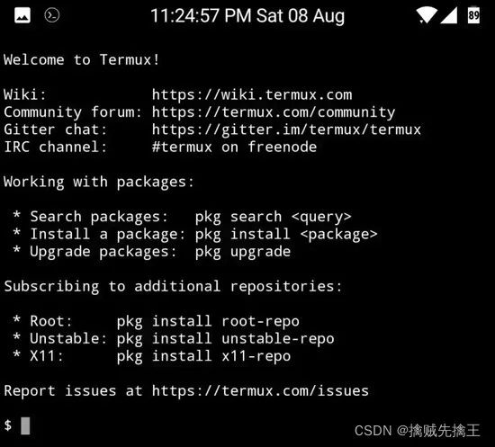
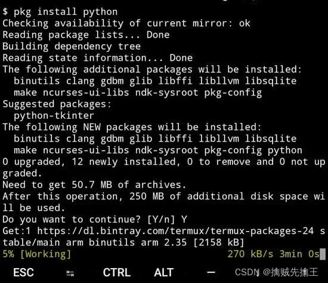

# Termux

## 目录

- [在 Android 上安装 Termux](#在-Android-上安装-Termux)
- [更新源、升级软件包](#更新源升级软件包)
- [管理员权限](#管理员权限)

android 手机如果要不使用数据线直接adb链接；就需要安装一个终端工具；Termux 是其中一个

- **termux**（**安卓5.0以上**）。Termux 是 Android 手机上一个高级的终端模拟器软件，开源且不需要 root，支持 apt 管理软件包，十分方便安装软件包，完美支持 Python、PHP、Ruby、Go、Nodejs、MySQL等。Termux  相当于在安卓上搭建了一个 Linux 平台，所以在 Linux上 能干的事情很多在手机上也都办得到。由于安卓平台的开放性，类似 termux 的手机神器还有很多。不说各类强大的编程 IDE，单是 termux 这样的 Linux 平台类软件就很多，如 GnuRoot 系列，LinuxDisplay 系列等。这其中 termux 很受人欢迎。随着智能设备的普及和性能的不断提升，如今的手机、平板等的硬件标准已达到了初级桌面计算机的硬件标准,用心去打造完全可以把手机变成一个强大的工具.。**termux 还有许多插件**：


- **gnuroot debian**。GNU 属于大而全，里面啥模块都有，安装包也大，termux 如果不够用就直接用 GNU 。GnuRoot 可以执行 python，java，c，php 。（gnu更方便，直接 apt install python-scipy之类搞定)。

我们选择了termux  ；初学用不到gnuroot debian

[ Termux 高级终端安装使用配置教程 | 国光 国光 https://www.sqlsec.com/2018/05/termux.html](https://www.sqlsec.com/2018/05/termux.html " Termux 高级终端安装使用配置教程 | 国光 国光 https://www.sqlsec.com/2018/05/termux.html")

[ Android 手机的高级终端 Termux 安装、使用\_擒贼先擒王的博客-CSDN博客\_安卓手机终端terminal 安卓推荐termux（安卓5.0以上）	GNUROOT DEBIANtermux 和GNUROOT DEBIAN 不只是针对 python 的，java，c，php之类也不在话下，超级强大；GNU 属于大而全的，里面啥模块都有，安装包也挺大，termux 如果不够用就直接用 GNU 。termux 模块要少一些，有些可能安装不了或者比较麻烦，体积也是超小。（gnu更方便，直接 apt instal https://blog.csdn.net/freeking101/article/details/122725389](https://blog.csdn.net/freeking101/article/details/122725389 " Android 手机的高级终端 Termux 安装、使用_擒贼先擒王的博客-CSDN博客_安卓手机终端terminal 安卓推荐termux（安卓5.0以上）	GNUROOT DEBIANtermux 和GNUROOT DEBIAN 不只是针对 python 的，java，c，php之类也不在话下，超级强大；GNU 属于大而全的，里面啥模块都有，安装包也挺大，termux 如果不够用就直接用 GNU 。termux 模块要少一些，有些可能安装不了或者比较麻烦，体积也是超小。（gnu更方便，直接 apt instal https://blog.csdn.net/freeking101/article/details/122725389")

开源应用仓库 F-Droid

[F-Droid.apk](./assets/file/F-Droid_z0KxhgpNQ2.apk "F-Droid.apk")

Google Play商店

[https://play.google.com/store/apps/details?id=com.termux](https://play.google.com/store/apps/details?id=com.termux "https://play.google.com/store/apps/details?id=com.termux")&#x20;

# 在 Android 上安装 Termux

安装 Termux 的三种方法：

- 1\. Google Play。Google Play下载的**版本**比酷安要新，有能力建议下载Google PLay**版本。**
- 2.  Fiord 。 F-Droid 客户端：[https://f-droid.org/packages/com.termux/](https://f-droid.org/packages/com.termux/ "https://f-droid.org/packages/com.termux/")
- 3. 直接下载 Termux 的 APK 安装包进行安装，但是这种方式安装后将不会收到更新通知。 安装 **Termux 应用程序**( [https://opensource.com/article/20/8/termux](https://opensource.com/article/20/8/termux "https://opensource.com/article/20/8/termux") )。

Termux 是一个强大的终端仿真器，它提供了所有最流行的 Linux 命令，加上数百个额外的包，以便于安装。它不需要任何特殊的权限，可以使用默认的Google Play商店( [https://play.google.com/store/apps/details?id=com.termux](https://play.google.com/store/apps/details?id=com.termux "https://play.google.com/store/apps/details?id=com.termux") )，或者开源应用仓库 F-Droid  ( [https://f-droid.org/repository/browse/?fdid=com.termux](https://f-droid.org/repository/browse/?fdid=com.termux "https://f-droid.org/repository/browse/?fdid=com.termux") ) 来安装。安装后如图所示：



- 1\. 第一部分是 termux 官方网站和相关资源， github 和官方 wiki 有很多资源供进一步学习。
- 2\. 第二部分介绍了个包管理器命令 pkg，给出了四个命令。最后的 help 是通用的，前面分别是搜索/安装/升级包。跟 linux 的 apt/apt-get, python 的 pip 差不多，实际上直接用 apt 命令也可以的。

```javascript 
su

setprop service.adb.tcp.port 5555

stop adbd

start adbd

断开连接：adb disconnect 手机ip.


```


安装 Termux 后，启动它并使用 Termux 的 pkg 命令执行一些必要的软件安装。

- 订阅附加仓库 root-repo ：**pkg install root-repo**
- 执行更新，使所有安装的软件达到最新状态： &#x20;

  \*\*apt update     // 更新源 &#x20;

  apt upgrade  // 升级软件包\*\*
- 安装 Python：**pkg install python**



安装和自动配置完成后，就可以构建你的应用了。

# 更新源、升级软件包

下载安装后，要首先 **更新、升级软件包**，国内使用termux安装包多少有点尴尬，所以更换 Termux 清华大学源，加快软件包下载速度。

- 编辑文件：**vim /data/data/com.termux/files/usr/etc/apt/sources.list**
- 输入：**deb **[**https://mirrors.ustc.edu.cn/termux/apt/termux-main**](https://mirrors.ustc.edu.cn/termux/apt/termux-main "https://mirrors.ustc.edu.cn/termux/apt/termux-main")** stable main**

清华大学开源软件镜像站：[https://mirrors.tuna.tsinghua.edu.cn/help/termux/](https://mirrors.tuna.tsinghua.edu.cn/help/termux/ "https://mirrors.tuna.tsinghua.edu.cn/help/termux/")

就将原来的官方源，替换为清华源了。（ 可以将原来的源加上 # 来注释掉 ）按 ESC 然后输入 :wq 保存并退出。上面是官方推荐的方法，其实还有更简单的方法，类似于 Linux 下直接编辑源文件：

最简单的方式：（推荐）

[ Termux 源使用帮助 — USTC Mirror Help  文档  http://mirrors.ustc.edu.cn/help/termux.html](http://mirrors.ustc.edu.cn/help/termux.html " Termux 源使用帮助 — USTC Mirror Help  文档  http://mirrors.ustc.edu.cn/help/termux.html")

Termux 目前（2021 年 6 月）的官方源为 [packages.termux.org](http://packages.termux.org "packages.termux.org")，我们推荐先更新 `termux-tools` 软件包，然后直接使用 `termux-change-repo` 命令选择 Mirrors by USTC 即可。

然后无意间发现了一个神奇的网站：[https://mirrors.ustc.edu.cn/](https://mirrors.ustc.edu.cn/ "https://mirrors.ustc.edu.cn/")

# 管理员权限

手机已经 root,安装tsu, 这是一个su的 termux 版本, 用来在 termux 上替代su:
然后终端下面输入:

```javascript 
pkg install tsu
tsu

```


即可切换root用户, 这个时候会弹出root授权提示。在管理员身份下，输入exit可回到普通用户身份。
