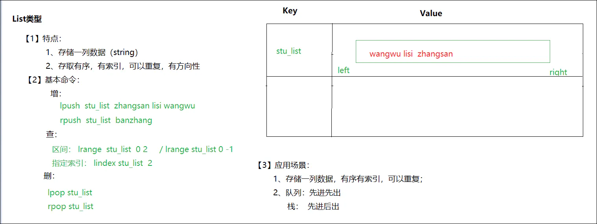
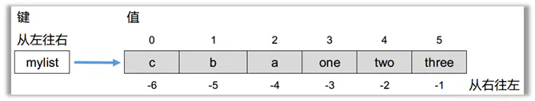

# 4、list类型的操作命令

## 目录

- [目标](#目标)
- [概述](#概述)
- [常用命令](#常用命令)
- [小结](#小结)

#### 目标

学习list类型的操作命令

#### 概述

在Redis中，List类型是**按照插入顺序排序的字符串链表**。和数据结构中的普通链表一样，我们可以在其左部(left)和右部(right)添加新的元素。

在插入时，如果该键并不存在，Redis将为该键创建一个新的链表。

与此相反，如果链表中**所有的元素均被移除，那么该键也将会被从数据库中删除**。

List**中可以包含的最大元素数量是4G个。**

#### 常用命令

| 命令                                   | 行为                                                                                                                           |
| ------------------------------------ | ---------------------------------------------------------------------------------------------------------------------------- |
| lpush 键 元素 元素...                     | left 从左边向指定的键中添加1个或多个元素，返回列表中元素的个数                                                                                           |
| rpush 键 元素 元素...                     | right 从右边向指定的键中添加1个或多个元素                                                                                                     |
| lpop 键                               | 从左边删除一个元素，返回被删除的元素                                                                                                           |
| rpop 键                               | 从右边删除一个元素，返回被删除的元素                                                                                                           |
| lrange 键 开始 结束                       | 得到键中指定范围的元素的数据 \&#x20; 每个元素都有一个索引号，从左向右0\\\~n \&#x20; 从右向左索引号：-1\\\~-(n+1)，每个元素有2个索引号 \&#x20; 如果要取出整个列表中所有的元素，索引号应该是：0\\\~-1 |
| lindex 键 索引值                         | 查询指定索引的元素                                                                                                                    |
| llen 键                               | 获取列表的长度                                                                                                                      |
| \*\*BRPOP\*\*key1 \\\[key2 ] timeout | 移出并获取列表的最后一个元素， 如果列表没有元素会阻塞列表直到等待超时或发现可弹出元素为止，超时时间单位默认是秒                                                                     |
| LREM key 删除元素个数 value值               | 从表头删除指定个数的元素                                                                                                                 |

使用场景：

- 微信朋友圈点赞，要求按照点赞顺序显示点赞好友信息。如果取消点赞，移除对应好友信息。
- list类型的lrange命令可以分页查看队列中的数据。可将每隔一段时间计算一次的排行榜存储在list类型中，如京东每日的手机销量排行、学校每次月考学生的成绩排名等，下图是酷狗音乐“K歌擂台赛”的昨日打擂金曲排行榜，每日计算一次，存储在list类型中。

#### 小结

1. 从左边添加元素: lpush
2. 从右边添加元素：rpush
3. 从左边删除元素：lpop
4. 从右边删除元素：rpop
5. 得到指定范围的元素：lrange
6. 得到列表的长度：llen
