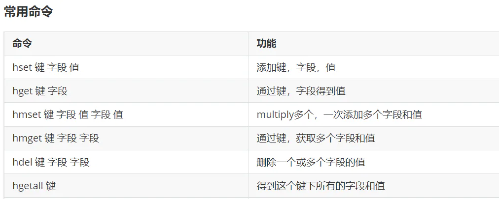

# 4.3.2.3操作哈希类型数据

## 目录

- [4.3.2.3操作哈希类型数据](#4323操作哈希类型数据)

##### [4.3.2.3](http://tnm2.oa.com/host/home/4.3.2.3 "4.3.2.3")操作哈希类型数据



需求：

> 1.存储几个哈希类型的数据
>
> 2.获取哈希类型的数据
>
> 3.根据键获取哈希类型中的所有字段
>
> 4.获得hash结构中的所有值

```javascript 
/**
 * 操作Hash类型数据
*/
@Test
public void testHash(){
       //获取操作Hash类型的接口对象
        HashOperations hashOperations = redisTemplate.opsForHash();
        //存值 下面的代码相当于命令:hset person name xiaoming
        //pseron表示键，name表示字段名  xiaoming表示字段值
        hashOperations.put("person","name","xiaoming");
        hashOperations.put("person","age","20");
        hashOperations.put("person","address","bj");

        //取值
        //下面的代码相当于执行命令：hget 键 字段===》hget person age===>表示根据键和字段名获取字段值
        String age = (String) hashOperations.get("person", "age");
        System.out.println(age);
        //获得hash结构中的所有字段
        //下面的代码相当于执行命令：HKEYS 键===》HKEYS person
        Set keys = hashOperations.keys("person");
        for (Object key : keys) {
            System.out.println(key);
        }

        //获得hash结构中的所有值
        //HVALS 键
        List values = hashOperations.values("person");
        for (Object value : values) {
            System.out.println(value);
        }
}

```
