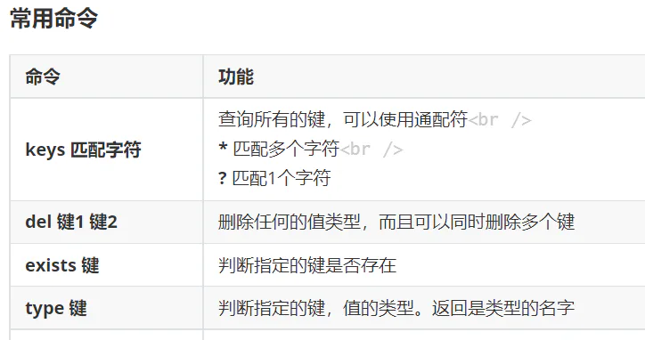

# 4.3.2.7 通用操作



需求：

> 1.获取Redis中所有的key
>
> 2.判断某个key是否存在
>
> 3.删除指定key
>
> 4.获取指定key对应的value的数据类型

```javascript 
/**
 * 通用操作，针对不同的数据类型都可以操作
*/
@Test
public void testCommon(){
       //获取Redis中所有的key
        Set<String> keys = redisTemplate.keys("*");
        for (String key : keys) {
            System.out.println(key);
        }

        //判断某个key是否存在
        Boolean itcast = redisTemplate.hasKey("itcast");
        System.out.println(itcast);

        //删除指定key
        redisTemplate.delete("myZset");

        //获取指定key对应的value的数据类型
        DataType dataType = redisTemplate.type("myset");
        System.out.println(dataType.name());

}

```
