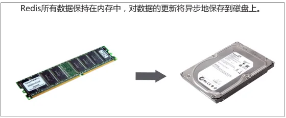

# 5.Redis持久化机制-扩展

## 目录

- [1、Redis持久化\[了解\]](#1Redis持久化了解)
  - [问题](#问题)
  - [概述](#概述)
    - [什么是Redis的持久化：](#什么是Redis的持久化)
    - [Redis持久化的两种方式：](#Redis持久化的两种方式)

### 1、Redis持久化\[了解]

#### 问题

**问：把服务端关闭了，再重新开启服务器，数据会不会丢失？**

```markdown 
会部分丢失，因为默认 redis服务器每隔一段时间写入一次内存中数据到硬盘上。
```


#### 概述

##### 什么是Redis的持久化：

Redis是**一个内存存储的数据库，内存必须在通电的情况下才能够对数据进行存储。** 如果 ，在使用redis的过程中突然发生断电，数据就会丢失。为了防止数据丢失，**redis提供了数据持久化的支持。**

```markdown 
持久化：把内存中的数据保存到硬盘上。
作用：防止数据在断电的情况下丢失。

```




redis是一个支持持久化的内存数据库，也就是说redis需要经常将内存中的数据同步到磁盘来保证持久化。redis支持两种持久化方式，一种**是RDB(快照)也是默认方式，另一种是Append Only File(缩写AOF)的方式**。下面分别介绍：

**注意：redis将内存中数据，写在硬盘文件上。服务器关闭，电脑重启数据也不会丢失。**

##### Redis持久化的两种方式：

1. RDB：Redis DataBase\*\* 默认的持久化方式，以二进制的方式将数据写入文件中\*\*。每隔一段时间写入一次。
2. AOF：Append Only File 以**文本文件的方式记录用户的每次操作，数据还原时候，读取AOF文件，模拟用户的操作，将数据还原。**

[RDB](./RDB/index.md "RDB")

[AOF](./AOF/index.md "AOF")

[RDB和AOF的区别](./RDB和AOF的区别/index.md "RDB和AOF的区别")
