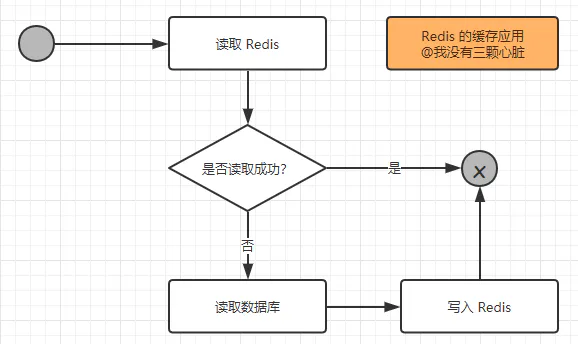
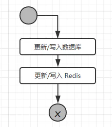
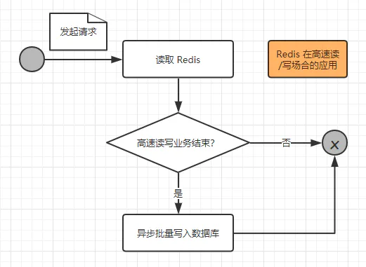
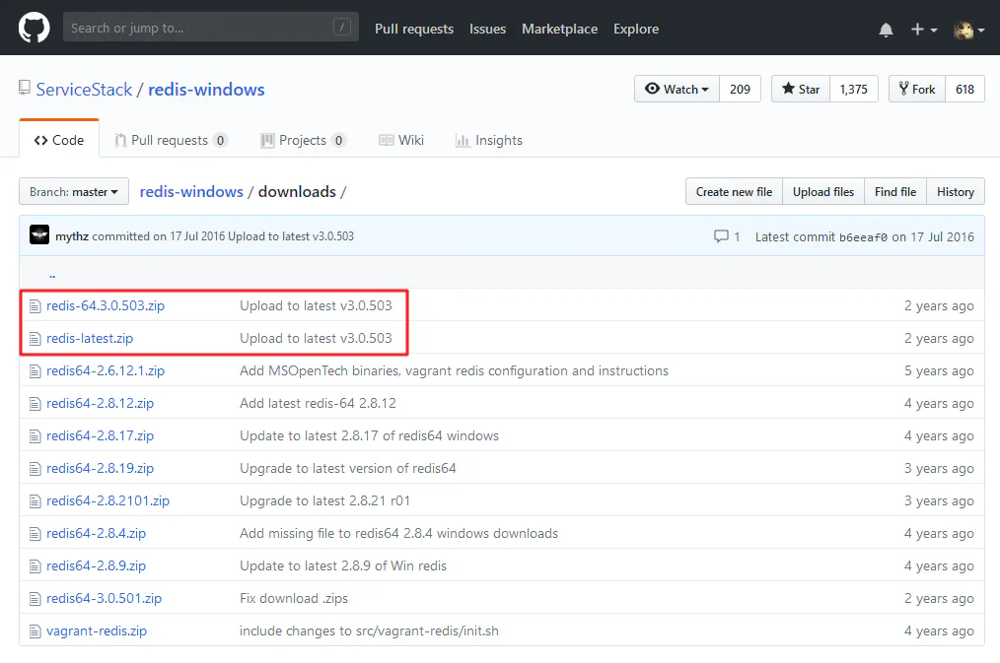
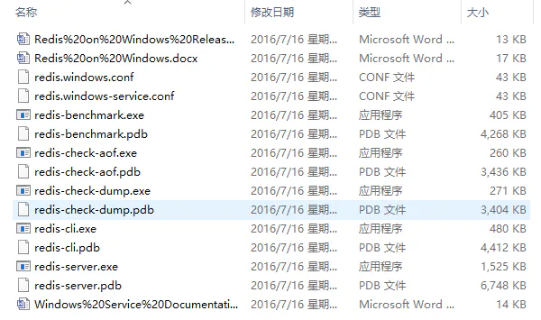
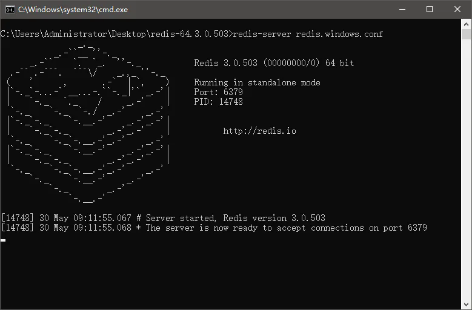
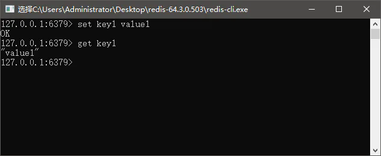
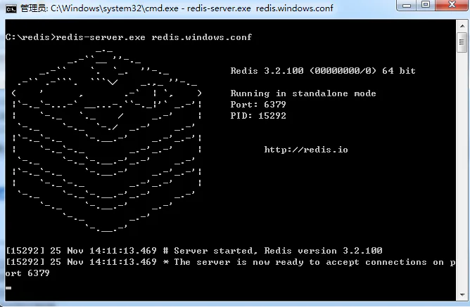
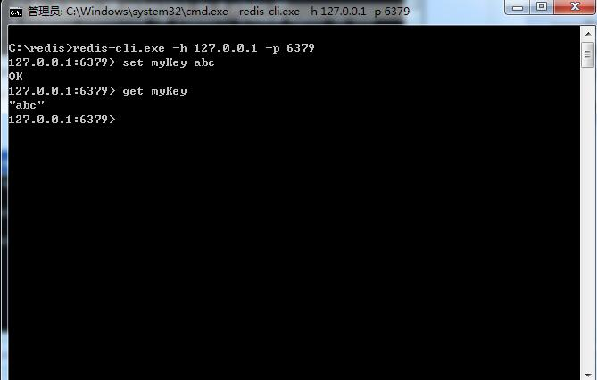

# Redis 入门 下载安装

## 目录

- [Redis【入门】就这一篇！](#Redis入门就这一篇)
  - [Redis 概述](#Redis-概述)
    - [NoSQL 技术](#NoSQL-技术)
  - [Redis 在 Java Web 中的应用](#Redis-在-Java-Web-中的应用)
    - [缓存](#缓存)
    - [高速读/写的场合](#高速读写的场合)
    - [Redis 的安装](#Redis-的安装)

[ Redis 安装 | 菜鸟教程 Redis 安装 Windows 下安装 下载地址：https://github.com/redis-windows/redis-windows/releases。 Redis 支持 32 位和 64 位。这个需要根据你系统平台的实际情况选择，这里我们下载 Redis-x64-xxx.zip压缩包到 C 盘，解压后，将文件夹重新命名为 redis。    打开文件夹，内容如下：.. https://www.runoob.com/redis/redis-install.html](https://www.runoob.com/redis/redis-install.html " Redis 安装 | 菜鸟教程 Redis 安装 Windows 下安装 下载地址：https://github.com/redis-windows/redis-windows/releases。 Redis 支持 32 位和 64 位。这个需要根据你系统平台的实际情况选择，这里我们下载 Redis-x64-xxx.zip压缩包到 C 盘，解压后，将文件夹重新命名为 redis。    打开文件夹，内容如下：.. https://www.runoob.com/redis/redis-install.html")

# Redis【入门】就这一篇！


## Redis 概述

在我们日常的Java Web开发中，无不都是使用数据库来进行数据的存储，由于一般的系统任务中通常不会存在高并发的情况，所以这样看起来并没有什么问题，可是一旦涉及大数据量的需求，比如一些商品抢购的情景，或者是主页访问量瞬间较大的时候，单一使用数据库来保存数据的系统会因为面向磁盘，磁盘读/写速度比较慢的问题而存在严重的性能弊端，一瞬间成千上万的请求到来，需要系统在极短的时间内完成成千上万次的读/写操作，这个时候往往不是数据库能够承受的，极其容易造成数据库系统瘫痪，最终导致服务宕机的严重生产问题。

#### NoSQL 技术

为了克服上述的问题，Java Web项目通常会引入NoSQL技术，这是一种基于内存的数据库，并且提供一定的持久化功能。Redis和MongoDB是当前使用最广泛的NoSQL，而就Redis技术而言，它的性能十分优越，可以支持每秒十几万此的读/写操作，其性能远超数据库，并且还支持集群、分布式、主从同步等配置，原则上可以无限扩展，让更多的数据存储在内存中，更让人欣慰的是它还支持一定的事务能力，这保证了高并发的场景下数据的安全和一致性。

## Redis 在 Java Web 中的应用

Redis 在 Java Web 主要有两个应用场景：

- 存储 缓存 用的数据；
- 需要高速读/写的场合使用它快速读/写；

#### 缓存

在日常对数据库的访问中，读操作的次数远超写操作，比例大概在1:9到3:7，所以需要读的可能性是比写的可能大得多的。当我们使用SQL语句去数据库进行读写操作时，数据库就会去磁盘把对应的数据索引取回来，这是一个相对较慢的过程。

如果我们把数据放在 Redis 中，也就是直接放在内存之中，让服务端直接去读取内存中的数据，那么这样速度明显就会快上不少，并且会极大减小数据库的压力，但是使用内存进行数据存储开销也是比较大的，限于成本的原因，一般我们只是使用 Redis 存储一些常用和主要的数据，比如用户登录的信息等。

一般而言在使用 Redis 进行存储的时候，我们需要从以下几个方面来考虑：

- 业务数据常用吗？命中率如何？如果命中率很低，就没有必要写入缓存；
- 该业务数据是读操作多，还是写操作多？如果写操作多，频繁需要写入数据库，也没有必要使用缓存；
- 业务数据大小如何？如果要存储几百兆字节的文件，会给缓存带来很大的压力，这样也没有必要；

在考虑了这些问题之后，如果觉得有必要使用缓存，那么就使用它！使用 Redis 作为缓存的读取逻辑如下图所示：



从上图我们可以知道以下两点：

1. 当第一次读取数据的时候，读取 Redis 的数据就会失败，此时就会触发程序读取数据库，把数据读取出来，并且写入 Redis 中；
2. 当第二次以及以后需要读取数据时，就会直接读取 Redis，读到数据后就结束了流程，这样速度就大大提高了。

从上面的分析可以知道，读操作的可能性是远大于写操作的，所以使用 Redis 来处理日常中需要经常读取的数据，速度提升是显而易见的，同时也降低了对数据库的依赖，使得数据库的压力大大减少。

分析了读操作的逻辑，下面我们来看看写操作的流程：



从流程可以看出，更新或者写入的操作，需要多个 Redis 的操作，如果业务数据写次数远大于读次数那么就没有必要使用 Redis。

> 关于使用内存存储数据，我知道谷歌好像就是把所有互联网的数据都存储在内存条的，所以才会有如此高质量、高效的搜索，但它毕竟是谷歌...

#### 高速读/写的场合

在如今的互联网中，越来越多的存在高并发的情况，比如天猫双11、抢红包、抢演唱会门票等，这些场合都是在某一个瞬间或者是某一个短暂的时刻有

成千上万的请求到达服务器，如果单纯的使用数据库来进行处理，就算不崩，也会很慢的，轻则造成用户体验极差用户量流失，重则数据库瘫痪，服务宕机

，而这样的场合都是不允许的！所以我们需要使用 Redis 来应对这样的高并发需求的场合，我们先来看看一次请求操作的流程图：



我们来进一步阐述这个过程：

1. 当一个请求到达服务器时，只是把业务数据在 Redis 上进行读写，而没有对数据库进行任何的操作，这样就能大大提高读写的速度，从而满足高速响应的需求；
2. 但是这些缓存的数据仍然需要持久化，也就是存入数据库之中，所以在一个请求操作完 Redis 的读/写之后，会去判断该高速读/写的业务是否结束，这个判断通常会在秒杀商品为0，红包金额为0时成立，如果不成立，则不会操作数据库；如果成立，则触发事件将 Redis 的缓存的数据以批量的形式一次性写入数据库，从而完成持久化的工作。

#### Redis 的安装

访问地址：

[https://github.com/ServiceStack/redis-windows/tree/master/downloads](https://github.com/ServiceStack/redis-windows/tree/master/downloads "https://github.com/ServiceStack/redis-windows/tree/master/downloads")



把 Redis 下载下来后找到一个合适的地方解压，就能得到如下图所示的目录（这里空格被替换成了%20...）：



为了方便启动，我们在该目录下新建一个 startup.cmd 的文件，然后将以下内容写入文件：redis-server redis.windows.conf

1这个命令其实就是在调用 redis-server.exe 命令来读取 redis.window\.conf 的内容，我们双击刚才创建好的 startup.cmd 文件，就能成功的看到 Redis 启动：



上图的提示信息告诉了我们：① Redis 当前的版本为 3.0.503；

② Redis 运行在 6379 端口；

③ Redis 进程的 PID 为 14748；④ 64 位。

我们可以打开同一个文件夹下的 redis-cli.exe 文件，这是 Redis 自带的一个客户端工具，它可以用来连接到我们当前的 Redis 服务器，我们做以下测试：



如此，我们便在 Windows 的环境下安装好了 Redis。

如果想方便的话，可以把 redis 的路径加到系统的环境变量里，这样就省得再输路径了，后面的那个 redis.windows.conf 可以省略，如果省略，会启用默认的。输入之后，会显示如下界面：



这时候另启一个 cmd 窗口，原来的不要关闭，不然就无法访问服务端了。

切换到 redis 目录下运行:

redis-cli.exe -h 127.0.0.1 -p 6379

设置键值对:set myKey abc

取出键值对:get myKey



```纯文本 
 或者中和上面两种： 
 在任何路径进入cmd 
 startup启动服务   然后redis-cli 启动客户端 
 redis-server D:\redis-64.3.0.503\redis.windows.conf
```


Redis 只能支持六种数据类型（string/hash/list/set/zset/hyperloglog）的操作，

string（字符串），hash（哈希），list（列表），set（集合）及zset(sorted set：有序集合)。
