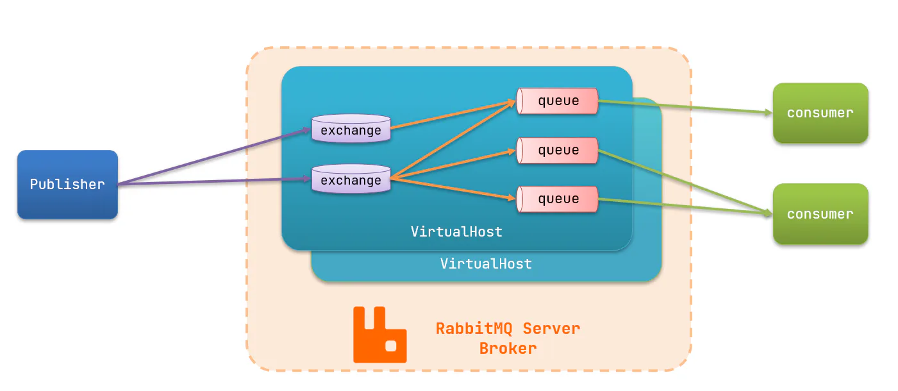
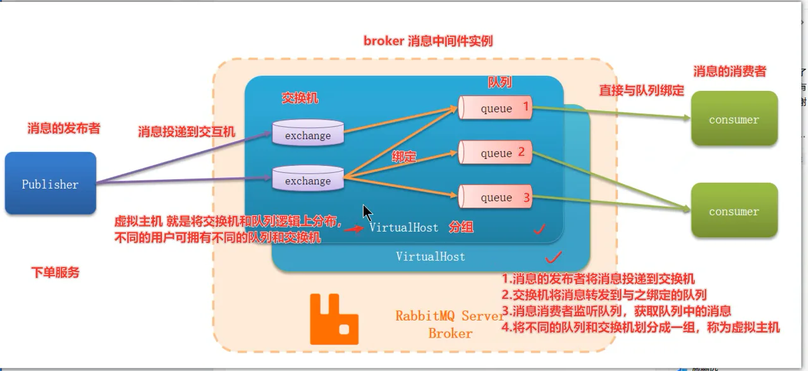

# MQ的基本结构：

【1】RabbitMQ中的一些角色：

- publisher：生产者(发布者)
- consumer：消费者
- exchange：交换机，负责消息路由
- queue：队列，存储消息
- virtualHost：虚拟主机，隔离不同租户的exchange、queue、消息的隔离
- channel：表示通道，操作MQ的工具。是消息发布者和交换机之间的连接通道，也是消息消费者连接队列的通道。

【2】将以上的RabbitMQ基本结构归纳为以下四点：

> 1.消息的发布者(publisher)将消息投递到交换机(exchange)
>
> 2.交换机(exchange)将消息转发到与之绑定的队列(queue)
>
> 3.消息消费者(consumer)监听队列(queue)，获取队列(queue)中的消息
>
> 4.将不同的队列(queue)和交换机(exchange)划分成一组，称为虚拟主机(virtualHost)

注意：消息的发布者(publisher)只知道对应的交换机(exchange)，不知道队列。反之，消息消费者(consumer)只知道队列(queue)，不知道交换机(exchange)
