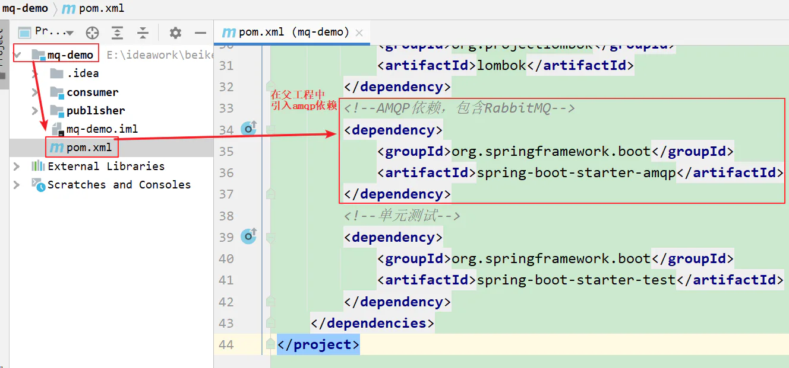
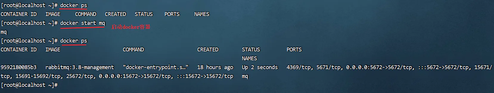
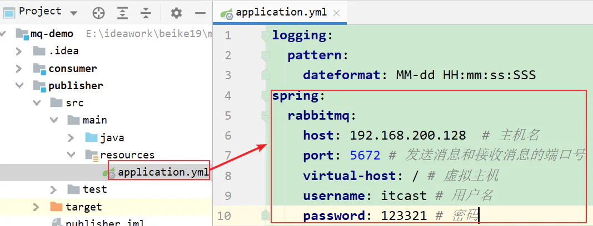
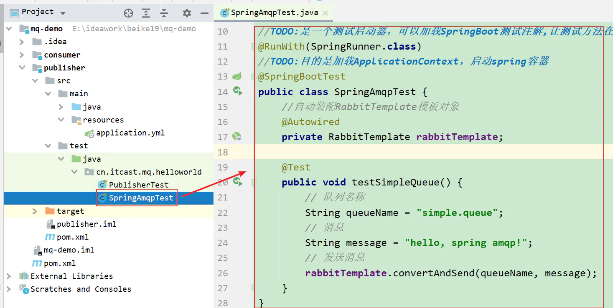
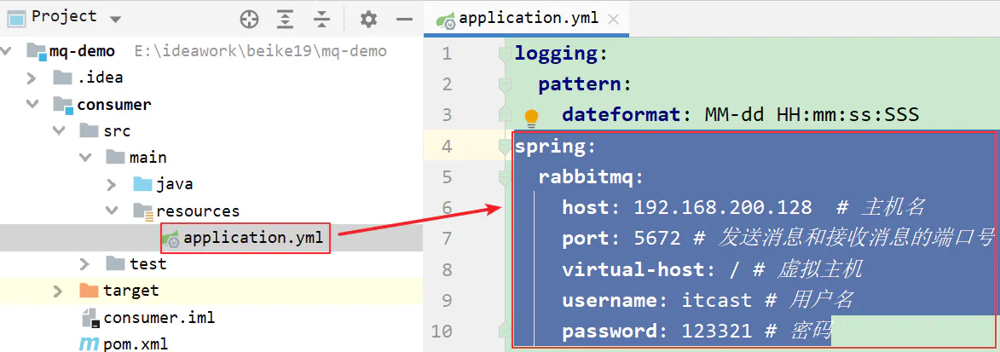
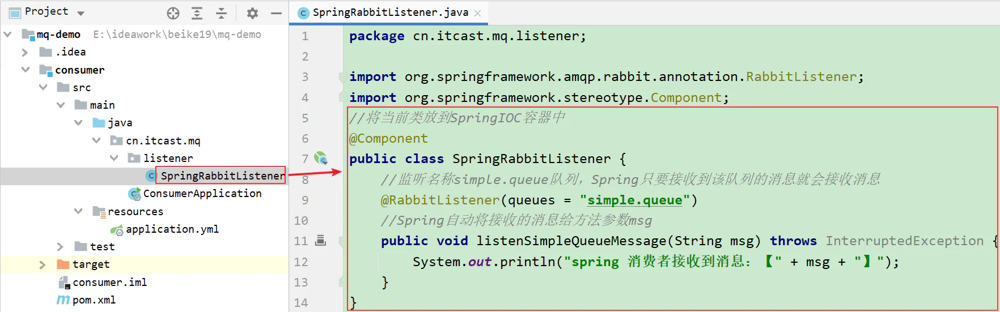
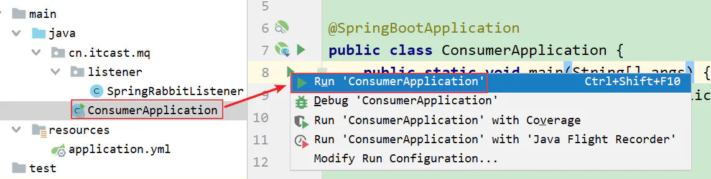
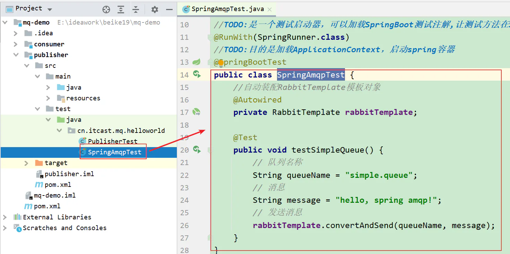

# Basic Queue 简单队列模型

## 目录

- [在父工程mq-demo中引入依赖](#在父工程mq-demo中引入依赖)
- [消息发送](#消息发送)
- [消息接收](#消息接收)
- [3.1.3.测试](#313测试)

步骤如下：

1.在父工程中引入spring-amqp的依赖

2.在publisher服务中利用RabbitTemplate发送消息到simple.queue这个队列

3.在consumer服务中编写消费逻辑，绑定simple.queue这个队列

### 在父工程mq-demo中引入依赖

```xml 
<!--AMQP依赖，包含RabbitMQ-->
<dependency>
    <groupId>org.springframework.boot</groupId>
    <artifactId>spring-boot-starter-amqp</artifactId>
</dependency>


```




### 消息发送

> 注意：整个过程一定保证mq的容器是启动的



【1】首先配置MQ地址，在publisher服务的application.yml中添加配置：



```yaml 
spring:
  rabbitmq:
    host: 192.168.200.128  # 主机名
    port: 5672 # 发送消息和接收消息的端口号
    virtual-host: / # 虚拟主机
    username: itcast # 用户名
    password: 123321 # 密码

```


【2】然后在publisher服务中编写测试类SpringAmqpTest，并利用RabbitTemplate实现消息发送：

> 1.定义变量保存队列名称
>
> 2.定义变量保存消息信息
>
> 3.发送消息



```java 
package cn.itcast.mq.helloworld;

import org.junit.Test;
import org.junit.runner.RunWith;
import org.springframework.amqp.rabbit.core.RabbitTemplate;
import org.springframework.beans.factory.annotation.Autowired;
import org.springframework.boot.test.context.SpringBootTest;
import org.springframework.test.context.junit4.SpringRunner;

//TODO:是一个测试启动器，可以加载SpringBoot测试注解,让测试方法在Spring容器环境下执行
@RunWith(SpringRunner.class)
//TODO:目的是加载ApplicationContext，启动spring容器
@SpringBootTest
public class SpringAmqpTest {
    //自动装配RabbitTemplate模板对象
    @Autowired
    private RabbitTemplate rabbitTemplate;

    @Test
    public void testSimpleQueue() {
        // 队列名称
        String queueName = "simple.queue";
        // 消息
        String message = "hello, spring amqp!";
        // 发送消息
        rabbitTemplate.convertAndSend(queueName, message);
    }
}
```


### 消息接收

【1】首先配置MQ地址，在consumer服务的application.yml中添加配置：



```yaml 
spring:
  rabbitmq:
    host: 192.168.200.128  # 主机名
    port: 5672 # 发送消息和接收消息的端口号
    virtual-host: / # 虚拟主机
    username: itcast # 用户名
    password: 123321 # 密码

```


【2】然后在consumer服务的`cn.itcast.mq.listener`包中新建一个类SpringRabbitListener



代码如下：

```java 
package cn.itcast.mq.listener;

import org.springframework.amqp.rabbit.annotation.RabbitListener;
import org.springframework.stereotype.Component;
//将当前类放到SpringIOC容器中
@Component
public class SpringRabbitListener {
    //监听名称simple.queue队列，Spring只要接收到该队列的消息就会接收消息
    @RabbitListener(queues = "simple.queue")
    //Spring自动将接收的消息给方法参数msg
    public void listenSimpleQueueMessage(String msg) throws InterruptedException {
        System.out.println("spring 消费者接收到消息：【" + msg + "】");
    }
}

```


### 3.1.3.测试

启动consumer服务，然后在publisher服务中运行测试代码，发送MQ消息




