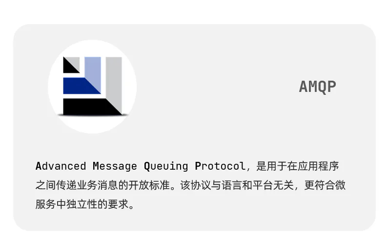
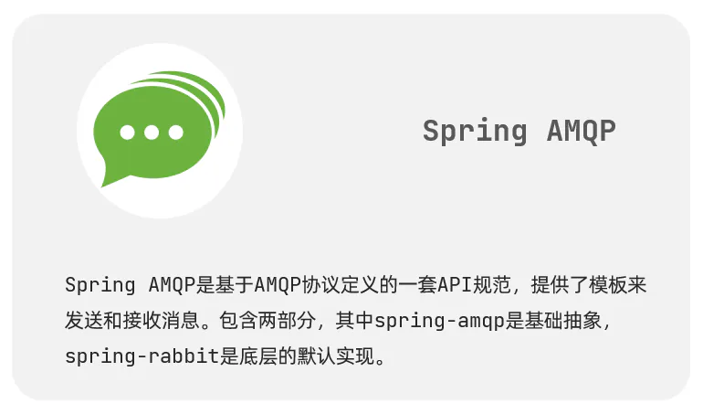

# &#x20;SpringAMQP介绍

SpringAMQP是基于RabbitMQ封装的一套模板，并且还利用SpringBoot对其实现了自动装配，使用起来非常方便。

SpringAmqp的官方地址：[https://spring.io/projects/spring-amqp](https://spring.io/projects/spring-amqp "https://spring.io/projects/spring-amqp")

说明：

> 1.Spring AMQP 是对 `Spring` 基于 AMQP 的消息收发解决方案，它是一个抽象层，不依赖于特定的 `AMQP Broker` 实现和客户端的抽象，所以可以很方便地替换。比如我们可以使用 `spring-rabbit` 来实现。
>
> 2.`spring-rabbit`用于与**RabbitMQ服务器**交互的工具包
>
> 3.SpringAMQP提供了三个功能：
>
> \-   自动声明队列、交换机及其绑定关系
> \-   基于注解的监听器模式，异步接收消息
> \-   封装了RabbitTemplate工具，用于发送和接收消息
