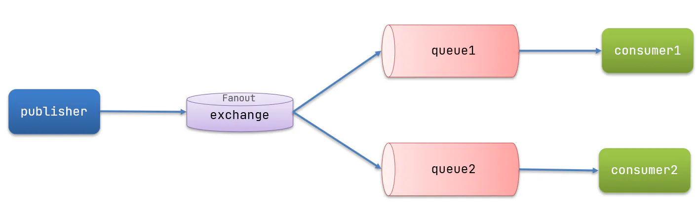
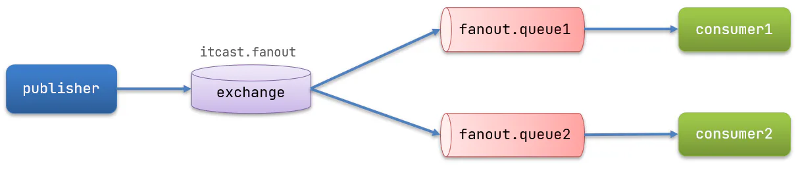
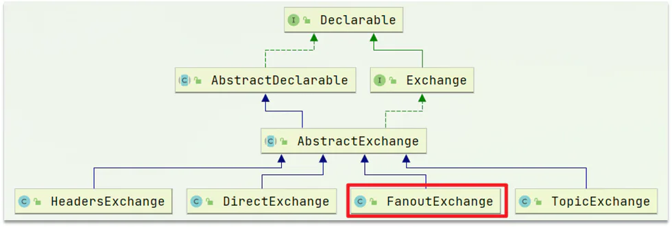
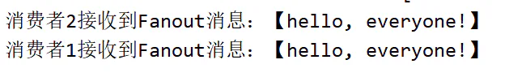
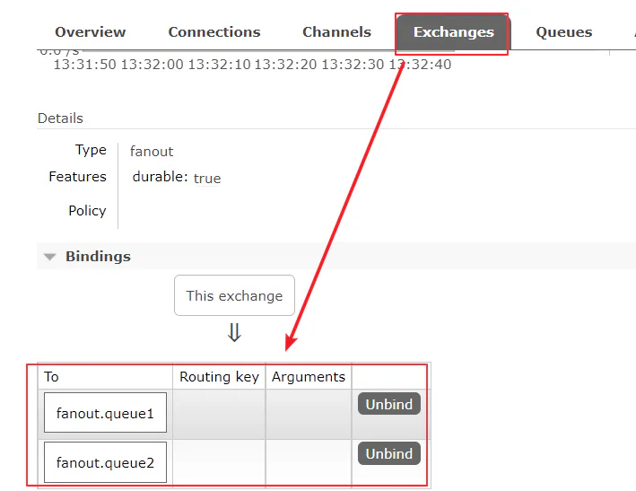

# Fanout

## 目录

- [3.4.1.声明队列和交换机](#341声明队列和交换机)
- [3.4.2.消息接收](#342消息接收)
- [3.4.3.消息发送](#343消息发送)
- [3.4.4.结果](#344结果)
- [3.4.5.总结](#345总结)

Fanout，英文翻译是扇出，我觉得在MQ中叫广播更合适。



在广播模式下，消息发送流程是这样的：

- 1） 可以有多个队列
- 2） 每个队列都要绑定到Exchange（交换机）
- 3） 生产者发送的消息，只能发送到交换机，交换机来决定要发给哪个队列，生产者无法决定
- 4） 交换机把消息发送给绑定过的所有队列
- 5） 订阅队列的消费者都能拿到消息

我们的计划是这样的：

- 创建一个交换机 itcast.fanout，类型是Fanout
- 创建两个队列fanout.queue1和fanout.queue2，绑定到交换机itcast.fanout



### 3.4.1.声明队列和交换机

Spring提供了一个接口Exchange，来表示所有不同类型的交换机：



在consumer中创建一个配置类，声明队列和交换机：

```java 
package cn.itcast.mq.config;

import org.springframework.amqp.core.Binding;
import org.springframework.amqp.core.BindingBuilder;
import org.springframework.amqp.core.FanoutExchange;
import org.springframework.amqp.core.Queue;
import org.springframework.context.annotation.Bean;
import org.springframework.context.annotation.Configuration;

@Configuration
public class FanoutConfig {
    /**
     * 声明交换机
     * @return Fanout类型交换机
     */
    @Bean//@Bean注解特点将修饰方法返回值放到IOC容器中，方法名fanoutExchange作为bean对象的key
    public FanoutExchange fanoutExchange(){
        //交换机名是：itcast.fanout
        return new FanoutExchange("itcast.fanout");
    }

    /**
     * 第1个队列
     */
    @Bean
    public Queue fanoutQueue1(){
        //fanout.queue1表示队列名
        return new Queue("fanout.queue1");
    }

    /**
     * 绑定队列和交换机
     * TODO:
     *  1.Queue fanoutQueue1 : fanoutQueue1表示IOC容器中Queue的bean的对应的key
     *  2.FanoutExchange fanoutExchange:fanoutExchange表示IOC容器中FanoutExchange的bean的对应的key是上述方法
     *          public FanoutExchange fanoutExchange(){}的方法名
     */
    @Bean
    public Binding bindingQueue1(Queue fanoutQueue1, FanoutExchange fanoutExchange){
        //绑定第一个队列到fanoutExchange交换机上
        return BindingBuilder.bind(fanoutQueue1).to(fanoutExchange);
    }

    /**
     * 第2个队列
     */
    @Bean
    public Queue fanoutQueue2(){
        //fanout.queue2 表示队列名
        return new Queue("fanout.queue2");
    }

    /**
     * 绑定队列和交换机
     */
    @Bean
    public Binding bindingQueue2(Queue fanoutQueue2, FanoutExchange fanoutExchange){
        //绑定第2个队列到fanoutExchange交换机上
        return BindingBuilder.bind(fanoutQueue2).to(fanoutExchange);
    }
}

```


### 3.4.2.消息接收

在consumer服务的SpringRabbitListener中添加两个方法，作为消费者：

```java 
   @RabbitListener(queues = "fanout.queue1")
    public void listenFanoutQueue1(String msg) {
        System.out.println("消费者1接收到Fanout消息：【" + msg + "】");
    }

    @RabbitListener(queues = "fanout.queue2")
    public void listenFanoutQueue2(String msg) {
        System.out.println("消费者2接收到Fanout消息：【" + msg + "】");
    }

```


### 3.4.3.消息发送

在publisher服务的SpringAmqpTest类中添加测试方法：

```java 
@Test
    public void testFanoutExchange() {
        // 交换机名称
        String exchangeName = "itcast.fanout";
        // 消息
        String message = "hello, everyone!";
        rabbitTemplate.convertAndSend(exchangeName, "", message);
    }

```


### 3.4.4.结果





### 3.4.5.总结

交换机的作用是什么？

- 接收publisher发送的消息
- 将消息按照规则路由到与之绑定的队列
- 不能缓存消息，路由失败，消息丢失
- FanoutExchange的会将消息路由到每个绑定的队列

声明队列、交换机、绑定关系的Bean是什么？

- Queue
- FanoutExchange
- Binding
