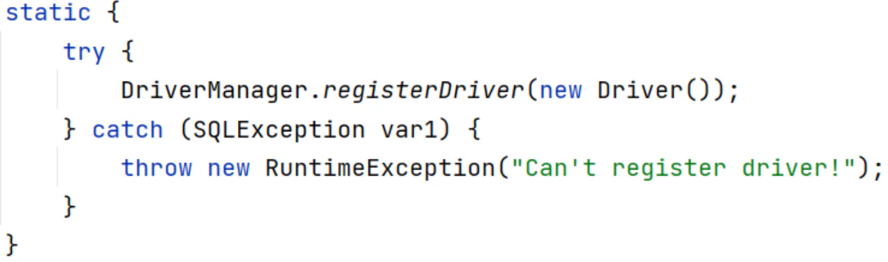
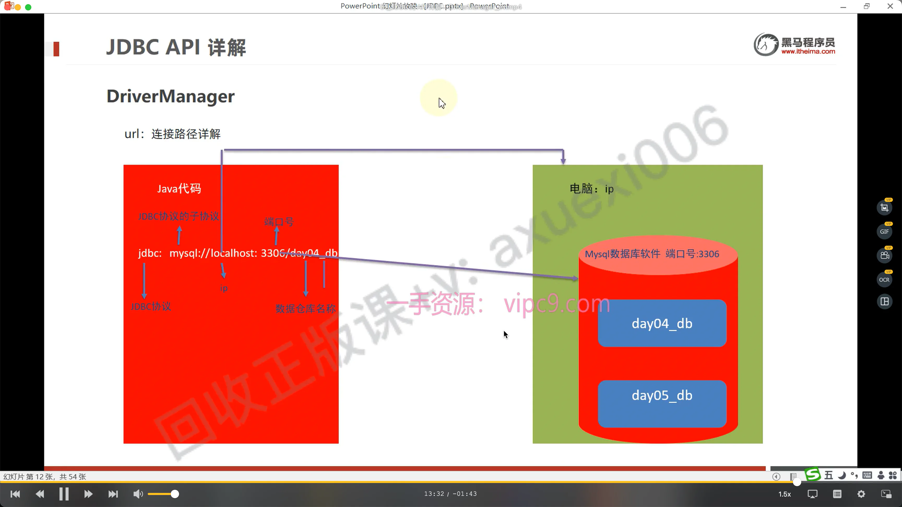

# DriverManager

## 目录

- [DriverManager(驱动管理类)作用：
  ](#DriverManager驱动管理类作用)
  - [1.注册驱动](#1注册驱动)
  - [获取连接](#获取连接)
  - [url：连接路径详解
    ](#url连接路径详解)

DriverManager(驱动管理类)作用：

注册驱动
获取数据库连接

## 1.注册驱动

```java 
Class.forName("com.mysql.jdbc.Driver");
```


&#x20;查看 Driver 类源码



> 提示：
> MySQL 5之后的驱动包，可以**省略注册驱动的步骤
> **自**动加载jar包中META-INF/services/java.sql.Driver文件中的驱动类**

## 获取连接


参数

1\.   url：连接路径

**语法**： jdbc:mysql://ip地址(域名):端口号/数据库名称?参数键值对1&参数键值对2…
**示例：** jdbc:mysql://127.0.0.1:3306/db1
细节：

- 如果连接的是本机mysql服务器，并且mysql服务默认端口是3306，则url可以简写为：jdbc:mysql:///数据库名称?参数键值对
- 如果**数据出现乱码需要**加上参数: ?`useUnicode=true&characterEncoding=utf8`，表示让数据库以UTF8编码来处理数据。

1. &#x20;user：用户名
2. &#x20;password：密码

url：连接路径详解


