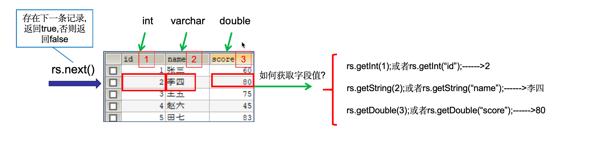
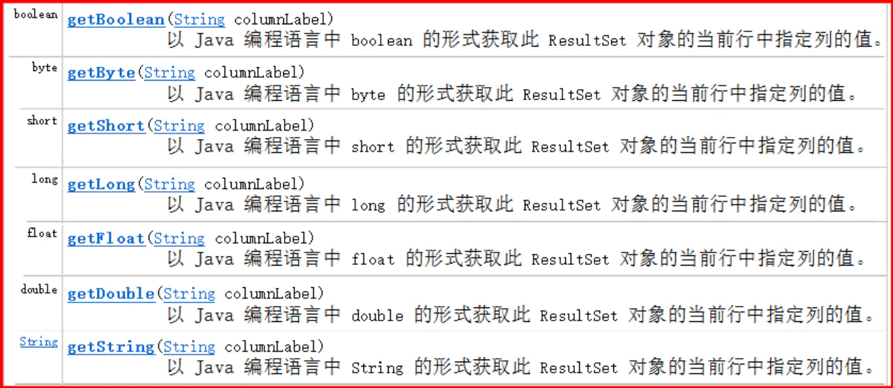

# ResultSet

## 目录

- [1.jdbc查询操作
  ](#1jdbc查询操作)
- [1) ResultSet的原理](#1-ResultSet的原理)
- [2) ResultSet获取数据的API](#2-ResultSet获取数据的API)
- [使用步骤：
  ](#使用步骤)
- [案例](#案例)

1.jdbc查询操作

```java 
ResultSet    stmt.executeQuery(sql)：执行DQL 语句，返回 ResultSet 对象
```


# 1) ResultSet的原理

1. ResultSet内部**有一个指针,刚开始记录开始位置**;
2. 调用next方法, ResultSet内部指针**会移动到下一行数据;**
3. 我们可以通过ResultSet得**到一行数据 getXxx得到某列数据;**



> 注意 **：这个取的是结果集；是别名**；而不是原名

# 2) ResultSet获取数据的API

其实`ResultSet`获取数据的API是有规律的**get后面加数据类型。** 我们统称`getXXX()`



使用步骤：

1. 游标向下移动一行，并判断该行否有数据：next()
2. 获取数据：getXxx(参数)

```java 
//循环判断游标是否是最后一行末尾
while(rs.next()){
    //获取数据
    rs.getXxx(参数);
}

```


# 案例

需求:

1. 使用SQL根据用户的账号和密码去数据库查询数据
2. 2\. 如果查询到数据，说明登录成功
3. 3\. 如果查询不到数据，说明登录失败

```java 
@Testpublic void test9() throws SQLException {    
    Connection conn = JdbcUtil.getConnection();    //获取发送sql的对象    
    Statement stm = conn.createStatement();    //发送登录的sql查询用户信息  
    String user="wangwu";    
    String password="123";    
    String loginSql="select * from user where username='"+user+"' and password='"+password+"'";    
    //select * from user where username='wangwu' and password='123'    
    ResultSet rs = stm.executeQuery(loginSql);    
  if(rs.next()){        
    String username = rs.getString("username");        
    String pwd = rs.getString(3);        
    System.out.println(username+pwd);        
    System.out.println("恭喜："+username+"登录成功！");    
  }else{        
    System.out.println("您输入的用户名或者密码错误！");    
  }    
  //关闭资源    
  JdbcUtil.close(rs,stm,conn);
}

```


```java 
package com.itheima.jdbc.api;

import org.junit.Test;

import java.sql.*;

public class UserLogin {


    //使用PreparedStatement解决SQL注入问题
    @Test
    public void loginTest2() throws ClassNotFoundException, SQLException {
        //1、注册驱动
        Class.forName("com.mysql.jdbc.Driver");

        //2、连接数据库
        final String URL = "jdbc:mysql://127.0.0.1:3306/db5";
        final String NAME = "root";
        final String PASWORD = "itheima";
        Connection conn = DriverManager.getConnection(URL, NAME, PASWORD);

        //3、编写SQL语句
        String username = "aaa";
        String password = "aaa' or 1=1-- ";
        String sql = "select id,username,password from user where username=? and password=?";

        //4、执行SQL语句
        PreparedStatement pstmt = conn.prepareStatement(sql);//创建预编译对象（对sql语句进行预编译操作）
        //给SQL语句中的占位符赋值
        pstmt.setString(1, username);
        pstmt.setString(2, password);

        ResultSet rs = pstmt.executeQuery();//执行SQL，查询结果封装在ResultSet对象中

        //5、处理SQL执行结果
        if (rs.next()) { //if判断，适用于查询的结果集中仅有一行记录
            String strname = rs.getString("username");
            String pwd = rs.getString("password");
            System.out.println("欢迎" + strname + "登录成功");

        } else {
            System.out.println("登录失败!");
        }

        //6、释放资源（倒着书写关闭功能）
        rs.close();
        pstmt.close();
        conn.close();
    }


    @Test
    public void loginTest() throws ClassNotFoundException, SQLException {
        //1、注册驱动
        Class.forName("com.mysql.jdbc.Driver");

        //2、连接数据库
        final String URL = "jdbc:mysql://127.0.0.1:3306/db5";
        final String NAME = "root";
        final String PASWORD = "itheima";
        Connection conn = DriverManager.getConnection(URL, NAME, PASWORD);

        //3、编写SQL语句
        String username = "aaa";
        String password = "aaa' or 1=1-- ";
        String sql = "select id,username,password " +
                "from user " +
                "where username='" + username + "' and password='" + password + "';";

        //4、执行SQL语句
        Statement stmt = conn.createStatement();//创建执行SQL的对象
        ResultSet rs = stmt.executeQuery(sql);//执行SQL，查询结果封装在ResultSet对象中

        //5、处理SQL执行结果
        if (rs.next()) { //if判断，适用于查询的结果集中仅有一行记录
            String strname = rs.getString("username");
            String pwd = rs.getString("password");
            System.out.println("欢迎" + strname + "登录成功");

        } else {
            System.out.println("登录失败!");
        }

        //6、释放资源（倒着书写关闭功能）
        rs.close();
        stmt.close();
        conn.close();
    }
}

```
