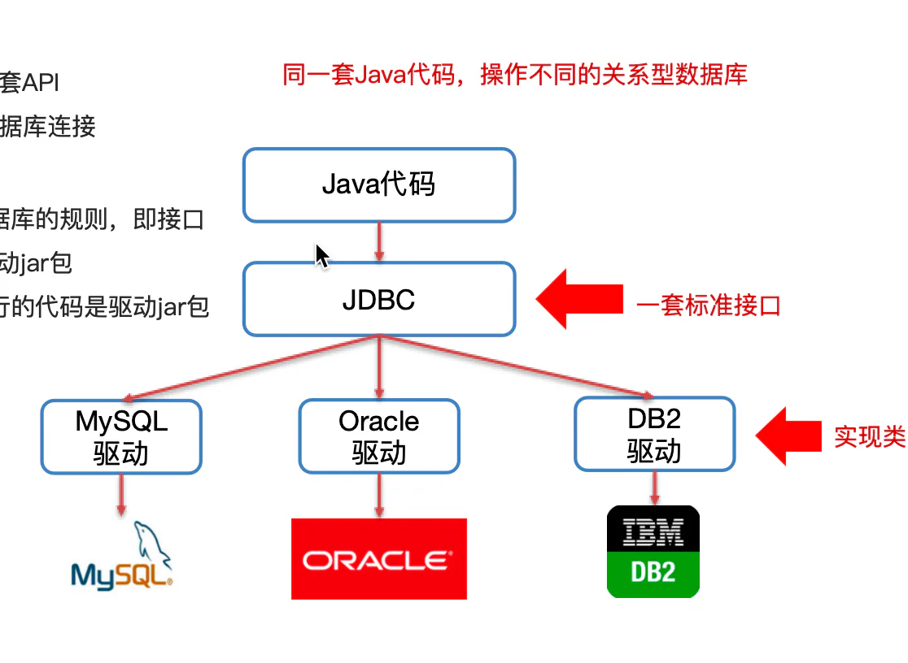

JDBC 简介&#x20;

## 目录

- [JDBC 概念：](#JDBC-概念)
- [JDBC 本质：
  ](#JDBC-本质)
- [JDBC 好处：
  ](#JDBC-好处)

# JDBC 概念：

**JDBC 就是使用Java语言操作关系型数据库的一套API**
全称：( Java DataBase Connectivity ) Java 数据库连接

JDBC 本质：

官方（sun公司）定义的\*\*一套操作所有关系型数据库的规则，\*\***即接口
**各个**数据库厂商去实现这套接口，提供数据库驱动jar包
**我们可以使用这套接口（JDBC）编程，真正执行**的代码是驱动jar包中的实现类**

JDBC 好处：

各**数据库厂商使用相同的接口，Java代码不需要针对不同数据库分别开发
**可随时**替换底层数据库，访问数据库的Java代码基本不变**

