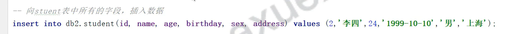
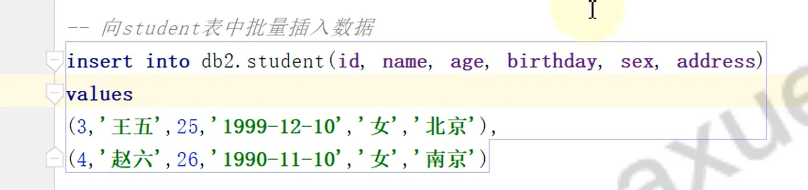
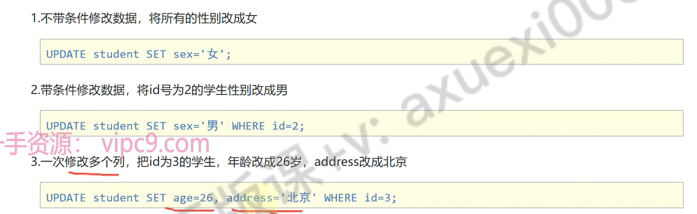
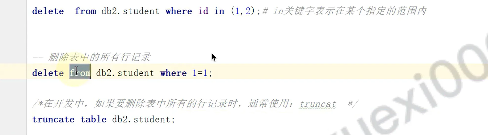

# DML数据操作语言

## 目录

- [添加 insert](#添加-insert)
  - [给指定列添加数据](#给指定列添加数据)
  - [给全部列添加数据
    ](#给全部列添加数据)
  - [批量添加数据](#批量添加数据)
- [修改 update  ](#修改-update--)
  - [修改表数据](#修改表数据)
- [删除 delete](#删除-delete)
  - [删除数据](#删除数据)
  - [truncate删除表记录 属于DDL](#truncate删除表记录-属于DDL)
- [truncate和delete的区别](#truncate和delete的区别)

# 添加 insert

#### 给指定列添加数据

> **字符串数据用****单引号****包含**; 如（字符串；日期`yyyy-MM-dd`）

```sql 
INSERT INTO 表名(列名1,列名2,…) VALUES(值1,值2,…);
```


#### 给全部列添加数据&#xD;

```sql 
INSERT INTO 表名 VALUES(值1,值2,…);
```


#### 批量添加数据

```sql 
INSERT INTO 表名(列名1,列名2,…) VALUES(值1,值2,…),(值1,值2,…),(值1,值2,…)…;

INSERT INTO 表名 VALUES(值1,值2,…),(值1,值2,…),(值1,值2,…)…;
```






> 注意

- **没指定的**值为`null`
- **类型不匹配**会报错；
- 字符串、日期。用单引号
- 日期固定默认格式 : `yyyy-MM-dd`

> 推荐

- 向表中插入一条数据的时候全部写出来
- 批量插入太长了；可以换行；方便阅读。

# 修改 update &#x20;

#### 修改表数据

```sql 
UPDATE 表名 SET 列名1=值1,列名2=值2,… [WHERE 条件] ;
```


> &#x20;**注意：修改语句中如果不加条件，则将所有数据都修改！**



# 删除 delete

#### 删除数据

```sql 
DELETE FROM 表名 [WHERE 条件] ;
```


> **注意：删除语句中如果不加条件，则将所有数据都删除！**

如果在开发中要删除所有行记录；用下面语句

#### truncate删除表记录 属于DDL

```sql 
TRUNCATE TABLE 表名;
```




> 注意

- **in 关键字；在范围内 ；例如： in(1,2)**

# truncate和delete的区别

- `delete`是将表中的数据一条一条删除 &#x20;
- &#x20;`truncate`是将整个表摧毁，重新创建一个新的表,新的表结构和原来表结构一模一样
