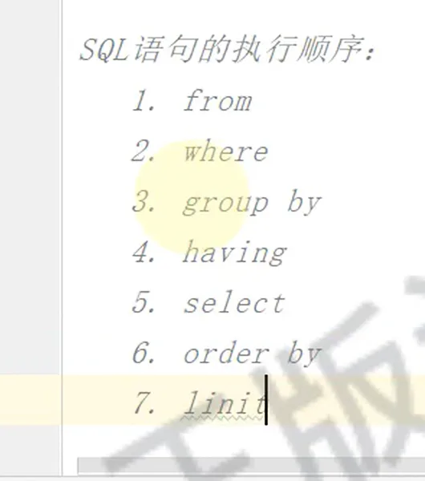
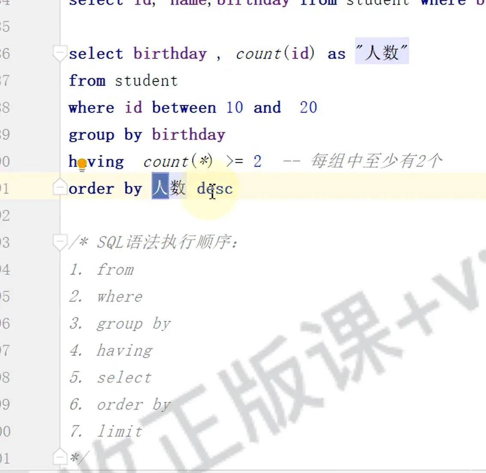

# DQL数据查询语言

## 目录

- [sql 语句的执行顺序](#sql-语句的执行顺序)

```sql 
SELECT 
    字段列表
FROM 
    表名列表 
WHERE 
    条件列表
GROUP BY
    分组字段
HAVING
    分组后条件
ORDER BY
    排序字段
LIMIT
    分页限定

```


- 基础查询
- 条件查询(WHERE）
- 分组查询(GROUP BY)
- 排序查询(ORDER BY)
- 分页查询(LIMIT)

# sql 语句的执行顺序



1. **from**
2. **where**
3. **group by**
4. **having**
5. **select**
6. **order by**
7. \*\*limit \*\*



[基础查询](./基础查询/index.md "基础查询")

[条件查询 where](<./条件查询 where/index.md> "条件查询 where")

[](./排序查询 order by-/index.md)

[分组查询 group by](<./分组查询 group by/index.md> "分组查询 group by")

[分页查询](./分页查询/index.md "分页查询")

[案例](./案例/index.md "案例")

## 子目录与文章

- [排序查询 order by-](./排序查询%20order%20by-/index.md)
