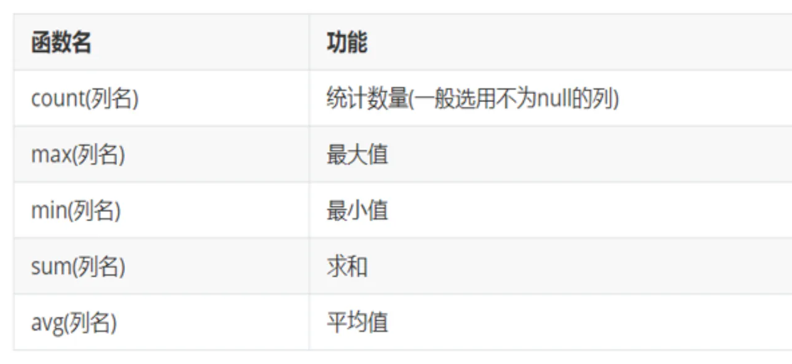
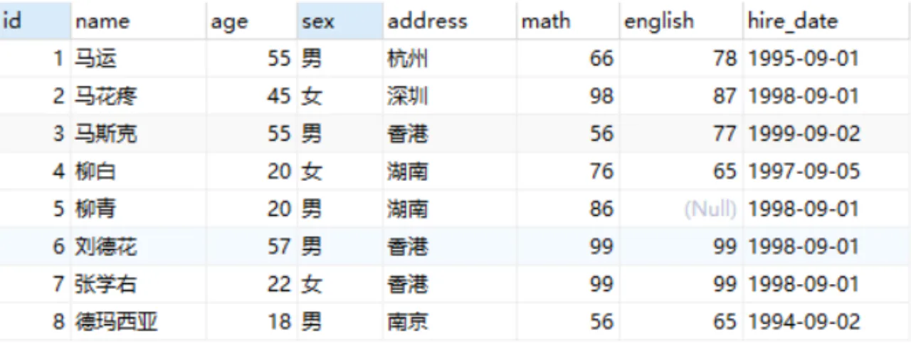
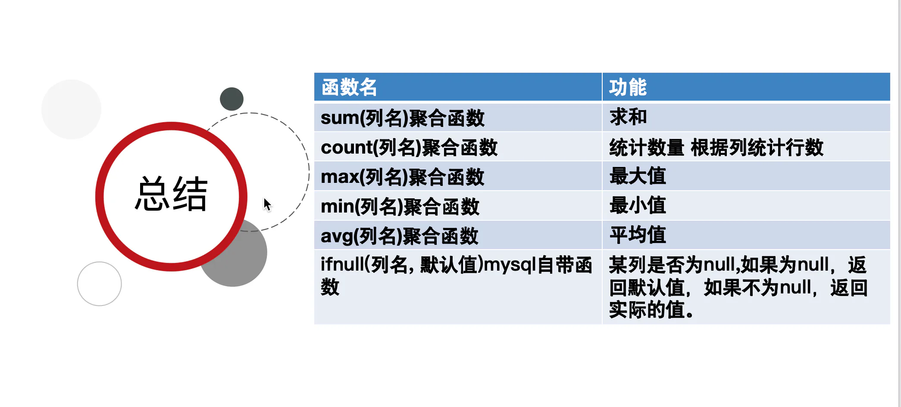

聚合函数

## 目录

- [概念：     ](#概念-----)
- [聚合函数分类：](#聚合函数分类)
- [聚合函数语法：](#聚合函数语法)
- [案例](#案例)
  - [查询学生总数](#查询学生总数)
  - [查询数学成绩总分](#查询数学成绩总分)
  - [查询数学成绩最高分](#查询数学成绩最高分)
  - [统计数学与英语的总和值](#统计数学与英语的总和值)
- [ifnull函数](#ifnull函数)
  - [语法](#语法)
  - [举例：](#举例)

# 概念：    &#x20;

- 将一**列数据作为一个整体，进行纵向计算。**

# 聚合函数分类：





# 聚合函数语法：

```sql 
SELECT 聚合函数名(列名) FROM 表;
```


> **注意：null 值不参与所有聚合函数运算**

# 案例

##### 查询学生总数

```sql 
SELECT COUNT(english) FROM student3;

//. 通常使用：
SELECT COUNT(*) FROM student3;

```


##### 查询数学成绩总分

```sql 
SELECT SUM(math) FROM student3;
```


##### 查询数学成绩最高分

```sql 
SELECT MAX(math) FROM student3;
```


##### 统计数学与英语的总和值

方法一：统计数学与英语的总和值

```sql 
-- 统计数学与英语的总和值
select sum(math) + sum(english) from student3;
```


方法二：先统计每个人的数学与英语的总和值

```sql 
-- 先统计每个人的数学与英语的总和值
select sum(math + english) from student3;
```


> **注意： 结果少了86**

- english的值是null，在`mysql`中`null`值和**任何值相加为**`null`,
- 并且`null`值在**聚合函数**`sum`中**不作为统计**

# ifnull函数

##### 语法

```sql 
ifnull(列名, 默认值)
```


- 函数表示判断该列是否为null,如果为null，返回默认值，如果不为null，返回实际的值。

##### 举例：

- english 的值是null

```sql 
ifnull(english,2) ====english列的值是null，返回值是 2


```


- english的值是3

```sql 
  ifnull(english,2) ===== english列的值不是null，返回实际值是3
```



