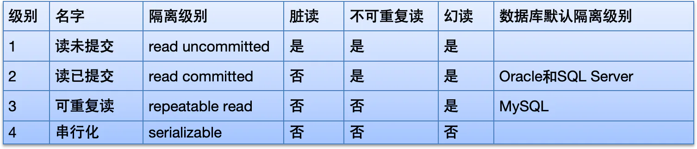
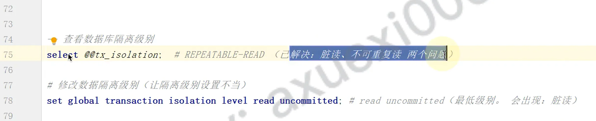

事务的隔离级别

## 目录

- [说明：](#说明)
- [2、安全和性能对比
  ](#2安全和性能对比)
- [查看数据库隔离级别](#查看数据库隔离级别)
  - [查询](#查询)
  - [设置事务隔离级别](#设置事务隔离级别)

MySQL数据库规范规定了\*\*4种隔离级别，用于解决上述出现的事务并发问题; \*\*



# 说明：

- 其实上述三个问题中，**最严重的就是脏读（读取了错误数据），这个问题一定要避免；**
- 关于不可重复读和虚读其实并不是逻辑上的错误，而是数据的时效性问题，所以这种问题并不属于很严重的错误；
- 如果对于数据的时效性要求不是很高的情况下，我们是可以接受不可重复读和虚读的情况发生的；

2、安全和性能对比

- 安全: 串行化>可重复读>读已提交>读未提交&#x20;
- 性能: 串行化<可重复读<读已提交<读未提交&#x20;

# 查看数据库隔离级别



> set global transaction isolation level read uncommitted;    #read uncommitted(最低级别。会出现：脏读)

> &#x20;select   @@tx\_  isolation;    #REPEATABLE-READ   (己解决：脏读、不可重复读两个问题）

### 查询

```sql 
show variables like '%isolation%';
-- 或
select @@tx_isolation;

```


### 设置事务隔离级别

```sql 
set global transaction isolation level 隔离级别;
-- 把当前事务的隔离级别降低为：读未提交（最低级别）

set global transaction isolation level read uncommitted;

```


```markdown 

 ## 注意：客户端需要重新连接，刷新事务隔离级别
-- 再次查询隔离级别
select @@tx_isolation; -- READ-UNCOMMITTED

```
