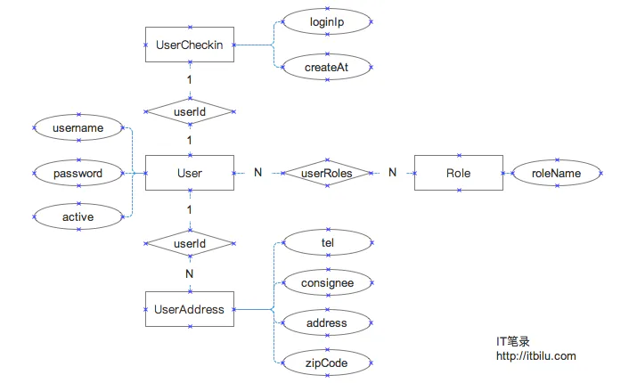
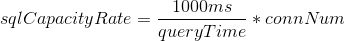
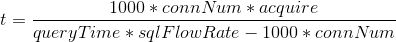

# Sequelize 文档

## 目录

- [Sequelize 推荐 github star   21.1k  截至 2020/2/14](#Sequelize-推荐-github-star-211k-截至-2020214)
  - [操作符](#操作符)
  - [1. DataTypes类](#1DataTypes类)
  - [支持原生sql语句](#支持原生sql语句)
    - [1.1 模型关系概述](#11-模型关系概述)
    - [1.2 定义关系模型](#12-定义关系模型)
    - [1.3 模型关联与数据库同步](#13-模型关联与数据库同步)
  - [2. 关系模型(表)的操作(CRUD)](#2-关系模型表的操作CRUD)
    - [2.1 插入数据](#21-插入数据)
    - [2.2 数据查询](#22-数据查询)
    - [2.3 数据更新](#23-数据更新)
    - [2.4 数据删除](#24-数据删除)

orm 模型 

# Sequelize 推荐 github star   21.1k  截至 2020/2/14

  推荐博客  为了像操作对象一样操作数据库

[https://blog.csdn.net/sd19871122/article/details/85221206](https://blog.csdn.net/sd19871122/article/details/85221206 "https://blog.csdn.net/sd19871122/article/details/85221206")

[https://www.liaoxuefeng.com/wiki/1022910821149312/1101571555324224](https://www.liaoxuefeng.com/wiki/1022910821149312/1101571555324224 "https://www.liaoxuefeng.com/wiki/1022910821149312/1101571555324224")

  --- 廖雪峰

### **操作符**

```纯文本 
 const Op = Sequelize.Op 
 
 [Op.and]: {a: 5}           // 且 (a = 5) 
 [Op.or]: [{a: 5}, {a: 6}]  // (a = 5 或 a = 6) 
 [Op.gt]: 6,                // id > 6 
 [Op.gte]: 6,               // id >= 6 
 [Op.lt]: 10,               // id < 10 
 [Op.lte]: 10,              // id <= 10 
 [Op.ne]: 20,               // id != 20 
 [Op.eq]: 3,                // = 3 
 [Op.not]: true,            // 不是 TRUE 
 [Op.between]: [6, 10],     // 在 6 和 10 之间 
 [Op.notBetween]: [11, 15], // 不在 11 和 15 之间 
 [Op.in]: [1, 2],           // 在 [1, 2] 之中 
 [Op.notIn]: [1, 2],        // 不在 [1, 2] 之中 
 [Op.like]: '%hat',         // 包含 '%hat' 
 [Op.notLike]: '%hat'       // 不包含 '%hat' 
 [Op.iLike]: '%hat'         // 包含 '%hat' (不区分大小写)  (仅限 PG) 
 [Op.notILike]: '%hat'      // 不包含 '%hat'  (仅限 PG) 
 [Op.regexp]: '^[h|a|t]'    // 匹配正则表达式/~ '^[h|a|t]' (仅限 MySQL/PG) 
 [Op.notRegexp]: '^[h|a|t]' // 不匹配正则表达式/!~ '^[h|a|t]' (仅限 MySQL/PG) 
 [Op.iRegexp]: '^[h|a|t]'    // ~* '^[h|a|t]' (仅限 PG) 
 [Op.notIRegexp]: '^[h|a|t]' // !~* '^[h|a|t]' (仅限 PG) 
 [Op.like]: { [Op.any]: ['cat', 'hat']} // 包含任何数组['cat', 'hat'] - 同样适用于 iLike 和 notLike 
 [Op.overlap]: [1, 2]       // && [1, 2] (PG数组重叠运算符) 
 [Op.contains]: [1, 2]      // @> [1, 2] (PG数组包含运算符) 
 [Op.contained]: [1, 2]     // <@ [1, 2] (PG数组包含于运算符) 
 [Op.any]: [2,3]            // 任何数组[2, 3]::INTEGER (仅限PG) 
 
 
 [Op.col]: 'user.organization_id' // = 'user'.'organization_id', 使用数据库语言特定的列标识符, 本例使用 PG
```


### 1. DataTypes类

\*    注意：\* ​

我们也可以通过模块的顶级对象

Sequelize

来引用指定的类型，如

Sequelize.INTEGER

，这种只是对

DataTypes

类中相关属性的一个便捷引用，其本质上还是引用了

DataTypes

类中相关属性。

    某些数据类型具有可访问的特殊属性，以便更改数据类型。如，与要补零得到一个无符号整数，可以使用

DataTypes.INTEGER.UNSIGNED.ZEROFILL

。

为数据类型指定长度时，可以像函数一样引用：

INTEGER(2)

。

NOW

、

UUIDV1

、

UUIDV4

这三个是用于指定默认值，所以不能用于类型定义。如，定义一个UUID类型并指定默认值为v1版本的uuid：

```纯文本 
 sequelize.define('model', { 
   uuid: { 
     type: DataTypes.UUID, 
     defaultValue: DataTypes.UUIDV1, 
     primaryKey: true 
   } 
 })
```


如果想想自己的算法生成自定义的UUID默认值，可以为

defaultValue

指定一个返回UUID的函数：

```纯文本 
 sequelize.define('model', { 
   uuid: { 
     type: DataTypes.UUID, 
     defaultValue: function() { 
       return generateMyId() 
     }, 
     primaryKey: true 
   } 
 })
```


```纯文本 
 STRING() - 变长字符串 将字段指定为变长字符串类型。默认长度为 255。 可用属性：BINARY 
 Sequelize.STRING                      // VARCHAR(255) 
 Sequelize.STRING(1234)                // VARCHAR(1234) 
 Sequelize.STRING.BINARY               // VARCHAR BINARY 
 
 CHAR() - 定长字符串  将字段指定为定长字符串类型。默认长度为 255 可用属性：BINARY 
 CHAR()   
 CHAR(64) 
 
 TEXT() - 指定为文本列 将字段指定为(无)有限长度的文本列。可用长度：tiny, medium, long 
 Sequelize.TEXT                        // TEXT 
 Sequelize.TEXT('tiny')                // TINYTEXT 
 
 INTEGER() - 整型 32位整型  可用属性：UNSIGNED,ZEROFILL 
 Sequelize.INTEGER                     // INTEGER 
 
 BIGINT() - 长整型 64位整型 可用属性：UNSIGNED,ZEROFILL 
 Sequelize.BIGINT                      // BIGINT 
 Sequelize.BIGINT(11)                  // BIGINT(11) 
 
 FLOAT() - 浮点数 4位精度的浮点数，接受一个或两个参数表示精度 可用属性：UNSIGNED,ZEROFILL 
 Sequelize.FLOAT                       // FLOAT 
 Sequelize.FLOAT(11)                   // FLOAT(11) 
 Sequelize.FLOAT(11, 12)               // FLOAT(11,12) 
 
 REAL() - 浮点数 4位精度的浮点数，接受一个或两个参数表示精度 可用属性：UNSIGNED,ZEROFILL 
 Sequelize.REAL                        // REAL         仅限于PostgreSQL. 
 Sequelize.REAL(11)                    // REAL(11)     仅限于PostgreSQL. 
 Sequelize.REAL(11, 12)                // REAL(11,12)  仅限于PostgreSQL. 
 
 DOUBLE() - 双精度浮点数 8位精度的浮点数，接受一个或两个参数表示精度 可用属性：UNSIGNED,ZEROFILL 
 Sequelize.DOUBLE                      // DOUBLE 
 Sequelize.DOUBLE(11)                  // DOUBLE(11) 
 Sequelize.DOUBLE(11, 12)              // DOUBLE(11,12) 
 
 DECIMAL() - 小数 小数，接受一个或两个参数表示精度 可用属性：UNSIGNED,ZEROFILL 
 Sequelize.DECIMAL                     // DECIMAL 
 Sequelize.DECIMAL(10, 2)              // DECIMAL(10,2) 
 
 BOOLEAN() - 布尔 小数，接受一个或两个参数表示精度 
 BOOLEAN() 
 Sequelize.BOOLEAN                     // TINYINT(1) 
 
 TIME() - 时间类型 指定为时间类型列 
 TIME() 
 
 DATE() - 日期时间类型 
 Sequelize.DATE                        // DATETIME 针对 mysql / sqlite, TIMESTAMP WITH TIME ZONE 针对 postgres 
 Sequelize.DATE(6)                     // DATETIME(6) 针对 mysql 5.6.4+. 小数秒支持多达6位精度 2020-02-20 11:09:39.605000 
 
 DATEONLY() - 日期类型 指定为日期类型列 
 Sequelize.DATEONLY                    // DATE 不带时间. 
 
 NOW() - 时间默认值 一个表示当前时间戳的默认值 
 NOW() 
 
 BLOB() - 二进制类型 二进制存储类型，可用长度：tiny, medium, long 
 BLOB() 
 
 UUID() - UUID类型 其默认值可以为UUIDV1或UUIDV4 
 UUID() 
 UUIDV1()  UUIDV1  v1：是基于时间的uuid，通过计算当前时间戳、随机数和机器MAC地址得到。 
 VIRTUAL()  v4：根据随机数，或者伪随机数生成UUID 
 
 VIRTUAL() - 虚拟值 
 VIRTUAL()一个不存储在数据库中的虚拟值。这种列在类型在需要提供一个默认值，但又不需要将其存储到数据库中时很适用。 
 也可以用于在重新排列和存储前进行验证。如，对密码做哈希运算前进行长度验证： 
 sequelize.define('user', { 
   password_hash: DataTypes.STRING, 
   password: { 
     type: DataTypes.VIRTUAL, 
     set: function (val) { 
        this.setDataValue('password', val); 
        this.setDataValue('password_hash', this.salt + val); 
      }, 
      validate: { 
         isLongEnough: function (val) { 
           if (val.length < 7) { 
             throw new Error("Please choose a longer password") 
          } 
       } 
     } 
   } 
 }) 
 在上面代码中，密码字段是存在的所以可以进行验证，但由于是虚拟类型，并不会将其存入数据库中。 
 别名：NONE 
 
 
 ENUM() - 枚举 
 Sequelize.ENUM('value 1', 'value 2')  // 一个允许具有 “value 1” 和 “value 2” 的 ENUM 
 
 GEOMETRY() - 几何类型 
 ARRAY() 
 DataTypes.ARRAY(DataTypes.DECIMAL) 
 Sequelize.ARRAY(Sequelize.TEXT)       // 定义一个数组。 仅限于 PostgreSQL。 
 Sequelize.ARRAY(Sequelize.ENUM)       // 定义一个 ENUM 数组. 仅限于 PostgreSQL。 
 
 GEOGRAPHY() - 地理类型 地理类型是一个二维空间对象 
 GEOGRAPHY()
```


### **支持原生sql语句**

```纯文本 
 const db = require('../config/db');const Sequelize = db.sequelize; 
 Sequelize.query('select * from user').then(res=>{ 
           console.log(res)})
```


**初始化**

```纯文本 
 var seq = new Sequelize('pamonitor', 'root','root' , sqlConfig); 
 //sqlConfig   全局配置 
   mysqlConfig: { 
         host: "localhost", 
         dialect:"mysql", 
         port: '3306',       //  接数据库的端口 
         protocol: 'tcp',    //  连接数据库使用的协议 
         pool: { 
             max: 10, 
             acquire: 60000,     //请求超时时间 
             idle: 30000          //断开连接后，连接实例在连接池保持的时间 
         }, 
         omitNull: false,    //  null 是否通过SQL语句查询 
         timezone: '+08:00',  //  解决时差 - 默认存储时间存在8小时误差 
         logging:false, // 输出日志信息 
         dialectOptions: { 
             dateStrings: true, 
             typeCast: true 
         }, 
         define: { 
             underscored: false, 
             freezeTableName: false, 
             charset: 'utf8', 
             dialectOptions: { 
                 collate: 'utf8_general_ci' 
             }, 
             timestamps: false， 
             engine:'InnoDB',   //默认为innoDB    MYISAM 
         }, 
     },
```


**model  定义模型 相当于表**

```纯文本 
 (不推荐） 
 用sequelize.import()也可以创建model这 通过文件导入模型定义。检查模型是否已经定义。被导入的模型会被缓存，所以多次导入并不会重复加载，path表示要导入文件的路径，如果使用相对路径会自动转换为绝对路径。 
 const AaronTest = sequelize.import('../model/user.js'); 
 //user.js 
 module.exports = function(sequelize, DataTypes) { 
   return sequelize.define("project", { 
     name: DataTypes.STRING, 
     description: DataTypes.TEXT 
   }) 
 }
```


```纯文本 
 （推荐） 
 sequelize.define(name,attr,config)  // 模型定义 
 /** 
 * 表名称 
 * 字段 
 * 相关配置 
 */ 
 attr 
    * autoIncrement：是否自增 
      * references：通过references选项可以创建外键 
           references: { 
                 model: User,  //主表 
                 key: 'id'                // 主表 主键 
            }, 
      * allowNull：设置 allowNull 选项为 false 后，会为列添加 NOT NULL 非空限制 
      * defaultValue：设置默认值 
      * type：字段类型 
      * unique：添加唯一（unique）约束后插入重复值会报错，unique属性可以是boolean 或 string类型 
      * primaryKey：设置为主键 
      * comment：字段描述 
      * field：指定数据库中的字段名 
      * validate： 如下表 
        validate:{ 
             isEven: function(value) { 
                 if(parseInt(value) % 2 != 0) { 
                     throw new Error('Only even values are allowed!') 
                 } 
             } 
         } 
           // Getters & setters - 访问器&设置器 
         get: function()  { 
               var title = this.getDataValue('title'); 
               // 'this' allows you to access attributes of the instance 
               return this.getDataValue('name') + ' (' + title + ')';  // 得到当前属性  
         }, 
         set: function(val) { 
               this.setDataValue('title', val.toUpperCase());  // 设置当前属性 
         } 
 
 
 config   ===》 global config 
     timestamps: true,  －时间戳，启用该配置后会自动添加createdAt、updatedAt两个字段，分别表示创建和更新时间 
     underscored: true, －使用下划线，自动添加的字段会在数据段中使用“蛇型命名”规则，如：createdAt在数据库中的字段名会是created_at     
     paranoid: true,  虚拟删除。启用该配置后，数据不会真实删除，而是添加一个deletedAt属性 
     freezeTableName: true,  确认表名 不会默认加s 
     tableName: 'user',   表名 
     charset: 'utf8',  
     collate: 'utf8_general_ci'， 
     createdAt:'add',    //更改这3个默认的字段名 
     updatedAt:'refreash' 
     deletedAt：'dele'
```


| 字段             | 说明                | 值类型 |
| -------------- | ----------------- | --- |
| is             | 存储值必须满足正则         | 正则  |
| not            | 除正则之外的值           | 布尔  |
| isEmail        | 是否为邮箱             | 布尔  |
| isUrl          | 检查Url格式           | 布尔  |
| isIP           | 检查 IPv4 或 IPv6 格式 | 布尔  |
| isIPv4         | 检查 IPv4           | 布尔  |
| isIPv6         | 检查 IPv6           | 布尔  |
| isAlpha        | 不能使用字母            | 布尔  |
| isAlphanumeric | 只允许字母数字字符         | 布尔  |
| isNumeric      | 只能使用数字            | 布尔  |
| isInt          | 只能是整数             | 布尔  |
| isFloat        | 只能是浮点数            | 布尔  |
| isDecimal      | 检查数字              | 布尔  |
| isLowercase    | 检查小写字母            | 布尔  |
| isUppercase    | 检查大写字母            | 布尔  |
| notNull        | 不允许null           | 布尔  |
| isNull         | 只能为null           | 布尔  |
| notEmpty       | 不能空字符串            | 布尔  |
| equals         | 只能使用指定值           | 字符串 |
| contains       | 必须包含子字符串          | 字符串 |
| notIn          | 不能是数组中的任意一个值      | 数组  |
| isIn           | 只能是数组中的任意一个值      | 数组  |
| notContains    | 不能包含子字符串          | 字符串 |
| len            | 值的长度必在 2 和 10 之间  | 数组  |
| isUUID         | 只能是UUID           | 数字  |
| isDate         | 只能是日期字符串          | 布尔  |
| isAfter        | 只能使用指定日期之后的时间     | 字符串 |
| isBefore:      | 只能使用指定日期之前的时间     | 字符串 |
| max            | 允许的最大值            | 数字  |
| min            | 允许的最小值            | 数字  |
| isArray        | 不能使用数组            | 布尔  |
| isCreditCard   | 检查是有效的信用卡         | 布尔  |

```纯文本 
   id: { 
         type: Sequelize.UUIDV4, 
         primaryKey: true, // 主键 
         allowNull: false,   //不为空 
         // autoIncrement: true, //自增 
         unique: true, 
         defaultValue: NOW, //默认值的设置 
         comment:'', // 说明 
         validate: { 
             is: ["^[a-z]+$",'i'],     // 只允许字母 
             is: /^[a-z]+$/i,          // 只允许字母 
             not: ["[a-z]",'i'],       // 不能使用字母 
             isEmail: true,            // 检测邮箱格式 (foo@bar.com) 
             isUrl: true,              // 检查Url格式 (http://foo.com) 
             isIP: true,               // 检查 IPv4 或 IPv6 格式 
             isIPv4: true,             // 检查 IPv4 
             isIPv6: true,             // 检查 IPv6 
             isAlpha: true,            // 不能使用字母 
             isAlphanumeric: true,     // 只允许字母数字字符 
             isNumeric: true,          // 只能使用数字 
             isInt: true,              // 只能是整数 
             isFloat: true,            // 只能是浮点数 
             isDecimal: true,          // 检查数字 
             isLowercase: true,        // 检查小写字母 
             isUppercase: true,        // 检查大写字母 
             notNull: true,            // 不允许null 
             isNull: true,             // 只能为null 
             notEmpty: true,           // 不能空字符串 
             equals: 'specific value', // 只能使用指定值 
             contains: 'foo',          // 必须包含子字符串 
             notIn: [['foo', 'bar']],  // 不能是数组中的任意一个值 
             isIn: [['foo', 'bar']],   // 只能是数组中的任意一个值 
             notContains: 'bar',       // 不能包含子字符串 
             len: [2, 10],              // 值的长度必在 2 和 10 之间 
             isUUID: 4,                // 只能是UUID 
             isDate: true,             // 只能是日期字符串 
             isAfter: "2011-11-05",    // 只能使用指定日期之后的时间 
             isBefore: "2011-11-05",   // 只能使用指定日期之前的时间 
             max: 23,                  // 允许的最大值 
             min: 23,                  // 允许的最小值 
             isArray: true,            // 不能使用数组 
             isCreditCard: true,       // 检查是有效的信用卡 
 
 
              // 也可以自定义验证: 
             isEven: function(value) { 
                 if(parseInt(value) % 2 != 0) { 
                 throw new Error('Only even values are allowed!') 
                 // we also are in the model's context here, so this.otherField 
                 // would get the value of otherField if it existed 
                 } 
             } 
         }, 
         // 假设昵称后要加上 id 值 
         get() { 
             const id = this.getDataValue('id'); 
             return this.getDataValue('nickName') + '-' + id; 
         }, 
         // set 假设数据库中存储的邮箱都要是大写的，可以在此处改写 
         set(val) { 
             this.setDataValue('email', val.toUpperCase()); 
         }, 
     },
```


```纯文本 
 sql： 
 增删改查 
 
 增 
 直接使用create命令直接创建一条写入数据库的数据 
 await Role.create({ 
     role_id: 2, 
     role_name: 'name-2', 
 }); 
 批量插入 bulkCreate(updatePhone) ; [{},{}]   
 
 查询新增 
 userLogs.findOrCreate({ 
     where: { 
       id: data.id 
     }, 
     defaults: { 
       name: data.name || '', 
       is_login_id: data.is_login_id 
     } 
   }).then(([user, created]) => { 
     res.send({ 
       code: 100001, msg: { 
         user: user, 
         created: created 
       } 
     }) 
   }).catch(err => { 
     console.log('err user:', err) 
     logger.error(error) 
     res.send({ code: 1, msg: err }) 
   }) 
 
 查询 
 sqlLogs.findAll({ 
        where: { 
           pageEvent: 'page_beforeunload' 
        }, 
        limit: 10,    //  查询多少条 
       offset: 0,    //  查询开始位置 
       row:true,//但是如果对查询到的结果进行数据操作时不行的，因为查询到的结果是sequelize处理过的模型，如果想对其操作需要在参数中添加row:true属性。 
     }).then(function(result) { 
       /    / success 
         res.send({err:0,msg:result}) 
     }).catch(function(error) { 
            // error 
          res.send({err:0,msg:error}) 
     }); 
 
 
 //推荐这个比较好用 
 sqlLogs.findAndCountAll({ 
         where: { 
             pageEvent: 'page_beforeunload' 
         }, 
         defaults：{  // 默认字段 
               name: data.name || '', 
               is_login_id: data.is_login_id 
         }， 
         limit: 10, 
         offset: 0, 
         raw:true, 
         attributes:["id", "pageSession"]    //  需要查询出的字段 
     }).then(function(result) { 
         // success 
 
 
         // { 
         //     count: 4, 
         //     rows: [ 
         //       { id: 7, pageSession: 'xb7idixk4kq-1581860194245' }, 
         //       { id: 9, pageSession: 'wry0hdvizl-1581860785396' }, 
         //       { id: 11, pageSession: 'gep8p48iglg-1581860852755' }, 
         //       { id: 15, pageSession: '6lbtsjwz6i2-1581860965762' } 
         //     ] 
         // } 
            
         console.log(result) 
         console.log(result.count) 
         console.log(result.rows) 
     }).catch(function(error) { 
         // error 
         console.log(error) 
     }); 
 
 
 sqlLogs.findOne({ 
      where:{ 
           id:6 
      }, 
      raw:true, 
      attributes:["id", "pageSession"] 
  }).then((result) => { 
      console.log(result) 
  }).catch((error) => { 
      console.log(error) 
  }) 
 
 
 跟新/修改     返回结果为数组形式，数据只有一个值，也就是数组的第0项，则是N条数据修改成功。 
 sqlLogs.update({ 
         webId: '前端部', 
         token:`前端 | ${Math.random()}` 
       },{ 
         where:{ 
           pageEvent: "hidden" 
         } 
       }).then((result) => { 
           // result === 10 
         console.log(result) 
       }).catch((error) => { 
         console.log(error) 
       }) 
 
 删除   ，返回结果为Number，删除多少条数据，如果没有删除则会返回0。此方法属于物理删除，删除后无法进行恢复。 
 sqlLogs.destroy({ 
         where: { 
             webId: "前端部", 
         } 
       }).then(function(result) { 
         console.log(result) 
       }).catch(function(error) { 
         console.log(error) 
       }); 
 
 查询参数    介绍 
 
 attributes - 属性与查询字段 
 attributes:["id", "title", "description"] 
 查询属性（字段）可以通过传入一个嵌套数据进行重命名，这里需要强调一下重命名所指的是对 查询出的数据键值进行重命名处理 ，而不是更改数据表中的字段名称。 
  attributes:["id", ["title","t"]], 
 当前所需要查询的表字段太多，但是只有一两个数据不想要，在attributes数组中添加很长的字段名称，这样会显得代码很臃肿。attributes不光可以为数组，还可以为对象在对 象存在exclude这个属性 
 AaronTest.findOne({ 
   where:{ 
     id:2 
   }, 
   attributes:{ 
     exclude: ['id'] 
   }, 
   raw:true 
 }).then((result) => { 
   console.log(result) 
 }).catch((error) => { 
   console.log(error) 
 }) 
 聚合： 
 Sequelize提供了 聚合函数 ，可以直接对模型进行聚合查询： 
 1. aggregate(field, aggregateFunction, [options])-通过指定的聚合函数进行查询 
 2. sum(field, [options])-求和 
 3. count(field, [options])-统计查询结果数 
 4. max(field, [options])-查询最大值 
 5. min(field, [options])-查询最小值 
 
    sqlLogs.findAll({ 
         where:{ 
             webId:"zhengchao" 
         }, 
         attributes: [ 
             "webId", 
             ["pageEvent","PE"], 
            // [sequelize.fn('COUNT', sequelize.col('webId')), 'count'] 
         ], 
         raw:true 
     }).then((result) => { 
         console.log(result) 
     }).catch((error) => { 
         console.log(error) 
     }) 
 
 [ 
   { webId: 'zhengchao', PE: 'visible' }, 
   { webId: 'zhengchao', PE: 'visible' }, 
   { webId: 'zhengchao', PE: 'visible' }, 
   { webId: 'zhengchao', PE: 'page_beforeunload' }, 
   { webId: 'zhengchao', PE: 'page_load' }, 
   { webId: 'zhengchao', PE: 'page_beforeunload' }, 
   { webId: 'zhengchao', PE: 'page_load' }, 
   { webId: 'zhengchao', PE: 'page_beforeunload' }, 
   { webId: 'zhengchao', PE: 'page_load' }, 
   { webId: 'zhengchao', PE: 'visible' }, 
   { webId: 'zhengchao', PE: 'page_beforeunload' }, 
   { webId: 'zhengchao', PE: 'page_load' }, 
   { webId: 'zhengchao', PE: 'visible' }, 
   { webId: 'zhengchao', PE: 'visible' }, 
   { webId: 'zhengchao', PE: 'visible' }, 
   { webId: 'zhengchao', PE: 'visible' }, 
   { webId: 'zhengchao', PE: 'visible' }, 
   { webId: 'zhengchao', PE: 'visible' } 
 ] 
    sqlLogs.findAll({ 
         where:{ 
             webId:"zhengchao" 
         }, 
         attributes: [ 
             "webId", 
             ["pageEvent","PE"], 
            [sequelize.fn('COUNT', sequelize.col('webId')), 'count'] 
            //[sequelize.fn('SUM', sequelize.col('name')), 'sum']], 
         ], 
         raw:true 
     }).then((result) => { 
         console.log(result) 
     }).catch((error) => { 
         console.log(error) 
     }) 
 [ { webId: 'zhengchao', PE: 'visible', count: 18 } ] 
 
 where   可以参考上面的操作符 
 $and: {a: 5}                    // AND (a = 5) 
 $or: [{a: 5}, {a: 6}]           // (a = 5 OR a = 6) 
 $gt: 6,                         // > 6 
 $gte: 6,                        // >= 6 
 $lt: 10,                        // < 10 
 $lte: 10,                       // <= 10 
 $ne: 20,                        // != 20 
 $not: true,                     // IS NOT TRUE 
 $between: [6, 10],              // BETWEEN 6 AND 10 
 $notBetween: [11, 15],          // NOT BETWEEN 11 AND 15 
 $in: [1, 2],                    // IN [1, 2] 
 $notIn: [1, 2],                 // NOT IN [1, 2] 
 $like: '%hat',                  // LIKE '%hat' 
 $notLike: '%hat'                // NOT LIKE '%hat' 
 $iLike: '%hat'                  // 包含'%hat' (case insensitive) (PG only) 
 $notILike: '%hat'               // 不包含'%hat'  (PG only) 
 $like: { $any: ['cat', 'hat']}  // 像任何数组['cat'， 'hat'] -也适用于iLike和notLike 
 
 limit/offset - 分页与限制返回结果数 
 // 获取 10 条数据（实例） 
 AaronTest.findAll({ limit: 10 }) 
 // 跳过 8 条数据（实例） 
 AaronTest.findAll({ offset: 8 }) 
 // 跳过 5 条数据并获取其后的 5 条数据（实例） 
 AaronTest.findAll({ offset: 5, limit: 5 }) 
 
 查询排序 
   sqlLogs.findAll({ 
         where:{ 
             webId:"zhengchao" 
         }, 
         raw:true, 
         order: [ 
           // 转义 username 并对查询结果按 DESC 方向排序 
           ['onPageTime', 'DESC'], 
           // 按 max(age) 排序 
         //   sequelize.fn('max', sequelize.col('onPageTime')), 
         //   // 按 max(age) DESC 排序 
         //   [sequelize.fn('max', sequelize.col('age')), 'DESC'], 
         //   // 按 otherfunction(`col1`, 12, 'lalala') DESC 排序 
         //   [sequelize.fn('otherfunction', sequelize.col('col1'), 12, 'lalala'), 'DESC'], 
         //   // 按相关联的User 模型的 name 属性排序 
         //   [User, 'name', 'DESC'], 
         //   // 按相关联的User 模型的 name 属性排序并将模型起别名为 Friend 
         //   [{model: User, as: 'Friend'}, 'name', 'DESC'], 
         //   // 按相关联的User 模型的嵌套关联的 Company 模型的 name 属性排序 
         //   [User, Company, 'name', 'DESC'], 
         ], 
         // 以下所有声明方式都会视为字面量，应该小心使用 
         // order: 'convert(user_name using gbk)' 
         // order: 'id DESC' 
         // order: sequelize.literal('convert(user_name using gbk)') 
       }).then(res=>{ 
         console.log(res) 
       }).catch(err=>{ 
           console.log(err) 
       }) 
 
 分组查询 
 GROUP BY子句要和聚合函数配合使用才能完成分组查询，  
 关联查询 
 例如： 订单表如下： 
 1. > select * from orders; 
 2. +---------+-------------+--------+------------+---------------------+ 
 3. | orderId | orderNumber | price | customerId | createdOn | 
 4. +---------+-------------+--------+------------+---------------------+ 
 5. | 1 | 00001 | 128.00 | 1 | 2016-11-25 10:12:49 | 
 6. | 2 | 00002 | 102.00 | 1 | 2016-11-25 10:12:49 | 
 7. | 3 | 00003 | 199.00 | 4 | 2016-11-25 10:12:49 | 
 8. | 4 | 00004 | 99.00 | 3 | 2016-11-25 10:12:49 | 
 9. +---------+-------------+--------+------------+---------------------+ 
 客户表结构如下： 
 1. > select * from customers; 
 2. +----+-----------+-----+---------------------+---------------------+ 
 3. | id | name | sex | birthday | createdOn | 
 4. +----+-----------+-----+---------------------+---------------------+ 
 5. | 1 | 张小三 | 1 | 1986-01-22 08:00:00 | 2016-11-25 10:16:35 | 
 6. | 2 | 李小四 | 2 | 1987-11-12 08:00:00 | 2016-11-25 10:16:35 | 
 7. | 3 | 王小五 | 1 | 1988-03-08 08:00:00 | 2016-11-25 10:16:35 | 
 8. | 4 | 赵小六 | 1 | 1989-08-11 08:00:00 | 2016-11-25 10:16:35 | 
 9. +----+-----------+-----+---------------------+---------------------+ 
 
 1对多 一个客户对应多个订单 
 Sequelize中进行连接查询时，首先需要建立模型间的关联关系： 
 Order.belongsTo(Customer, {foreignKey: 'customerId'}); 
 
 
 users.hasMany(events,{foreignKey:'distinct_id',targetKey:'distinct_id',as:'Events'}) 
 events.belongsTo(users) 
     // users.findAll({ 
     //     where:{ 
     //         distinct_id:'zc1' 
     //     }, 
     //     include: { 
     //         model:events, 
     //         as:'Events', 
     //         where:{ 
     //             time:[] 
     //         } 
     //     } 
      
     // }).then(function(tasks) { 
     //     console.log(JSON.stringify(tasks)) 
     //     res.send({err:0,msg:tasks}) 
     //     /* 
     //       [{ 
     //         "name": "A Task", 
     //         "id": 1, 
     //         "createdAt": "2013-03-20T20:31:40.000Z", 
     //         "updatedAt": "2013-03-20T20:31:40.000Z", 
     //         "userId": 1, 
     //         "user": { 
     //           "name": "John Doe", 
     //           "id": 1, 
     //           "createdAt": "2013-03-20T20:31:45.000Z", 
     //           "updatedAt": "2013-03-20T20:31:45.000Z" 
     //         } 
     //       }] 
     //     */ 
     //   })
```


**关联关系**

    Sequelize

模型之间存在关联关系，这些关系代表了数据库中对应表之间的

主/外

键关系。基于模型关系可以实现关联表之间的连接查询、更新、删除等操作。本文将通过一个示例，介绍模型的定义，创建模型关联关系，模型与关联关系同步数据库，及关系模型的增、删、改、查操作。

#### 1.1 模型关系概述

数据库中的表之间存在一定的关联关系，表之间的关系基于

主/外

键进行关联、创建约束等。关系表中的数据分为

1对1

(

1:1

)、

1对多

(

1:M

)、

多对多

(

N:M

)三种关联关系。

在

Sequelize

中建立关联关系，通过调用模型(

源模型

)的

belongsTo

、

hasOne

、

hasMany

、

belongsToMany

方法，再将要建立关系的模型(

目标模型

)做为参数传入即可。这些方法会按以下规则创建关联关系：

- hasOne - 与目标模型建立1:1关联关系，关联关系(外键)存在于目标模型中。详见：[Model.hasOne()](http://itbilu.com/nodejs/npm/41qaV3czb.html#api-hasOne "Model.hasOne()")
- belongsTo - 与目标模型建立1:1关联关系，关联关系(外键)存在于源模型中。详见：[Model.belongsTo()](http://itbilu.com/nodejs/npm/41qaV3czb.html#api-belongsTo "Model.belongsTo()")
- hasMany - 与目标模型建立1:N关联关系，关联关系(外键)存在于目标模型中。详见：[Model.hasMany()](http://itbilu.com/nodejs/npm/41qaV3czb.html#api-hasMany "Model.hasMany()")
- belongsToMany - 与目标模型建立N:M关联关系，会通过sourceId和targetId创建交叉表。详见：[Model.belongsToMany()](http://itbilu.com/nodejs/npm/41qaV3czb.html#api-belongsToMany "Model.belongsToMany()")

#### 1.2 定义关系模型

为了能够清楚说明模型关系的定义及关系模型的使用，我们定义如下4个模型对象：

- 用户(User)－与其它模型存在1:1、1:N、N:M
- 用户登录信息(UserCheckin)－与User存在1:1关系
- 用户地址(UserAddress)－与User存在N:1关系
- 角色(Role)－与User存在N:M关系

这几个模型的

E-R

结构如下：



定义

[User](https://github.com/itbilu/sequlize_model_relation_demo/blob/master/model/user.js "User")

模型如下：

```纯文本 
 module.exports = function (sequelize, DataTypes) { 
   return sequelize.define('User', { 
     id:{type:DataTypes.BIGINT(11), autoIncrement:true, primaryKey : true, unique : true}, 
     username: { type: DataTypes.STRING,  allowNull: false, comment:'用户名' }, 
     password: { type: DataTypes.STRING, allowNull: false, comment:'用户密码' }, 
     active: { type: DataTypes.BOOLEAN, allowNull: false, defaultValue: true, comment:'是否正常状态' } 
   }, 
   { 
     timestamps: true, 
     underscored: true, 
     paranoid: true, 
     freezeTableName: true, 
     tableName: 'user', 
     charset: 'utf8', 
     collate: 'utf8_general_ci' 
 }); 
 }
```


在这个模型中，

[配置模型](http://itbilu.com/nodejs/npm/V1PExztfb.html#definition-configuration "配置模型")

时，我们使用了以下配置：

- timestamps: true－时间戳，启用该配置后会自动添加createdAt、updatedAt两个字段，分别表示创建和更新时间
- underscored: true－使用下划线，自动添加的字段会在数据段中使用“蛇型命名”规则，如：createdAt在数据库中的字段名会是created\_at
- paranoid: true－虚拟删除。启用该配置后，数据不会真实删除，而是添加一个deletedAt属性

更多关于模型配置，请参考：

[配置模型](http://itbilu.com/nodejs/npm/V1PExztfb.html#definition-configuration "配置模型")

。

定义

[UserCheckin](https://github.com/itbilu/sequlize_model_relation_demo/blob/master/model/userCheckin.js "UserCheckin")

模型如下：

```纯文本 
 module.exports = function (sequelize, DataTypes) { 
   return sequelize.define('UserCheckin', { 
     id: { type: DataTypes.BIGINT(11), autoIncrement: true, primaryKey: true, unique: true }, 
     userId: { 
       type: DataTypes.BIGINT(11), 
       field: 'user_id', 
       unique: true, 
       references: { 
         model: 'User', 
         key: 'id' 
       }, 
       comment:'用户Id' }, 
     loginIp: { type: DataTypes.STRING, field: 'login_ip', allowNull: false, defaultValue: '' , validate: {isIP: true}, comment:'登录IP'} 
   }, 
   { 
     underscored: true, 
     timestamps: true, 
     tableName: 'userCheckin', 
     comment: '用户登录信息', 
     charset: 'utf8', 
     collate: 'utf8_general_ci', 
     indexes: [{ 
       name: 'userCheckin_userId', 
       method: 'BTREE', 
      fields: ['user_id'] 
     }] 
   }); 
 }
```


在定义这个模型时，我们通过

references

特性将

userId

定义为外键，并通过

field

特性将其在数据库中的字段名指定为

user\_id

。

定义

[UserAddress](https://github.com/itbilu/sequlize_model_relation_demo/blob/master/model/userAddress.js "UserAddress")

模型如下：

```纯文本 
 module.exports = function (sequelize, DataTypes) { 
   return sequelize.define('UserAddress', { 
     id: { type: DataTypes.BIGINT(11), autoIncrement: true, primaryKey: true, unique: true, comment:'主键' }, 
     userId: {type: DataTypes.BIGINT(11), field: 'user_id', allowNull: false, comment:'用户Id' }, 
     consignee : { type: DataTypes.STRING, field: 'consignee', allowNull: false, comment:'收货人' }, 
     address: { type: DataTypes.STRING(1024), field: 'address', allowNull: false, comment:'详细地址' }, 
     zipCode: { type: DataTypes.STRING(16), field: 'zip_code', allowNull: true, comment:'邮编' }, 
     tel: { type: DataTypes.STRING(32), field: 'tel', allowNull: false, comment:'电话' }, 
   }, 
   { 
     underscore: true, 
     timestamps: false, 
     freezeTableName: true, 
     tableName: 'userAddress', 
     comment: '用户地址表', 
     charset: 'utf8', 
     collate: 'utf8_general_ci', 
     indexes: [{ 
       name: 'userAddress_userId', 
       method: 'BTREE', 
       fields: ['user_id'] 
     }] 
   }); 
 }
```


User

模型与

UserAddress

存在

1:N

的关联关系，但在这样我们并没有用

references

特性显式的指定外键。这是因为，Sequlieze不仅可以在模型定义时指定外键，还可以在建立模型关系时指定，甚至主外键关系并不需要显示的存在，只要在建立模型关系时指定关联键即可。

定义

[Role](https://github.com/itbilu/sequlize_model_relation_demo/blob/master/model/role.js "Role")

模型如下：

```纯文本 
 module.exports = function (sequelize, DataTypes) { 
   return sequelize.define('Role', { 
     id: { type: DataTypes.BIGINT(11), autoIncrement: true, primaryKey: true, unique: true, comment:'角色Id' }, 
     roleName: { type: DataTypes.STRING, field: 'role_name', comment:'角色名' } 
   }, 
   { 
     underscored: true, 
     timestamps: false, 
     freezeTableName: true, 
     tableName: 'role', 
     charset: 'utf8', 
     collate: 'utf8_general_ci' 
   }); 
 }
```


Role

模型与

User

存在

N:M

的关系，这样就需要两者通过一个关系表（关系模型）进行关联。但并不需要手工建立这个关系表，指定关联关系后Sequelize会自动创建关系表。

*注意：*

在上面定义模型时，我们使用了

comment

属性添加字段描述。经测试及查看Sequlize源码，这一特性并不会向数据中添加相关描述信息，但仍然建议添加这一属性以增强代码的可读性。

更多关于模型定义的介绍，请参考：

[模型定义](http://itbilu.com/nodejs/npm/V1PExztfb.html#definition-define "模型定义")

#### 1.3 模型关联与数据库同步

定义好模型后，就可以建立模型关联关系，并将模型及关系同步到数据库中。

**模型导入**

在上面定义模型时，我们每个模型定义为了单独的文件，这样就需要通过

[sequlize.import()](http://itbilu.com/nodejs/npm/V1PExztfb.html#definition-import "sequlize.import()")

方法导入模型：

```纯文本 
 var sequelize=require('./_db').sequelize(); 
 var User = sequelize.import('./user.js'); 
 var UserCheckin = sequelize.import('./userCheckin.js'); 
 var UserAddress = sequelize.import('./userAddress.js'); 
 var Role = sequelize.import('./role.js'); 
 

```


**关系建立**

导入后，建立模型关系：

```纯文本 
 // 建立模型之间的关系 
 User.hasOne(UserCheckin); 
 UserCheckin.belongsTo(User); 
 User.hasMany(UserAddress, {foreignKey:'user_id', targetKey:'id', as:'Address'}); 
 User.belongsToMany(Role, {through: 'userRoles', as:'UserRoles'}); 
 Role.belongsToMany(User, {through: 'userRoles', as:'UserRoles'});
```


在定义

UserAddress

模型时，我们没有定义关联模型，所以需要在

hasMany()

方法中通过

foreignKey

和

targetKey

来指定关联关系(主外键关系)，指定后该关系同样会被同步到数据库中。除指定关联关系外，我们还指定了

as

选项，该选项表示“别名”，目标模型会混入到源模型后会使用该名称。

通过

belongsToMany()

方法建立

Role

与

User

之间的关系时，设置了

through

选项，该选项表示“关系”（可以是一个模型或字符串，使用字符串时表示在数据库中表名）。

**同步数据库**

建立关联关系后，调用

[sequelize.sync()](http://itbilu.com/nodejs/npm/V1PExztfb.html#api-sync "sequelize.sync()")

方法即可以将模型及关联关系同步到数据库中。

在本例中，相关操作定义在了

[index.js](https://github.com/itbilu/sequlize_model_relation_demo/blob/master/model/index.js "index.js")

文件中，运行项后

sync()

方法会被调用，模型及关联关系会自动同步到数据库中。

**同步结果**

接下来，我们看一下同步结果。

运行项目后，数据库中会创建以下表：

mysql> show tables;

+---------------------+

\| Tables\_in\_modeltest |

+---------------------+

\| role |

\| user |

\| userAddress |

\| userCheckin |

\| userRoles |

+---------------------+

5 rows in set (0.04 sec)

模型已经被同步到了数据库中。各表结构如下：

User

模型所对应的

user

表：

mysql> desc user;

+------------+--------------+------+-----+---------+----------------+

\| Field | Type | Null | Key | Default | Extra |

+------------+--------------+------+-----+---------+----------------+

\| id | bigint(11) | NO | PRI | NULL | auto\_increment |

\| username | varchar(255) | NO | | NULL | |

\| password | varchar(255) | NO | | NULL | |

\| active | tinyint(1) | NO | | 1 | |

\| created\_at | datetime | NO | | NULL | |

\| updated\_at | datetime | NO | | NULL | |

\| deleted\_at | datetime | YES | | NULL | |

+------------+--------------+------+-----+---------+----------------+

7 rows in set (0.03 sec)

除模型中定义的字段外，Sequlize还自动添加了

created\_at

/

updated\_at

/

deleted\_at

三个字段，这与我们前面的

*模型配置*

有关。

UserAddress

模型所对应的

userAddress

表：

mysql> desc userAddress;

+-----------+---------------+------+-----+---------+----------------+

\| Field | Type | Null | Key | Default | Extra |

+-----------+---------------+------+-----+---------+----------------+

\| id | bigint(11) | NO | PRI | NULL | auto\_increment |

\| user\_id | bigint(11) | YES | MUL | NULL | |

\| consignee | varchar(255) | NO | | NULL | |

\| address | varchar(1024) | NO | | NULL | |

\| zip\_code | varchar(16) | YES | | NULL | |

\| tel | varchar(32) | NO | | NULL | |

+-----------+---------------+------+-----+---------+----------------+

6 rows in set (0.01 sec)

由上可见，在建立模型时指定的外键约束，也被添加到了

user\_id

字段中。

UserCheckin

模型所对应的

userCheckin

表：

mysql> desc userCheckin;

+------------+--------------+------+-----+---------+----------------+

\| Field | Type | Null | Key | Default | Extra |

+------------+--------------+------+-----+---------+----------------+

\| id | bigint(11) | NO | PRI | NULL | auto\_increment |

\| user\_id | bigint(11) | YES | UNI | NULL | |

\| login\_ip | varchar(255) | NO | | | |

\| created\_at | datetime | NO | | NULL | |

\| updated\_at | datetime | NO | | NULL | |

+------------+--------------+------+-----+---------+----------------+

5 rows in set (0.01 sec)

Role

模型所对应的

role

表：

mysql> desc role;

+-----------+--------------+------+-----+---------+----------------+

\| Field | Type | Null | Key | Default | Extra |

+-----------+--------------+------+-----+---------+----------------+

\| id | bigint(11) | NO | PRI | NULL | auto\_increment |

\| role\_name | varchar(255) | YES | | NULL | |

+-----------+--------------+------+-----+---------+----------------+

2 rows in set (0.01 sec)

定义

Role

模型时，设置了

timestamps: false

，所以并没有生成

created\_at

/

updated\_at

两个字段。

除前面定义4个模型所对应的表外，Sequelize还自动创建了一个关系表

userRoles

，该表使用

User

和

Role

两个表的外键做为联合主键。其结构如下：

mysql> desc userRoles;

+------------+------------+------+-----+---------+-------+

\| Field | Type | Null | Key | Default | Extra |

+------------+------------+------+-----+---------+-------+

\| created\_at | datetime | NO | | NULL | |

\| updated\_at | datetime | NO | | NULL | |

\| role\_id | bigint(11) | NO | PRI | 0 | |

\| user\_id | bigint(11) | NO | PRI | 0 | |

+------------+------------+------+-----+---------+-------+

4 rows in set (0.01 sec)

### 2. 关系模型(表)的操作(CRUD)

为了方便操作，本示例以一个

Web应用的方式提供，每个操作都做为一个单独的路由，实现详细请查看

[routes/index.js](https://github.com/itbilu/sequlize_model_relation_demo/blob/master/routes/index.js "routes/index.js")

文件。运行项目后，在浏览器输入相应路径即可查看效果。

#### 2.1 插入数据

**单独插入数据**

为

User

和

Role

添加数据：

Promise.all(\[

User.create({username:'itbilu', password:'

[itbilu.com](http://itbilu.com/ "itbilu.com")

'}),

Role.create({roleName:'管理员'})

]).then(function(results){

res.set('Content-Type', 'text/html; charset=utf-8')

res.end('创建成功：'+JSON.stringify({user:results\[0].dataValues, role:results\[1].dataValues}));

}).catch(next);

运行项目，并访问以下路径可查看执行效果：

[http://localhost:3000/](http://localhost:3000/ "http://localhost:3000/")

控制台打印，执行的SQL类似如下：

Executing (default): INSERT INTO \`user\` (\`id\`,\`username\`,\`password\`,\`active\`,\`created\_at\`,\`updated\_at\`) VALUES (DEFAULT,'itbilu','

[itbilu.com',true,'2016-07-07](http://itbilu.com%27%2ctrue%2c%272016-07-07/ "itbilu.com',true,'2016-07-07")

10:00:11','2016-07-07 10:00:11');

Executing (default): INSERT INTO \`role\` (\`id\`,\`role\_name\`) VALUES (DEFAULT,'管理员');

**关联模型插入数据**

被关联的“目标模型”可以调用其自身的

create()

等方法插入数据，可以通过“源模型”的

[模型实例](http://itbilu.com/nodejs/npm/N1sdaHTzb.html "模型实例")

中

*设置器方法*

插入数据。

**注意：**

定义模型的关联关系后，对于

1:1

或

1:N

关系模型，目标模型会做为源模型的一个实例属性提供，同时会相应的

*设置器方法*

源模型实例中；而对于

N:M

关系模型，源模型及目标模型会做为彼些的实例属性提供，并为双方相应的

*设置器方法*

。

如：通过

User

实例，

UserCheckin

中插入数据：

User.create({username:'itbilu', password:'

[itbilu.com](http://itbilu.com/ "itbilu.com")

'}).then(function(user){

var userCheckin = UserCheckin.build({loginIp:'127.0.0.1'});

user.setUserCheckin(userCheckin);

res.set('Content-Type', 'text/html; charset=utf-8');

res.end('UserCheckin 插入数据成功');

}).catch(next);

访问URI：

[http://localhost:3000/create/checkin](http://localhost:3000/create/checkin "http://localhost:3000/create/checkin")

在上面

setUserCheckin()

操作中，会执行类似以下SQL语句：

INSERT INTO \`userCheckin\` (\`id\`,\`login\_ip\`,\`created\_at\`,\`updated\_at\`,\`user\_id\`) VALUES (DEFAULT,'127.0.0.1','2016-07-07 11:06:23','2016-07-07 11:06:23',26);

对于

N:M

关系的两个模型，如果未显式定义关系模型(关系表)，就只能通过源模型实例或目标模型实例向数据库中的关系表插入数据。通过

User

及

Role

实例，向关系表插入数据：

Promise.all(\[

User.create({username:'itbilu', password:'

[itbilu.com](http://itbilu.com/ "itbilu.com")

'}),

Role.create({roleName:'管理员'})

]).then(function(results){

var user = results\[0];

var role = results\[1];

user.setUserRoles(role);

// 或

// role.setUserRoles(user);

res.set('Content-Type', 'text/html; charset=utf-8');

res.end('userRoles 插入数据成功');

}).catch(next);

访问URI：

[http://localhost:3000/create/userRoles](http://localhost:3000/create/userRoles "http://localhost:3000/create/userRoles")

会执行类似如下SQL语句：

INSERT INTO \`userRoles\` (\`user\_id\`,\`role\_id\`,\`created\_at\`,\`updated\_at\`) VALUES (41,24,'2016-07-07 11:29:11','2016-07-07 11:29:11');

#### 2.2 数据查询

对于

1:1

关联关系的模型，可以在查询时通过

[include](http://itbilu.com/nodejs/npm/V1PExztfb.html#api-findAll "include")

指定要连接查询的模型。指定后Sequelize会自动生成连接查询语句：

User.findOne({include:\[UserCheckin]}).then(function(user){

console.log(user);

res.set('Content-Type', 'text/html; charset=utf-8');

res.end(JSON.stringify(user));

}).catch(next);

访问URI:

[http://localhost:3000/select/user](http://localhost:3000/select/user "http://localhost:3000/select/user")

生成的查询语句类型如下：

SELECT \`User\`.\`id\`, \`User\`.\`username\`, \`User\`.\`password\`, \`User\`.\`active\`, \`User\`.\`created\_at\`, \`User\`.\`updated\_at\`, \`User\`.\`deleted\_at\`, \`UserCheckin\`.\`id\` AS \`UserCheckin.id\`, \`UserCheckin\`.\`user\_id\` AS \`UserCheckin.userId\`, \`UserCheckin\`.\`login\_ip\` AS \`UserCheckin.loginIp\`, \`UserCheckin\`.\`created\_at\` AS \`UserCheckin.created\_at\`, \`UserCheckin\`.\`updated\_at\` AS \`UserCheckin.updated\_at\`, \`UserCheckin\`.\`user\_id\` AS \`UserCheckin.user\_id\` FROM \`user\` AS \`User\` LEFT OUTER JOIN \`userCheckin\` AS \`UserCheckin\` ON \`User\`.\`id\` = \`UserCheckin\`.\`user\_id\` WHERE \`User\`.\`deleted\_at\` IS NULL LIMIT 1;

而

1:N

或

N:M

关系的模型，可以通过调用源模型实例的访问器方法查询目标模型。如，查询

UserAddress

：

User.findOne().then(function(user){

user.getAddress();

res.set('Content-Type', 'text/html; charset=utf-8');

res.end(JSON.stringify(user));

}).catch(next);

访问URI：

[http://localhost:3000/select/userAddress](http://localhost:3000/select/userAddress "http://localhost:3000/select/userAddress")

调用

user.getAddress()

时，会执行类似如下语句：

SELECT \`id\`, \`user\_id\` AS \`userId\`, \`consignee\`, \`address\`, \`zip\_code\` AS \`zipCode\`, \`tel\`, \`user\_id\` FROM \`userAddress\` AS \`UserAddress\` WHERE \`UserAddress\`.\`user\_id\` = 1;

#### 2.3 数据更新

访问器方法同样可以用于关系模型的更新，使用设置器设置属性时，设置器方法首先会通过

isNewRecord

特性判断是否是新记录，从而进行插入数据或更新数据。

如，通过

User

实例更新

UserCheckin

：

User.findOne({include:\[UserCheckin]}).then(function(user){

var userCheckin = UserCheckin.build({userId:user.id, loginIp:'192.168.0.1'});

user.setUserCheckin(userCheckin);

res.set('Content-Type', 'text/html; charset=utf-8');

res.end(JSON.stringify(user));

}).catch(next);

访问URI：

[http://localhost:3000/delete/user](http://localhost:3000/delete/user "http://localhost:3000/delete/user")

会生成类似如下两条SQL语句：

UPDATE \`userCheckin\` SET \`user\_id\`=NULL,\`updated\_at\`='2016-07-07 14:12:07' WHERE \`id\` = 17;

INSERT INTO \`userCheckin\` (\`id\`,\`user\_id\`,\`login\_ip\`,\`created\_at\`,\`updated\_at\`) VALUES (DEFAULT,1,'192.168.0.1','2016-07-07 14:12:07','2016-07-07 14:12:07');

#### 2.4 数据删除

对于逻辑删除的模(

paranoid: true

)，删除时会向表中更新一个

deleted\_at

时间戳。

删除

User

：

User.destroy({where:{id:2}}).then(function(result){

res.set('Content-Type', 'text/html; charset=utf-8');

res.end('删除完成');

}).catch(next);

// 使用模型实例删除

// User.findOne().then(function(user){

// user.destroy();

// res.set('Content-Type', 'text/html; charset=utf-8');

// res.end('删除完成');

// }).catch(next);

访问URI：

[http://localhost:3000/delete/user](http://localhost:3000/delete/user "http://localhost:3000/delete/user")

逻辑删除相当于一个更新操作。生成的SQL语句类型如下：

UPDATE \`user\` SET \`deleted\_at\`='2016-07-07 14:46:01' WHERE \`deleted\_at\` IS NULL AND \`id\` = 2;

下面demo用import（）导入模型 而我是用 define 定义模型

[sequlize\_model\_relation\_demo-master.zip](./assets/file/sequlize_model_relation_demo-master_FwavFgMY5_.zip "sequlize_model_relation_demo-master.zip")

\*\*连接池设定： \*\*​

[**https://zhuanlan.zhihu.com/p/77671683**](https://zhuanlan.zhihu.com/p/77671683 "https://zhuanlan.zhihu.com/p/77671683")

“ResourceRequest timed out” 错误  资源请求超时；连接池不够

设 queryTime 表示平均每个sql查询的耗时，单位 毫秒

    设 connNum 表示连接池中的数据库连接个数

    设 sqlCapacityRate 表示客户端感受到的数据库查询吞吐速率，单位 次/s

    设 sqlFlowRate 表示业务需要执行sql的速率，单位 次/s

    设 acquire 表示一条sql查询在获取连接资源之前的最长等待时间，单位 秒

    设 t 表示当sqlFlowRate 大于 sqlCapacityRate 时，连接资源请求超时的系统最短运行时间，单位 秒

    则：&#x20;





    如果： queryTime = 200ms（从发起查询到最终获得数据释放连接资源的时间），connNum = 10（线上的连接池数量），则 sqlCapacityRate = 50

次/秒（每一秒可以执行50个sql），sqlFlowRate = 51次/秒（正好超出sqlCapacityRate，会引起请求堆积），acquire = 10s（sequelize的默认值）

**解决**

**问题方式与思路**

1. **将客户端连接池的连接数量上限调整的大一些（线上从10调整到了20）。**
2. **将客户端连接池的数量下限调整的大一些，当服务空闲时依然保留一定的连接，应对突发流量（向上从1调整到了10）。**
3. **尽可能利用缓存，减少对数据库的查询（这是个业务和架构持续优化的过程）。**
4. **重视慢sql，重构所有的慢sql。一个慢sql除了消耗数据库服务器的资源外，也一直占用着客户端的连接。**
5. **使用完一个数据库连接后，尽快释放给管理池**
