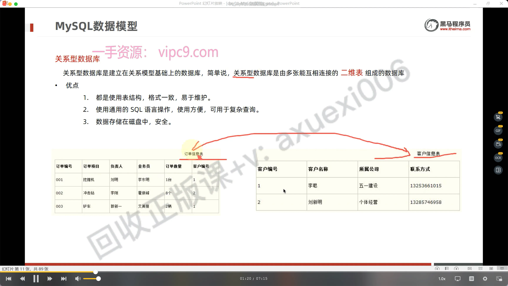
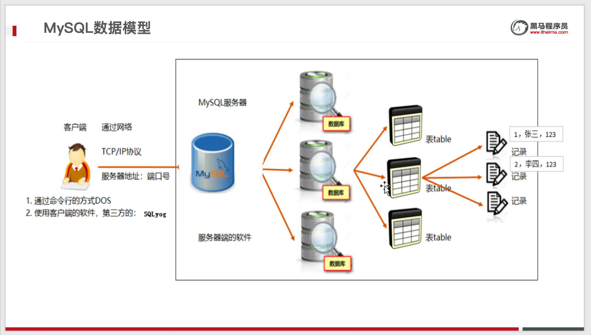
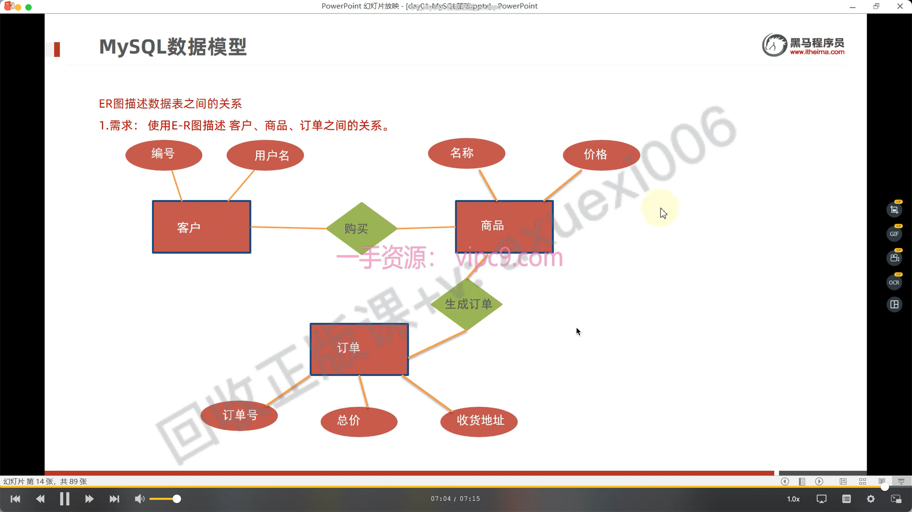

数据模型

## 目录

- [关系型数据库](#关系型数据库)
- [完整模型图](#完整模型图)
- [ER图](#ER图)

# 关系型数据库

&#x20;关系型数据库是建立在**关系模型基础上**的数据库，简单说，关系型数据库是由**多张能互相连接的 二维表 组成的数据库**

优点

- 都是使用表结构，格式一致，易于维护。
- 使用通用的 SQL 语言操作，使用方便，可用于复杂查询。
- 数据存储在磁盘中，安全。

# 完整模型图

# ER图

ER图描述**数据表之间的关系**

1. 数据表中的数据之间必然会有一定的关系存在，比如商品和客户之间的关系，一个客户是可以买多种商品，而一种商品是可以被多个客户来购买的。
2. 设计数据库的时候，可以使用ER实体关系图来描述表之间的关系，**E表示Entity 实体** ,\*\* R表示Relationship  关系\*\*
3. 实体：可以理解成我们Java程序中的一个对象。比如商品，客户等都是一个实体对象。**在E-R图中使用 矩形(长方形) 表示。**
4. 属性：实体对象中是含有属性的，比如商品名、价格等。针对一个实体中的属性，我们称为这个实体的数据，**在E-R图中使用椭圆表示。**
5. 关系：实体和实体之间的关系：&#x20;

