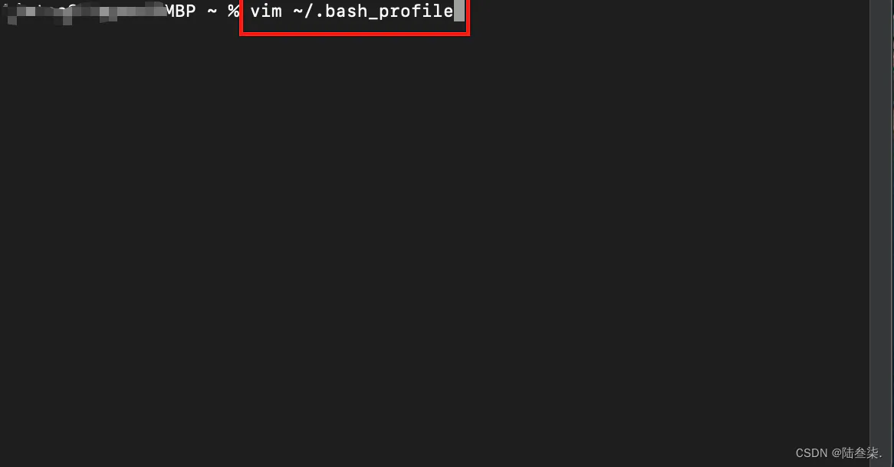
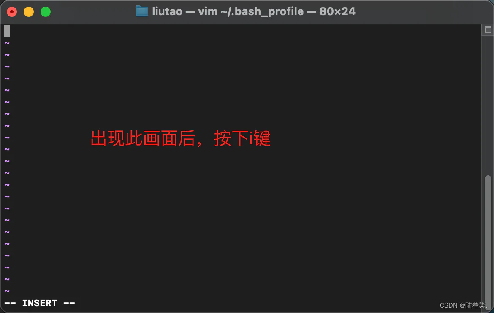
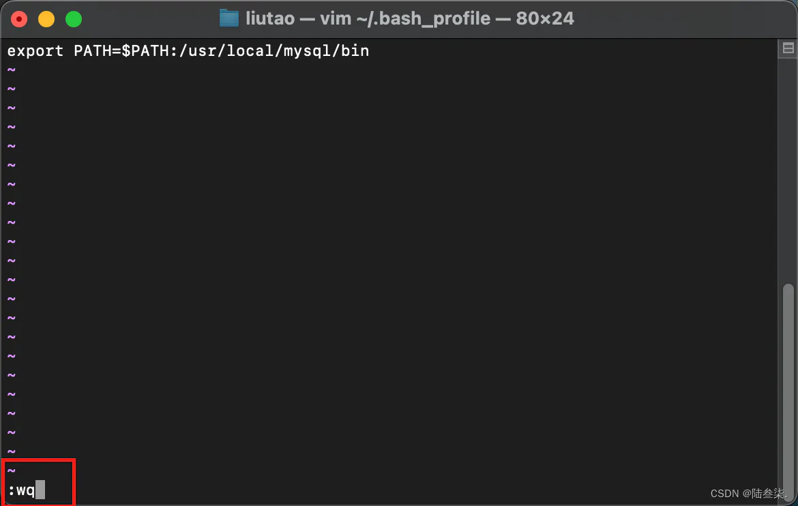
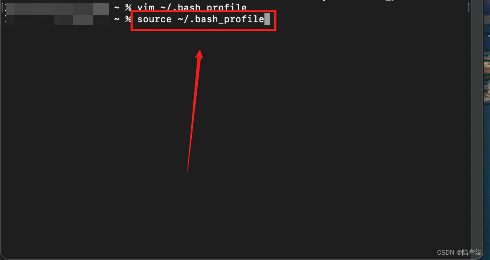

# 配置

## 目录

- [Mac对Mysql环境进行配置](#Mac对Mysql环境进行配置)

#### Mac对Mysql环境进行配置

1.首先在我们的设备上找到终端并打开,输入 vim \~/.bash\_profile(注意vim后面的空格)，输入完成后点击回车键(Enther)

2.点击回车键后会出现此画面，此时按下键盘上的“ i ”键进行编写,输入 export PATH=\$PATH:/usr/local/mysql/bin

3.按下Esc键，输入 :wq;按下回车键进行保存

4.输入 source \~/.bash\_profile 使此文本生效(注意source后面的空格)，按下回车

5.此时输入 mysql --version 可以查看Mysql安装的版本，此时环境配置完成 &#x20;

