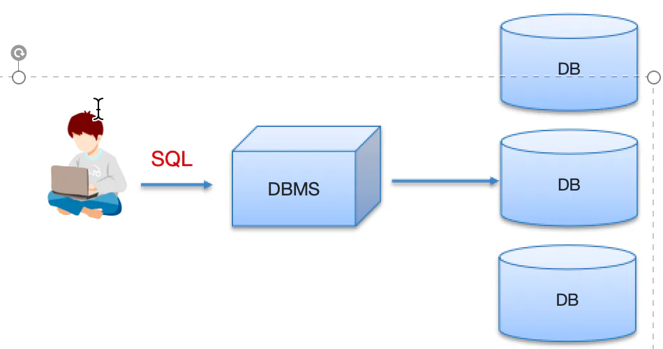
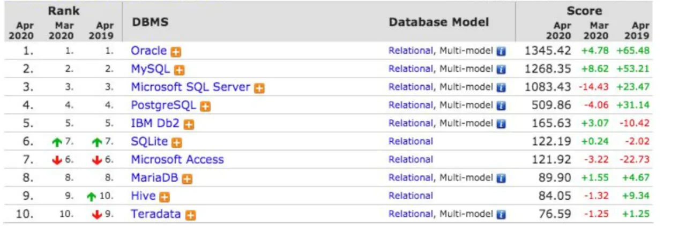

# 相关概念

## 目录

- [常见的关系型数据库管理系统
  ](#常见的关系型数据库管理系统)

数据库

- 存储数据的仓库，数据是有组织的进行存储
- 英文：DataBase，简称 DB

数据库管理系统

- **管理数据库**的大型软件
- 英文：DataBase Management System，简称 DBMS

SQL

- 英文：Structured Query Language，简称 SQL，结构化查询语言
- 操作关系型数据库的编程语言
- \*\*定义操作所有关系型数据库的统一标准
  \*\*​

常见的关系型数据库管理系统

- Oracle：收费的大型数据库，Oracle 公司的产品
- MySQL： **开源免费的中小型数据库。** 后来 Sun公司收购了 MySQL，而 Sun 公司又被 Oracle 收购
- SQL Server：MicroSoft 公司收费的中型的数据库。C#、.net 等语言常使用
- PostgreSQL：开源免费中小型的数据库
- DB2：IBM 公司的大型收费数据库产品
- SQLite：嵌入式的微型数据库。如：作为 Android 内置数据库
- MariaDB：开源免费中小型的数据库
  &#x20;
