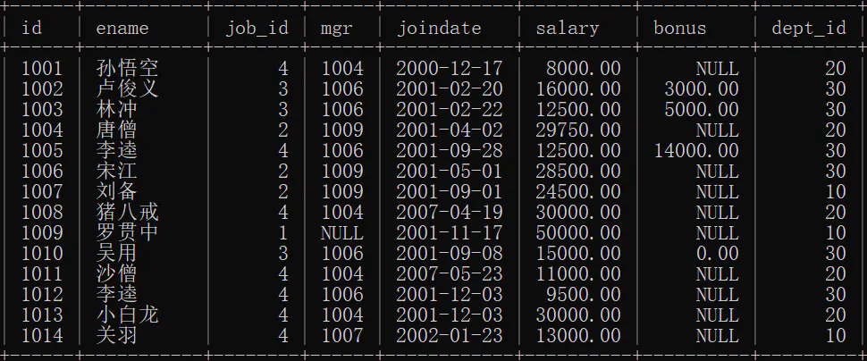
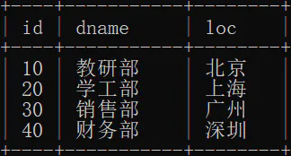
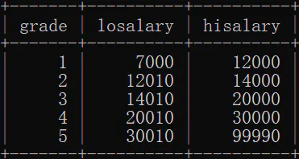
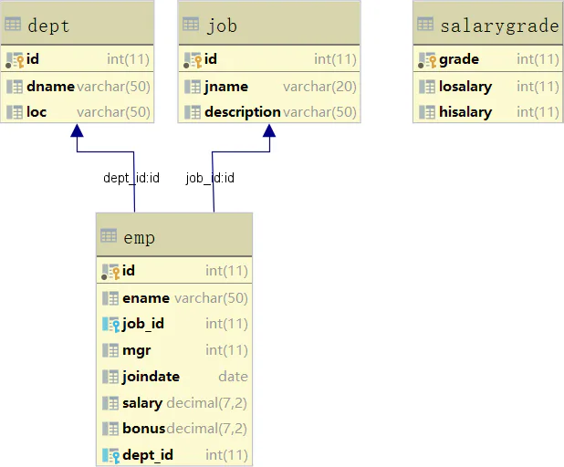

# sql使用

## 目录

- [数据示例](#数据示例)
- [功能1：查询经理信息](#功能1查询经理信息)
- [功能2：查询部门信息](#功能2查询部门信息)

根据给定的`员工表`、`部门表`、`职务表`、`工资等级表`实现功能：

1. 查询经理信息
2. 查询部门信息

员工表：



部门表：



职务表：


工资等级表：



数据表关系模型：



### 数据示例

表结构：

```sql 
-- 部门表
CREATE TABLE dept (
  id INT PRIMARY KEY PRIMARY KEY, -- 部门id
  dname VARCHAR(50), -- 部门名称
  loc VARCHAR(50) -- 部门位置
);

-- 职务表，职务名称，职务描述
CREATE TABLE job (
  id INT PRIMARY KEY,
  jname VARCHAR(20),
  description VARCHAR(50)
);

-- 员工表
CREATE TABLE emp (
  id INT PRIMARY KEY, -- 员工id
  ename VARCHAR(50), -- 员工姓名
  job_id INT, -- 职务id
  mgr INT , -- 上级领导
  joindate DATE, -- 入职日期
  salary DECIMAL(7,2), -- 工资
  bonus DECIMAL(7,2), -- 奖金
  dept_id INT, -- 所在部门编号
  CONSTRAINT emp_jobid_ref_job_id_fk FOREIGN KEY (job_id) REFERENCES job (id),
  CONSTRAINT emp_deptid_ref_dept_id_fk FOREIGN KEY (dept_id) REFERENCES dept (id)
);

-- 工资等级表
CREATE TABLE salarygrade (
  grade INT PRIMARY KEY,
  losalary INT, -- 最低薪资
  hisalary INT -- 最高薪资
);

```


测试数据：

```sql 
-- 添加4个部门
INSERT INTO dept(id,dname,loc) VALUES 
(10,'教研部','北京'),
(20,'学工部','上海'),
(30,'销售部','广州'),
(40,'财务部','深圳');


-- 添加4个职务
INSERT INTO job (id, jname, description) VALUES
(1, '董事长', '管理整个公司，接单'),
(2, '经理', '管理部门员工'),
(3, '销售员', '向客人推销产品'),
(4, '文员', '使用办公软件');


-- 添加员工
INSERT INTO emp(id,ename,job_id,mgr,joindate,salary,bonus,dept_id) VALUES 
(1001,'孙悟空',4,1004,'2000-12-17','8000.00',NULL,20),
(1002,'卢俊义',3,1006,'2001-02-20','16000.00','3000.00',30),
(1003,'林冲',3,1006,'2001-02-22','12500.00','5000.00',30),
(1004,'唐僧',2,1009,'2001-04-02','29750.00',NULL,20),
(1005,'李逵',4,1006,'2001-09-28','12500.00','14000.00',30),
(1006,'宋江',2,1009,'2001-05-01','28500.00',NULL,30),
(1007,'刘备',2,1009,'2001-09-01','24500.00',NULL,10),
(1008,'猪八戒',4,1004,'2007-04-19','30000.00',NULL,20),
(1009,'罗贯中',1,NULL,'2001-11-17','50000.00',NULL,10),
(1010,'吴用',3,1006,'2001-09-08','15000.00','0.00',30),
(1011,'沙僧',4,1004,'2007-05-23','11000.00',NULL,20),
(1012,'李逵',4,1006,'2001-12-03','9500.00',NULL,30),
(1013,'小白龙',4,1004,'2001-12-03','30000.00',NULL,20),
(1014,'关羽',4,1007,'2002-01-23','13000.00',NULL,10);


-- 添加5个工资等级
INSERT INTO salarygrade(grade,losalary,hisalary) VALUES 
(1,7000,12000),
(2,12010,14000),
(3,14010,20000),
(4,20010,30000),
(5,30010,99990);

```


### 功能1：查询经理信息

> 查询经理的信息
>
> \*   显示员工姓名，工资，职务名称，职务描述，部门名称，部门位置，工资等级

```sql 
SELECT e.ename, e.salary, j.jname, j.description, d.dname, d.loc, s.grade 
FROM emp e INNER JOIN job j INNER JOIN dept d INNER JOIN salarygrade s 
ON e.job_id=j.id 
   AND e.dept_id=d.id 
   AND e.salary BETWEEN s.losalary AND s.hisalary 
   AND j.jname='经理';

```


### 功能2：查询部门信息

> 查询出每个部门的部门编号、部门名称、部门位置、部门人数

```sql 
SELECT d.id, d.dname, d.loc,
       IFNULL(e.total, 0) as 部门人数
FROM dept d 
     LEFT JOIN 
     (select dept_id , count(*) AS total from emp group by dept_id) as e
ON d.id = e.dept_id;

```
